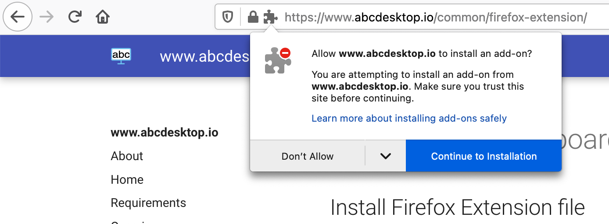
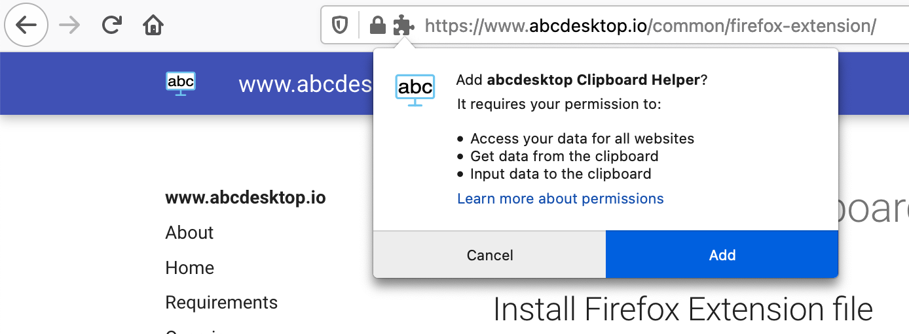
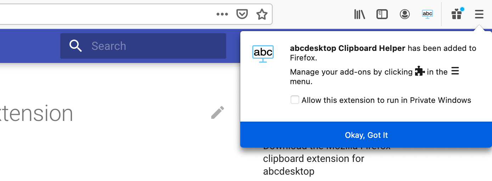

# Mozilla Firefox clipboard extension

## Install Firefox Extension file

### Download the Mozilla Firefox clipboard extension for abcdesktop

1. Download the firefox clipboard extension [abcdesktop_clipboard_helper.xpi](https://www.abcdesktop.io/abcdesktop_clipboard_helper-1.0.3-fx.xpi) and press `Continue to Installation` button.

2. Choose `Add` as a response to the question `Add abcdesktop Clipboad Helper ?` 

3. Press `OKay, Got it` to confirm the `abcdesktop Clipboad helper` insallation

## Use fully qualified domain name filter

Firefox clipboard extension runs **ONLY if the hostname contains `desktop` string**.

The URL must matches `*://*desktop*/*"` to run the clipboard extension.

* `https://demo.abcdesktop.io` matches, the firefox clipboard extension is running.
* `https://desktop.domain.io` matches, the firefox clipboard extension is running.
* `https://abcdesktop.mydomain.local` matches, the firefox clipboard extension is running.
* `https://demo.domain.com` does not match, the firefox clipboard extension is not running.

## Run firefox clipboard extension for abcdesktop

> Firefox clipboard extension syncs **only text data**, binary data like images are not yet supported. 

* Firefox clipboard extension syncs your clipboard data selected from your abcdesktop desktop to your local desktop environment. 

* Firefox clipboard extension syncs your local desktop environment clipboard to your abcdesktop desktop clipboard.
