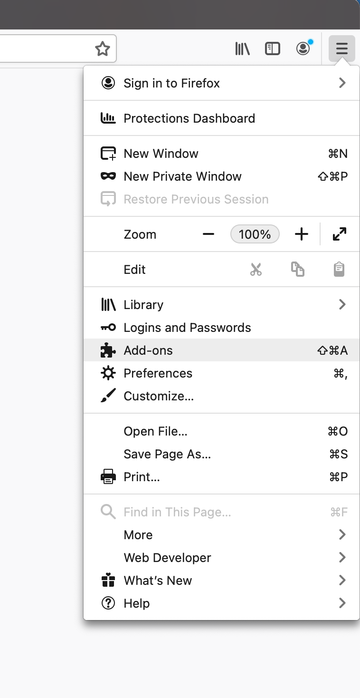
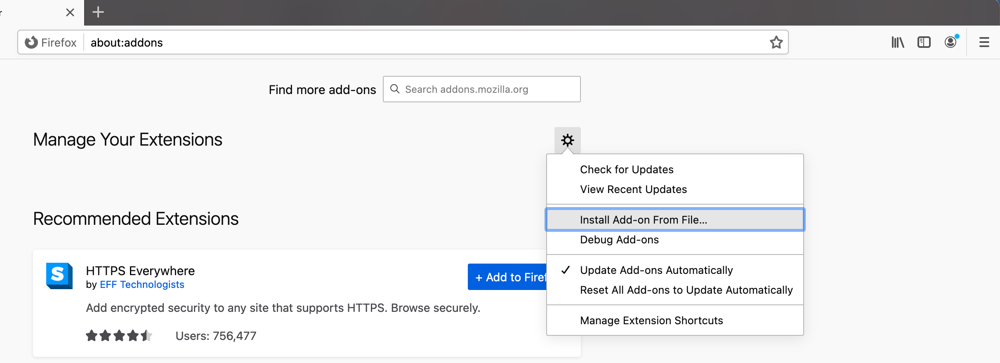
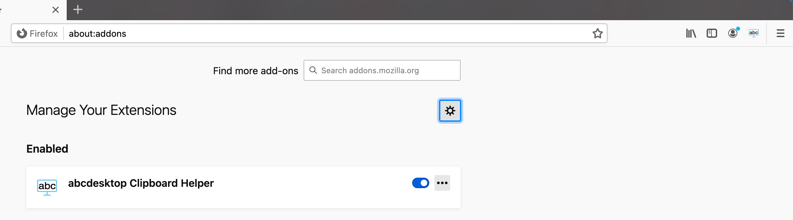

# Mozilla Firefox clipboard extension

## Install Firefox Extension file

### Download the Mozilla Firefox clipboard extension for abcdesktop

Download the firefox clipboard extension [https://www.abcdesktop.io/abcdesktop_clipboard_helper-1.0.1-fx.xpi](https://www.abcdesktop.io/abcdesktop_clipboard_helper-1.0.1-fx.xpi) and save it to your local directory

### Configure Mozilla Firefox

* Start the Mozilla Firefox application
* In the `about` menu, choose `Add-ons` 

* In the `Manage your Extensions` menu, choose `Install Add-ons From File...` , add `open` the `abcdesktop_clipboard_helper-1.0.0-fx.xpi` file.

* Choose `Add` as a response to the question `Add abcdesktop Clipboad Helper ?` 

* Press `OKay, Got it` to confirm the `abcdesktop Clipboad helper` insallation

* Confirm `abcdesktop Clipboad helper` status is enabled

## Run  Firefox clipboard extension for abcdesktop

> Firefox clipboard extension syncs **only text data**, binary data like images are not yet supported. 

* Firefox clipboard extension syncs your clipboard data selected from your abcdesktop desktop to your local desktop environment. 

* Firefox clipboard extension syncs your local desktop environment clipboard to your abcdesktop desktop clipboard.
