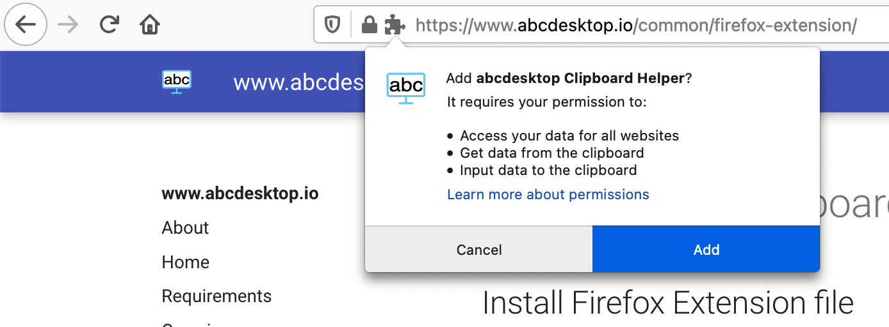

# Mozilla Firefox Clipboard Extension

## Install the Firefox Extension

### Download the Mozilla Firefox Clipboard Extension for abcdesktop

1. Download the Firefox clipboard extension [abcdesktop_clipboard_helper.xpi](https://www.abcdesktop.io/abcdesktop_clipboard_helper-1.0.3-fx.xpi) and click the `Continue to Installation` button.

2. Select `Add` when prompted with `Add abcdesktop Clipboard Helper?`

3. Click `OKay, Got it` to confirm the installation of the `abcdesktop Clipboard Helper` extension.

## Hostname-Based Activation Filter

The Firefox clipboard extension activates **only when the URL hostname contains the string `desktop`**. This filter ensures the extension operates exclusively within abcdesktop sessions and does not interfere with unrelated web applications.

The URL must match the pattern `*://*desktop*/*` to activate the clipboard extension.

* `https://demo.abcdesktop.io` matches; the Firefox clipboard extension is active.
* `https://desktop.domain.io` matches; the Firefox clipboard extension is active.
* `https://abcdesktop.mydomain.local` matches; the Firefox clipboard extension is active.
* `https://demo.domain.com` does not match; the Firefox clipboard extension is not active.

## Using the Firefox Clipboard Extension with abcdesktop

> The Firefox clipboard extension synchronizes **only text data**. Binary data such as images is not yet supported.

* The Firefox clipboard extension synchronizes clipboard content selected within your abcdesktop session to your local desktop environment, enabling seamless copy-and-paste from the remote session into local applications.

* The Firefox clipboard extension also synchronizes your local desktop clipboard to your abcdesktop session clipboard, allowing you to paste locally copied text directly into applications running inside the remote desktop.
