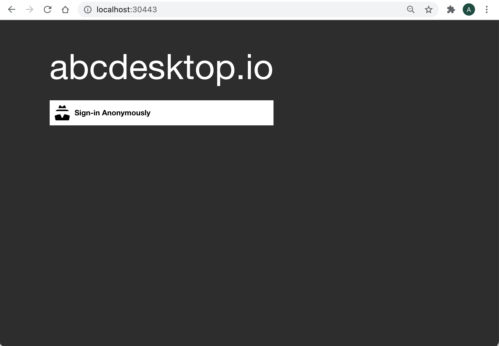
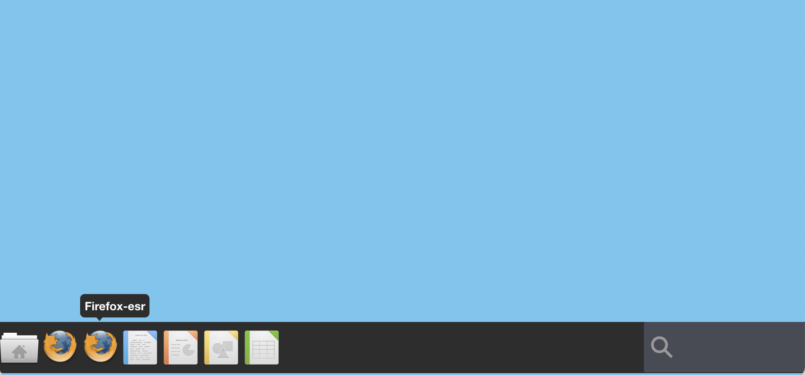
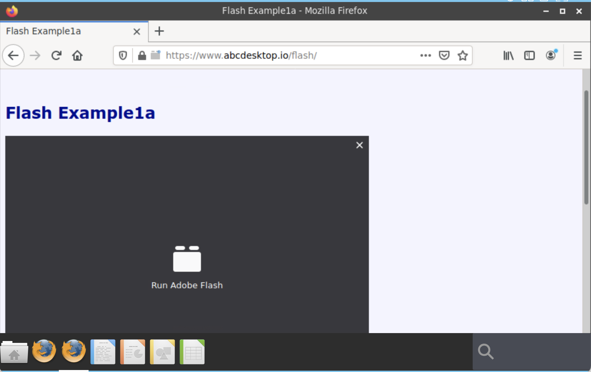
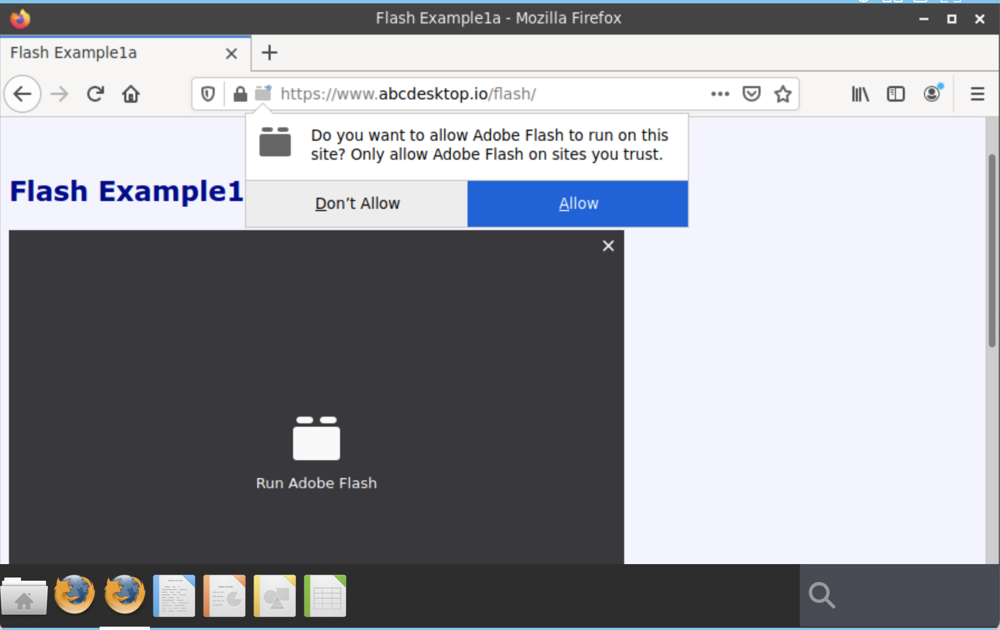
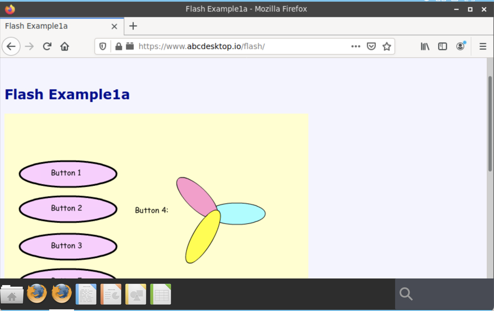

# How to build and run abcdesktop firefox-esr image to run flash application


Adobe no longer supports Flash Player after December 31, 2020 and blocked Flash content from running in Flash Player beginning January 12, 2021.

Lot of applications need to be rewrite, this can take time to rewrite application using HTML5. 

Abcdesktop can be use to run Abode Flash application, using Firefox ESR web browser. 

Firefox Extended Support Release (ESR) is an official version of Firefox developed for large organizations like universities and businesses that need to set up and maintain Firefox on a large scale. Firefox ESR does not come with the latest features but it has the latest security and stability fixes.

## Goals
* use Flash Player for own web site

## Requirements

- A running dockerd last version 
- An access to the docker public registry
- Nodejs installed on your host.  


## Clone the application repo 

 
To build a new `firefox-esr` with `adobe flash player` embeded, clone the `oc.apps` repo

```
    git clone https://github.com/abcdesktopio/oc.apps.git
```

### Edit the mms.cfg file 

Edit the mms.cfg file, and add your own website url

```
EOLUninstallDisable=1
SilentAutoUpdateEnable=0
AutoUpdateDisable=1
EnableAllowList=1
AllowListURLPattern=*://*.adobe.com
AllowListURLPattern=https://*.abcdesktop.io
```

Add the a new line and replace `https://www.domain.com `by your own web site

```
AllowListURLPattern=https://www.domain.com
```


## Build the new firefox-esr abcdesktop image

Run the docker build command 

``` 
docker build -t firefox-esr.d -f firefox-esr.d .
```


## Run the firefox-esr application

### Login to your abcdesktop service

Using you web browser, log in to your abcdesktop service



Look at the twice firefox icon for `Firefox` and `Firefox-esr` application.

Start the application `Firefox-esr`



Open you own flash website, or go to [https://www.abcdesktop.io/flash](https://www.abcdesktop.io/flash) sample web site



Click to the `Run Adobe Flash` plugins 



And Allow the `Adobe Flash to run` 



You can use run the Adobe Flash plugins.
