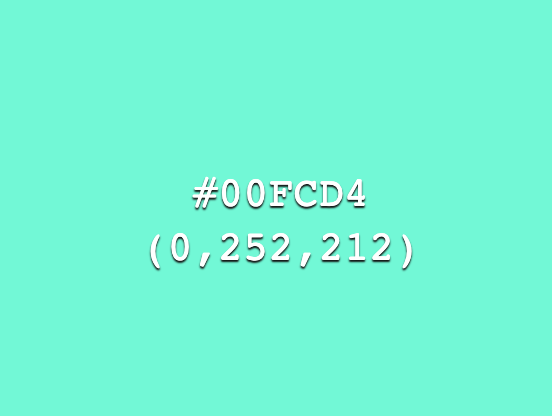

# Update and custom front end image


## Requirements 


## Goals
* Update abcdesktop.io images to use your own.


## Build images

Build image process from abcdesktopio docker registry to your private registry


## Update oc.nginx image

Goal :

* Custom web site colors
* Change logo
* Rename the web site name
 


Only the name of the network is used by abcdesktop.


### Clone default webmodules  

```bash
git clone https://github.com/abcdesktopio/webModules.git
```


## Locate project and ui files 

### Update ui.json file

Update your `ui.json` file.  `ui.json` is located in `var/webModules/transpile/config` directory.


```bash
# cd var/webModules/transpile/config
var/webModules/transpile/config# ls -la
total 204
drwxrwxr-x   1 root root   4096 Feb  1 15:14 .
drwxr-xr-x   1 root root   4096 Feb  1 15:14 ..
-rw-rw-r--   1 root root     34 Feb  1 15:14 .cache.json
-rw-rw-r--   1 root root   2215 Feb  1 15:11 modules.json
-rw-rw-r--   1 root root   1044 Feb  1 15:11 ui.json
```

`ui.json` is a json dictionary file

The main entry is `name`, name is the project name:


| entry          | default value       | example          |
|----------------|---------------------|------------------|
| name           | abcdesktop.io       | acmedesktop.io   |


```json
{
  "name": "abcdesktop.io",
  "colors": [
    {
      "name": "@primary",
      "value": "#474B55"
    },
    {
      "name": "@secondary",
      "value": "#2D2D2D"
    },
    {
      "name": "@tertiary",
      "value": "#6EC6F0"
    },
    {
      "name": "@svgColor",
      "value": "#FFFFFF"
    },
    {
      "name": "@danger",
      "value": "#CD3C14"
    },
    {
      "name": "@success",
      "value": "#32C832"
    },
    {
      "name": "@info",
      "value": "#527EDB"
    },
    {
      "name": "@warning",
      "value": "#FFCC00"
    },
    {
      "name": "@light",
      "value": "#FFFFFF"
    },
    {
      "name": "@dark",
      "value": "#666666"
    },
    {
      "name": "@blue",
      "value": "#4BB4E6"
    },
    {
      "name": "@green",
      "value": "#50BE87"
    },
    {
      "name": "@purple",
      "value": "#A885D8"
    },
    {
      "name": "@pink",
      "value": "#FFB4E6"
    },
    {
      "name": "@yellow",
      "value": "#FFD200"
    }
  ],
  "urlcannotopensession": "/identification/site/"
}
```

#### Colors dictionary entries

| entry          | default value  | example   |
|----------------|----------------|-----------|
| @primary       | #474B55        | #474B55   |
| @secondatry    | #2D2D2D        | #2D2D2D   |
| @tertiary      | #6EC6F0        | #6EC6F0   |


### Create a new `Dockerfile` to build changes


#### Update the ui.json with your own values

Change for example the name to

```
"name": "acmedesktop.io"
```

and the  

```
@tertiary "value": "#00BCD4"
```

Example

```json
{
  "name": "acmedesktop.io",
  "colors": [
    {
      "name": "@primary",
      "value": "#474B55"
    },
    {
      "name": "@secondary",
      "value": "#2D2D2D"
    },
    {
      "name": "@tertiary",
      "value": "#00FCD4"
    },
    {
      "name": "@svgColor",
      "value": "#FFFFFF"
    },
    {
      "name": "@danger",
      "value": "#CD3C14"
    },
    {
      "name": "@success",
      "value": "#32C832"
    },
    {
      "name": "@info",
      "value": "#527EDB"
    },
    {
      "name": "@warning",
      "value": "#FFCC00"
    },
    {
      "name": "@light",
      "value": "#FFFFFF"
    },
    {
      "name": "@dark",
      "value": "#666666"
    },
    {
      "name": "@blue",
      "value": "#4BB4E6"
    },
    {
      "name": "@green",
      "value": "#50BE87"
    },
    {
      "name": "@purple",
      "value": "#A885D8"
    },
    {
      "name": "@pink",
      "value": "#FFB4E6"
    },
    {
      "name": "@yellow",
      "value": "#FFD200"
    }
  ],
  "urlcannotopensession": "/identification/site/"
}
```


#### Write your Dockerfile

```docker
FROM abcdesktopio/oc.nginx:builder as builder

# copy data files
COPY --from=abcdesktopio/oc.nginx:dev var/webModules /var/webModules
# copy updated file ui.json 
COPY ui.json /var/webModules/transpile/config/ui.json
# run makefile 
RUN cd /var/webModules && make css


# --- START Build image ---
FROM abcdesktopio/oc.nginx:dev

# COPY generated web site from builder container
COPY --from=builder var/webModules /var/webModules
```

#### Docker build

Run the docker build command to build the new `oc.nginx:acme` image

```bash
docker build -t oc.nginx:acme .
```

```
Sending build context to Docker daemon  258.3MB
Step 1/6 : FROM abcdesktopio/oc.nginx:builder as builder
 ---> b04ba79c6b97
Step 2/6 : COPY --from=abcdesktopio/oc.nginx:dev var/webModules /var/webModules
 ---> Using cache
 ---> 3c16ce97b6b5
Step 3/6 : COPY ui.json /var/webModules/transpile/config/ui.json
 ---> Using cache
 ---> 3c8e48730bb0
Step 4/6 : RUN cd /var/webModules && make css
 ---> Running in b9660fb676b2
Build css: 1.005s
Total duration: 1.007s
Removing intermediate container b9660fb676b2
 ---> febdb98ad1aa
Step 5/6 : FROM abcdesktopio/oc.nginx:dev
 ---> 2b311b600a4e
Step 6/6 : COPY --from=builder var/webModules /var/webModules
 ---> Using cache
 ---> c9545d07f825
Successfully built c9545d07f825
Successfully tagged oc.nginx:acme
```


Run the `docker images` command to read the new `oc.nginx` image

```bash
docker images 

REPOSITORY                   TAG       IMAGE ID       CREATED             SIZE
oc.nginx                     acme      4de1755b60d7   About an hour ago   746MB
```

### Update the dockercompose or the abcdesktop.yaml file 

Update the dockercompose or the abcdesktop.yaml file to replace the default `abcdesktopio/oc.nginx` by the new image `oc.nginx:acme` name.

```YAML
version: '3'
services:
  pyos:
    depends_on:
      - memcached
      - mongodb
    image: 'abcdesktopio/oc.pyos'
    networks:
      - netback
    volumes:
      - /var/run/docker.sock:/var/run/docker.sock
  speedtest:
    image: 'abcdesktopio/oc.speedtest'
    networks:
      - netuser
  nginx:
    depends_on:
      - memcached
      - pyos
    image: 'oc.nginx:acme'
    ports:
      - '80:80'
      - '443:443'
    networks:
      - netuser
      - netback
  memcached:
    image: memcached
    networks:
      - netback
  mongodb:
    image: mongo
    networks:
      - netback
networks:
  netuser:
    driver: bridge
  netback:
    internal: true
```

The run the docker-compose up, and start you web browser. You can read the new project name at the home page.


We define the new tertiary color as `#00FCD4` in dict ` { "name": "@tertiary",   "value": "#00FCD4" } `



Old tertiary color has been replace by `#00FCD4`.


 

