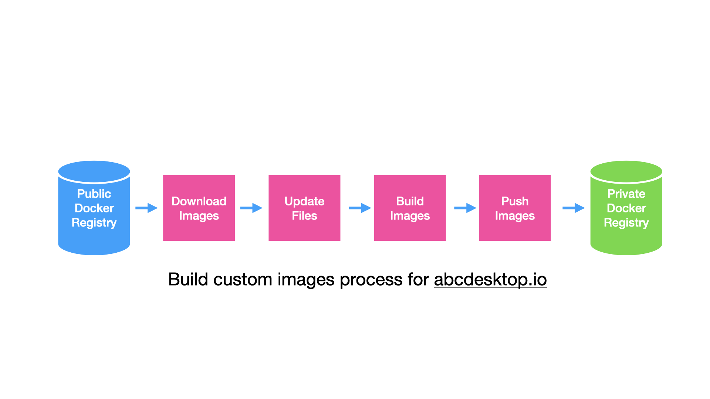
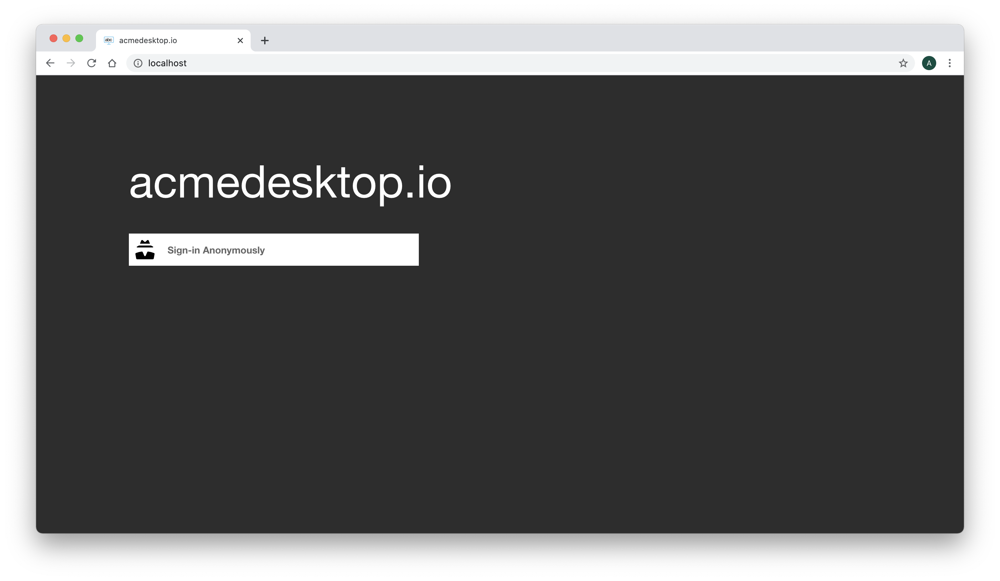
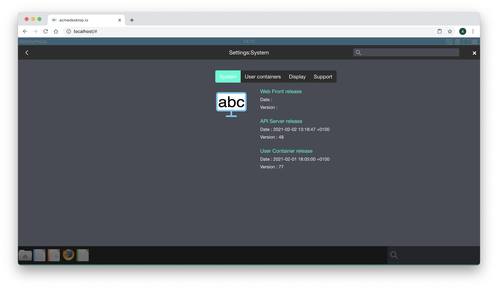

# Update and custom front end image


## Requirements 


## Goals
* Update abcdesktop.io images to use your own.


## Build images

Build image process from abcdesktopio docker registry to your private registry




## Update oc.nginx image

Goal :

* Custom web site colors
* Change logo
* Rename the web site name
 


Only the name of the network is used by abcdesktop.


### Download default oc.nginx images 

```bash
docker pull abcdesktopio/oc.nginx
```


### Locate project and ui files 

```bash
docker run -it abcdesktopio/oc.nginx bash
```

### Update ui.json file

Update your ```ui.json``` file 

```bash
root@b2069ae9a62a:/# cd /var/webModules/transpile
root@b2069ae9a62a:/var/webModules/transpile# ls -la
total 204
drwxrwxr-x   1 root root   4096 Feb  1 15:14 .
drwxr-xr-x   1 root root   4096 Feb  1 15:14 ..
-rw-rw-r--   1 root root     34 Feb  1 15:14 .cache.json
-rw-rw-r--   1 root root   7146 Feb  1 15:11 index.js
-rw-rw-r--   1 root root   2215 Feb  1 15:11 modules.json
drwxr-xr-x 273 root root  12288 Feb  1 15:14 node_modules
-rw-rw-r--   1 root root 145456 Feb  1 15:11 package-lock.json
-rw-rw-r--   1 root root   1175 Feb  1 15:14 package.json
-rw-rw-r--   1 root root   1044 Feb  1 15:11 ui.json
-rwxrwxr-x   1 root root  10809 Feb  1 15:11 use_require.js
-rwxrwxr-x   1 root root   1709 Feb  1 15:11 use_require_helpers.js
```


```ui.json``` is a json dictionary file

The main entry is :


| entry           | default value       | example          |
|----------------|----------------------|------------------|
| name           | abcdesktop.io        | acmedesktop.io   |


```json
{
  "name": "abcdesktop.io",
  "colors": [
    {
      "name": "@primary",
      "value": "#474B55"
    },
    {
      "name": "@secondary",
      "value": "#2D2D2D"
    },
    {
      "name": "@tertiary",
      "value": "#6EC6F0"
    },
    {
      "name": "@svgColor",
      "value": "#FFFFFF"
    },
    {
      "name": "@danger",
      "value": "#CD3C14"
    },
    {
      "name": "@success",
      "value": "#32C832"
    },
    {
      "name": "@info",
      "value": "#527EDB"
    },
    {
      "name": "@warning",
      "value": "#FFCC00"
    },
    {
      "name": "@light",
      "value": "#FFFFFF"
    },
    {
      "name": "@dark",
      "value": "#666666"
    },
    {
      "name": "@blue",
      "value": "#4BB4E6"
    },
    {
      "name": "@green",
      "value": "#50BE87"
    },
    {
      "name": "@purple",
      "value": "#A885D8"
    },
    {
      "name": "@pink",
      "value": "#FFB4E6"
    },
    {
      "name": "@yellow",
      "value": "#FFD200"
    }
  ],
  "urlcannotopensession": "/identification/site/"
}
```

#### Colors dictionary entries


| entry          | default value  | example   |
|----------------|----------------|-----------|
| @primary       | #474B55        | #474B55   |
| @secondatry    | #2D2D2D        | #2D2D2D   |
| @tertiary      | #6EC6F0        | #6EC6F0   |


### Create a new ```Dockerfile``` to build changes

#### Download the ui.json

Download the ui.json from the source repository [ui.json](https://raw.githubusercontent.com/abcdesktopio/webModules/main/transpile/ui.json) and update data value.


```bash
wget -O ui.json https://raw.githubusercontent.com/abcdesktopio/webModules/main/transpile/ui.json
```

#### Update the ui.json with your own values

Change for example the name to

```
"name": "acmedesktop.io"
```

and the  

```
@tertiary "value": "#00BCD4"
```

Example

```json
{
  "name": "acmedesktop.io",
  "colors": [
    {
      "name": "@primary",
      "value": "#474B55"
    },
    {
      "name": "@secondary",
      "value": "#2D2D2D"
    },
    {
      "name": "@tertiary",
      "value": "#00FCD4"
    },
    {
      "name": "@svgColor",
      "value": "#FFFFFF"
    },
    {
      "name": "@danger",
      "value": "#CD3C14"
    },
    {
      "name": "@success",
      "value": "#32C832"
    },
    {
      "name": "@info",
      "value": "#527EDB"
    },
    {
      "name": "@warning",
      "value": "#FFCC00"
    },
    {
      "name": "@light",
      "value": "#FFFFFF"
    },
    {
      "name": "@dark",
      "value": "#666666"
    },
    {
      "name": "@blue",
      "value": "#4BB4E6"
    },
    {
      "name": "@green",
      "value": "#50BE87"
    },
    {
      "name": "@purple",
      "value": "#A885D8"
    },
    {
      "name": "@pink",
      "value": "#FFB4E6"
    },
    {
      "name": "@yellow",
      "value": "#FFD200"
    }
  ],
  "urlcannotopensession": "/identification/site/"
}
```


#### Write you Dockerfile

```docker
FROM abcdesktopio/oc.nginx
COPY ui.json /var/webModules/transpile
RUN cd /var/webModules/ && make -B prod
```

#### Docker build

Run the docker build command to build the new ```oc.nginx:acme``` image

```bash
docker build -t oc.nginx:acme .
```

```
[+] Building 0.1s (8/8) FINISHED                                                                                                                                                                            
 => [internal] load build definition from Dockerfile                                                                                                                                                   0.0s
 => => transferring dockerfile: 36B                                                                                                                                                                    0.0s
 => [internal] load .dockerignore                                                                                                                                                                      0.0s
 => => transferring context: 2B                                                                                                                                                                        0.0s
 => [internal] load metadata for docker.io/abcdesktopio/oc.nginx:latest                                                                                                                                0.0s
 => [1/3] FROM docker.io/abcdesktopio/oc.nginx                                                                                                                                                         0.0s
 => [internal] load build context                                                                                                                                                                      0.0s
 => => transferring context: 29B                                                                                                                                                                       0.0s
 => CACHED [2/3] COPY ui.json /var/webModules/transpile                                                                                                                                                0.0s
 => CACHED [3/3] RUN cd  /var/webModules/ && make -B prod                                                                                                                                              0.0s
 => exporting to image                                                                                                                                                                                 0.0s
 => => exporting layers                                                                                                                                                                                0.0s
 => => writing image sha256:4de1755b60d7adea56460814302fdd7b943e8e40f5f4d093011dea5b08fa30c8                                                                                                           0.0s
 => => naming to docker.io/library/oc.nginx:acme
```


Run the docker images command to read the new ```oc.nginx``` image

```bash
docker images 
REPOSITORY                   TAG       IMAGE ID       CREATED             SIZE
oc.nginx                     acme      4de1755b60d7   About an hour ago   746MB
```

#### Update the dockercompose or the abcdesktop.yaml file 

Update the dockercompose or the abcdesktop.yaml file to replace the default ```abcdesktopio/oc.nginx``` by the new image ```oc.nginx:acme``` name.

```YAML
version: '3'
services:
  pyos:
    depends_on:
      - memcached
      - mongodb
    image: 'abcdesktopio/oc.pyos'
    networks:
      - netback
    volumes:
      - /var/run/docker.sock:/var/run/docker.sock
  speedtest:
    image: 'abcdesktopio/oc.speedtest'
    networks:
      - netuser
  nginx:
    depends_on:
      - memcached
      - pyos
    image: 'oc.nginx:acme'
    ports:
      - '80:80'
      - '443:443'
    networks:
      - netuser
      - netback
  memcached:
    image: memcached
    networks:
      - netback
  mongodb:
    image: mongo
    networks:
      - netback
networks:
  netuser:
    driver: bridge
  netback:
    internal: true
```

The run the docker-compose up, and start you web browser. You can read the new project name at the home page.




The new tertiary color is now ```#00FCD4```

```
  "name": "@tertiary" 
  "value": "#00FCD4"
```


 

