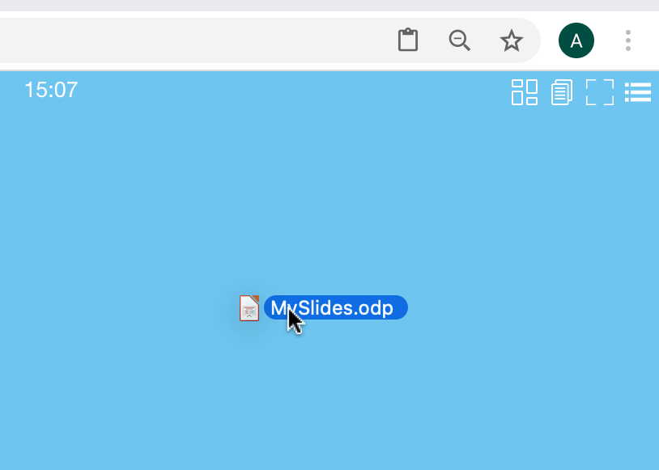
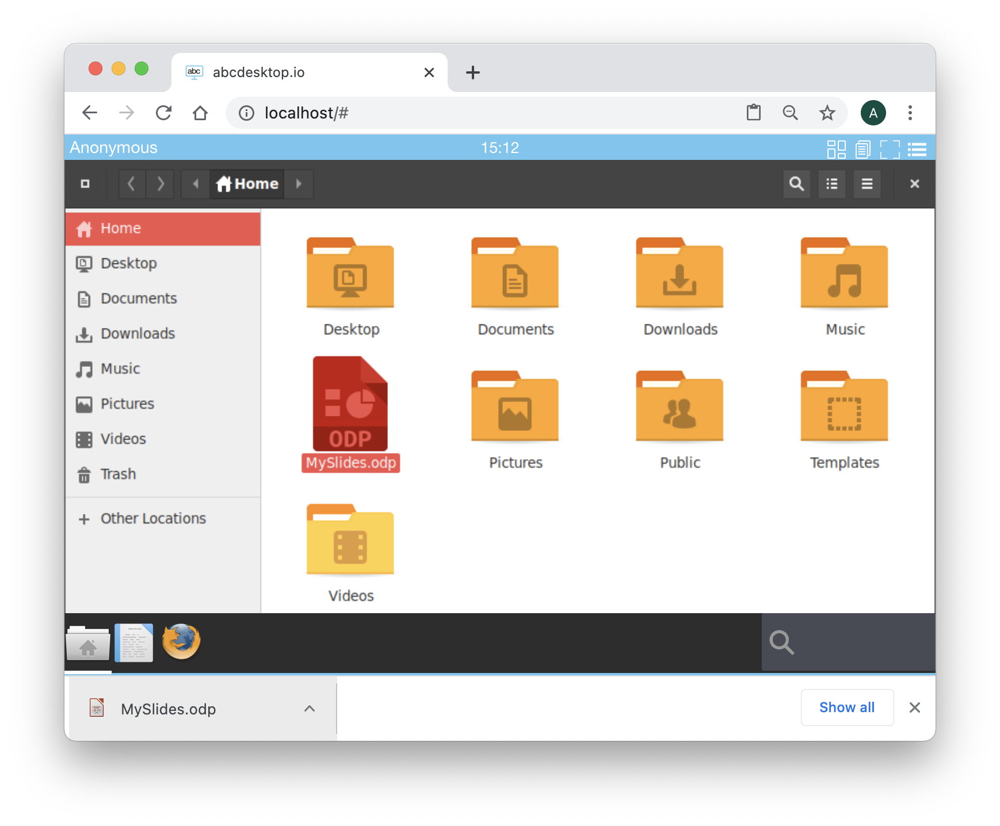
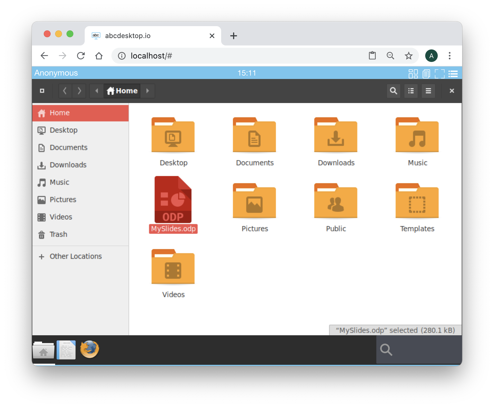
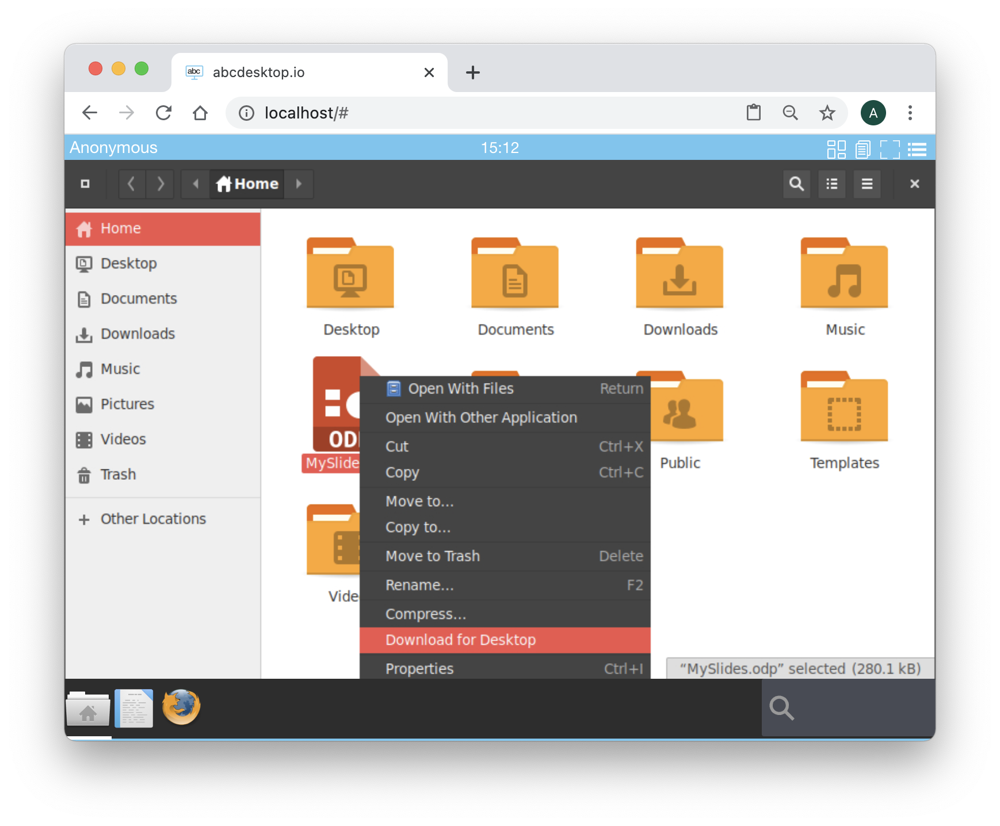
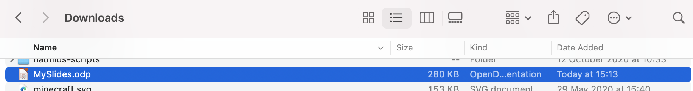

# Upload and Download files in your desktop

## Goals
* Upload file from your local storage to your abcdesktop
* Download file from your abcdesktop to your local storage

## Upload file in your desktop

To upload file into your local storage, just use a drag & drop, from your device to you adcdesktop

Then, start the filemanager, your new file is located in your home directory

## Download file from your desktop

To download file from your abcdesktop to you local storage, just start the file manager.

Choose your file and using the right mouse button, choose the menu option 
`Download for Desktop` as describe :

The file is downloaded by your web browser

The file is located in your `Downloads` directory

Great, you have uploaded and downloaded files with your abcdesktop, you can now use abcdesktop.io applications to edit all your files.

