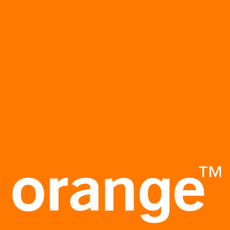

# Adopters

## Organizations Using abcdesktop.io in Production

The following organizations are known to be running abcdesktop.io in production environments.

| Adopter | Name | Description | Public Application Repository |
|---|---|---|---|
|  | [EMBL](https://www.embl.org/) | The European Molecular Biology Laboratory is an intergovernmental research organization dedicated to molecular biology research, supported by 28 member states, one prospect state, and one associate member state. | [https://git.embl.de/ysun/abcdesktop-apps/](https://git.embl.de/ysun/abcdesktop-apps/) |
|  | [Orange](https://www.orange.com/) | Multinational telecommunications operator and digital services provider serving 287 million customers across consumer, professional, and enterprise segments. | Orange uses standard public and proprietary enterprise applications. |

If your organization is using abcdesktop.io and is not listed here, please submit a pull request to add an entry to this table.
