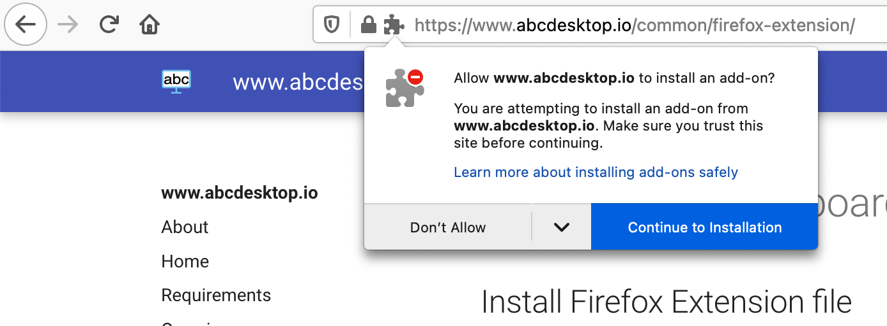
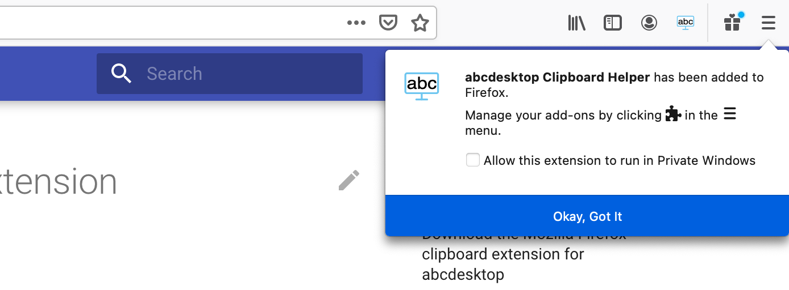

# Mozilla Firefox Clipboard Extension

## Install Firefox Extension File

### Download the Mozilla Firefox Clipboard Extension for abcdesktop

1. Download the Firefox clipboard extension [abcdesktop_clipboard_helper.xpi](https://www.abcdesktop.io/abcdesktop_clipboard_helper-1.0.3-fx.xpi) and click `Continue to Installation`.

2. Click `Add` in response to the prompt `Add abcdesktop Clipboard Helper?`

3. Click `Okay, Got it` to confirm the `abcdesktop Clipboard Helper` installation.

## Fully Qualified Domain Name Filter

The Firefox clipboard extension activates **only when the hostname contains the string `desktop`**.

The URL must match the pattern `*://*desktop*/*` for the clipboard extension to activate.

* `https://demo.abcdesktop.io` matches — the Firefox clipboard extension is active.
* `https://desktop.domain.io` matches — the Firefox clipboard extension is active.
* `https://abcdesktop.mydomain.local` matches — the Firefox clipboard extension is active.
* `https://demo.domain.com` does not match — the Firefox clipboard extension is not active.

## Run Firefox Clipboard Extension for abcdesktop

> The Firefox clipboard extension synchronizes **text data only**. Binary data such as images is not yet supported.

* The Firefox clipboard extension synchronizes clipboard content selected within your abcdesktop desktop session to your local desktop environment.

* The Firefox clipboard extension also synchronizes your local desktop environment clipboard to your abcdesktop desktop clipboard.
