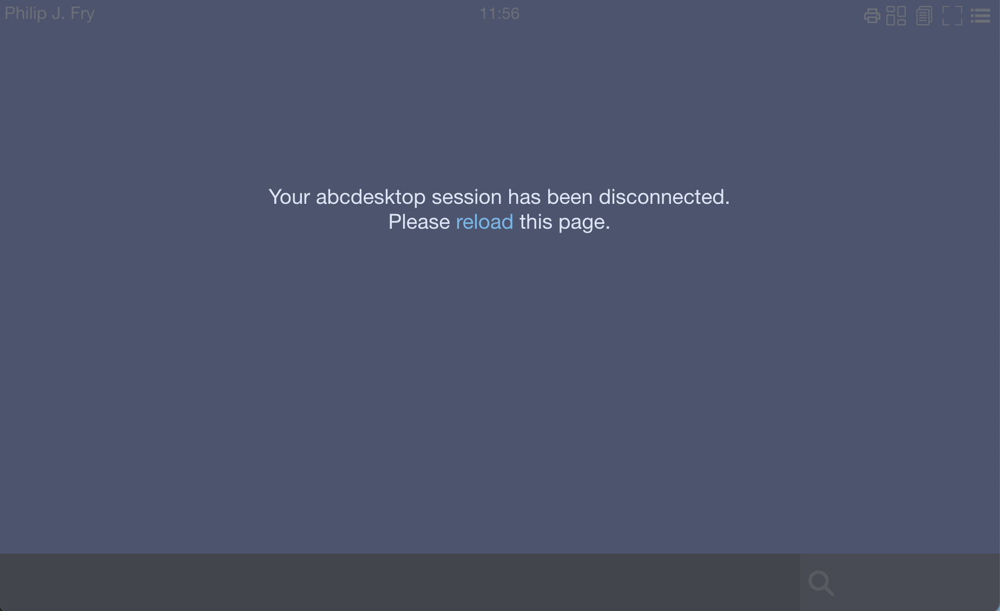

---
tags:
  - faq
  - ingresscontroller
  - nginx
---

# FAQ: Ingress Controller

## How to Expose a New Service with the NGINX Ingress Controller

A Kubernetes Ingress Controller acts as a reverse proxy and routes external HTTP(S) traffic to internal cluster services. This section describes how to use the `nginx` ingress controller to expose abcdesktop services.

In the `Ingress` resource, define a path that routes traffic to the abcdesktop `nginx` service:

```
apiVersion: networking.k8s.io/v1
kind: Ingress
metadata:
  name: ingress-demo
  namespace: abcdesktop
spec:
  rules:
    - host: demo.digital.pepins.net
      http:
        paths:
          - path: /
            pathType: Prefix
            backend:
              service:
                name: nginx
                port:
                  number: 80
  ingressClassName: nginx
```

Requests matching `path: /` are proxied to the service named `nginx` in the `abcdesktop` namespace.


## How to Prevent the Connection from Closing After 60 Seconds of Inactivity

My desktop disconnects after 60 seconds of inactivity, and the message *"Your abcdesktop session has been disconnected. Please reload this page"* appears.



The message `Your abcdesktop session has been disconnected. Please reload this page` appears when the `websockify` WebSocket connection is closed due to inactivity.

Add a heartbeat value to send a ping to the client at a regular interval. Edit the `od.config` file and add `'WEBSOCKIFY_HEARTBEAT':'30'` to the `desktop.envlocal` option:

```
desktop.envlocal: { 'WEBSOCKIFY_HEARTBEAT':'30', 'LIBOVERLAY_SCROLLBAR':'0', 'UBUNTU_MENUPROXY':'0', 'X11LISTEN':'tcp' }
```

With this setting, the `/usr/bin/websockify` process sends a WebSocket ping to the client every 30 seconds. This process runs inside the user's pod.

Update the `abcdesktop-config` ConfigMap:

```
kubectl create -n abcdesktop configmap abcdesktop-config --from-file=od.config -o yaml --dry-run=client | kubectl replace -n abcdesktop -f -
```

Restart the pyos pod:

```
kubectl delete pods -l run=pyos-od -n abcdesktop
```

For more information on WebSocket keepalive behavior, see [Keepalive in WebSockets](https://websockets.readthedocs.io/en/stable/topics/timeouts.html).

Configuring connection timeouts helps prevent unnecessary network bandwidth consumption from idle sessions.

## How to Prevent the Connection from Closing After 60 Seconds of Inactivity with an NGINX Ingress Controller

My desktop disconnects after 60 seconds of inactivity, and the message *Your abcdesktop session has been disconnected. Please reload this page* appears.

To prevent the connection from closing when routing through an Ingress Controller, ensure that the Ingress Controller is not configured to automatically terminate long-lived connections. The default timeout for the NGINX ingress controller is 60 seconds.

Update the `nginx.ingress.kubernetes.io/proxy-read-timeout` and `nginx.ingress.kubernetes.io/proxy-send-timeout` annotations to a value greater than 60 seconds:

```
apiVersion: networking.k8s.io/v1
kind: Ingress
metadata:
  name: ingress-demo
  namespace: abcdesktop
  annotations:
    nginx.ingress.kubernetes.io/proxy-read-timeout: "3600"
    nginx.ingress.kubernetes.io/proxy-send-timeout: "3600"
spec:
  rules:
    - host: demo.digital.pepins.net
      http:
        paths:
          - path: /
            pathType: Prefix
            backend:
              service:
                name: nginx
                port:
                  number: 80
  ingressClassName: nginx
```
