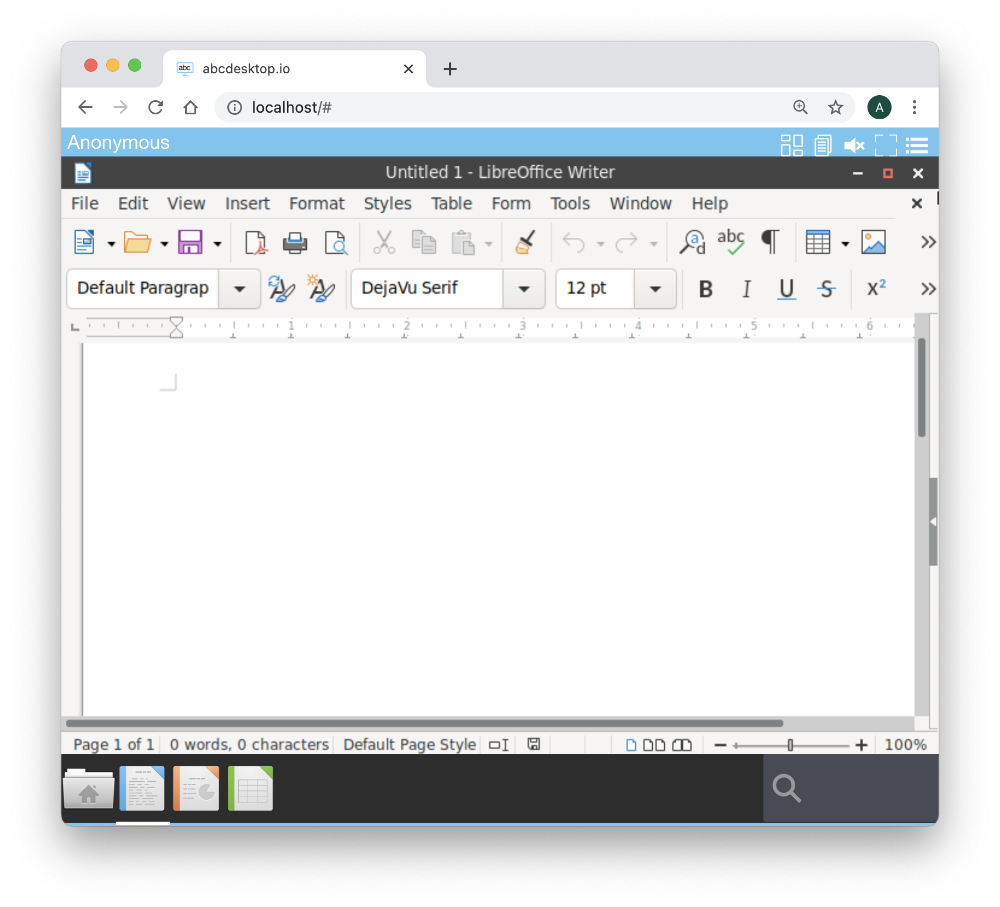
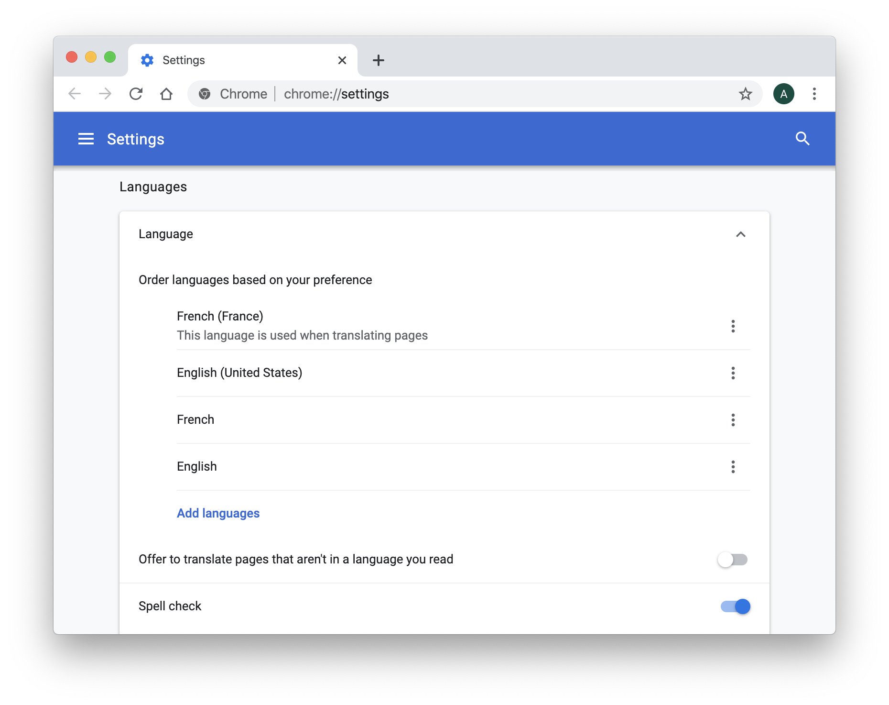
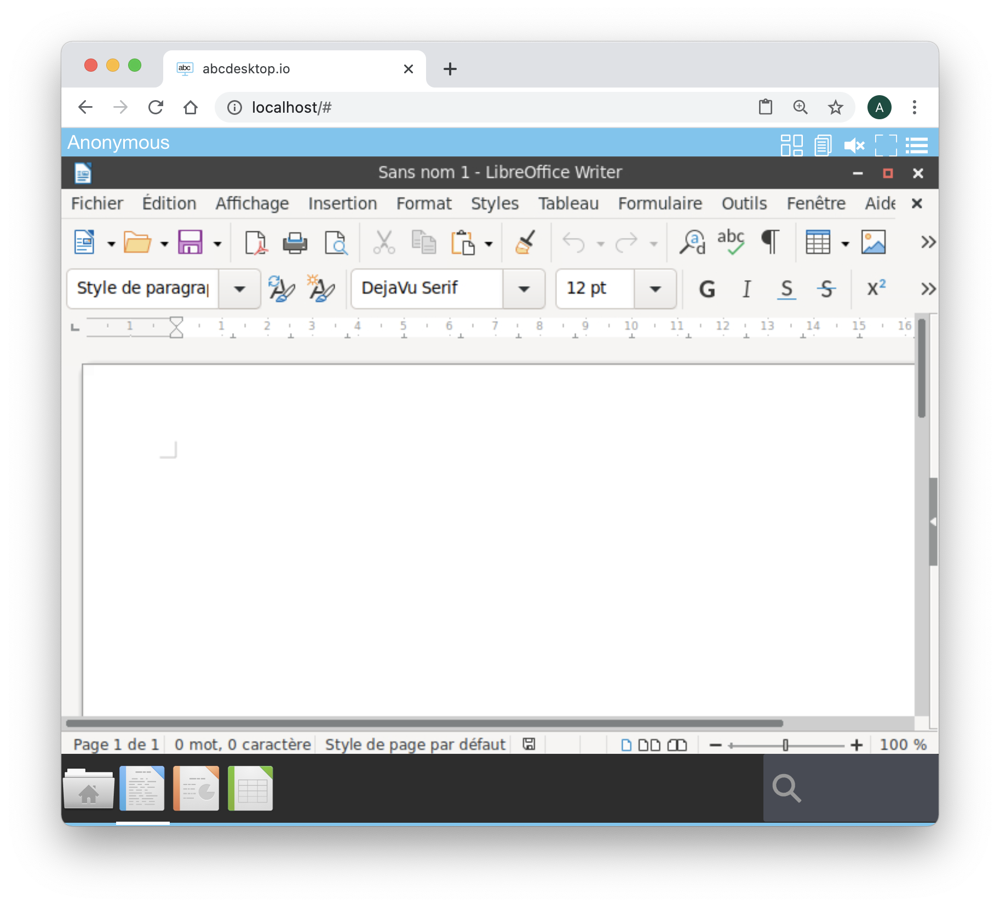

---
tags:
  - faq
  - browser
---

# FAQ Web Browser


## Which web browser is supported ?

abcdesktop.io uses many modern web technologies. However these are the minimum versions we are currently aware of:

* Chrome 49, 
* Firefox 58, 
* Safari 11, 
* Opera 36,  
* Microsoft Edge (based on Chromium)


## How to do a `copy and paste` ?

To fully use `copy and paste` features, from your local device to your abcdesktop (and vice versa), choose `Chrome`, `Chromium` or  `Microsoft Edge Chromium`. The `copy and paste` feature is also supported on Firefox with a [dedicated abcdesktop extension](firefox-extension.md).

| Web browser      | Clipboard sync                 |
|------------------|-------------------------------------|
|  Chrome     | Yes, built in support |
|  Chromium     | Yes, built in support  |
|  Microsoft Edge Chromium     | Yes, built in support  |
|  Firefox       | Yes, install the [dedicated abcdesktop extension](/common/firefox-extension)| 
|  Safari       | No, the clipboard access is not allowed by the user agent or the platform in the current context, possibly because the user denied permission|

> Make sure to use `https` protocol to allow read and write api calls to your clipboard


## How to change the default language ?

abcdesktop reads the your web browser language and starts application and desktop this user's choose.
The default installed languages are `English`, `French`, `German`, and `Romanian`. If you need other languages support you have to rebuild the container image with your language.

abcdesktop uses the web browser language property to set the application's language. This list must match with the ```Accept-Language``` request HTTP header. If the language is not found, the default value is set to ```en_US```.


To check the supported language, change your web browser language, and run `LibreOffice` applications. The language setting uses the web browser value. During this test you can keep the same users session.


- Set the web browser's default language to ```en_US``` : 

The launch LibreOffice Writer. The menu is set to ```en_US``` 

LibreOffice Writer use English/US ```en_US``` language.

- Set the web browser's default language to ```fr_FR``` :



> You can keep the same user's session, you do not need to logout.

The launch LibreOffice Writer. The menu is set to ```fr_FR```

LibreOffice Writer use French ```fr_FR```language.


 
