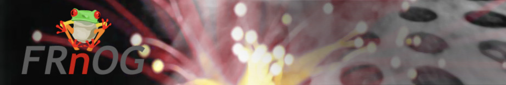

# FRNOG 42

People interested in security, research, and internet operation in France are gathered by the FRench Network Operators Group ([FRnOG](www.frnog.org)) for information exchange.

Chapters describe documents for the session on Friday, October 24, 2025 [FRnOG 42](https://www.frnog.org/?page=frnog42)

## Slides content

- format PDF file [download file](abcdesktop-frnog.pdf)

## Video content

<iframe width="640" height="480" src="https://www.youtube.com/watch?v=dq3bcFu5pr8" allow="accelerometer; autoplay; encrypted-media; gyroscope; picture-in-picture" allowfullscreen></iframe>

Description

- Login credentials (`Philip J. Fry`,`fry`)
- Create pod desktop, with all containers 
- Start terminal application 
- Run `kubectl get pods -n abcdesktop`
  - Show current user pod for `fry`
- Start Firefox application
  - look for video on `http://culturepub.fr` web site
- Start Qterminal application as Pod 
	- Start `top` command, to show process 
- Run `kubectl get pods -n abcdesktop` again in terminal
- Run `kubectl delete pods fry-qterminal-app-XXXX -n abcdesktop` again in terminal
- Logoff

Link

- [youtube video link](https://www.youtube.com/watch?v=dq3bcFu5pr8)