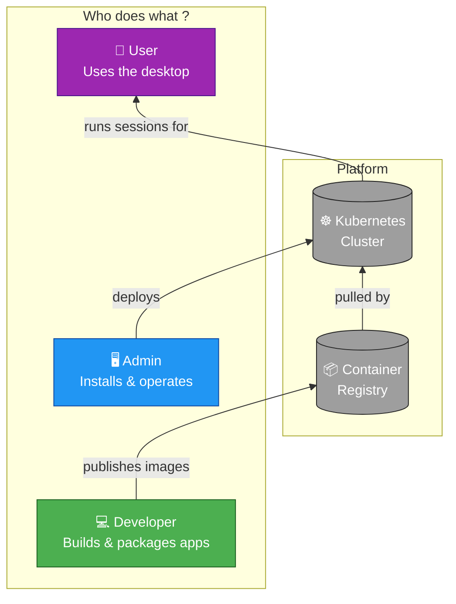

---
hide:
  - navigation   # masque le sidebar gauche
  - toc          # masque la table des matières droite
wizard_overview: true  
---

Choose your profile to follow the right path.

=== ":material-account: User"

    You use abcdesktop to access your applications from a browser.

    **Estimated time: ~xx min**

    | Step | Page | Time |
    |------|------|------|
    | 1 | [Overview](user/step1.md) | 2 min |
    | 2 | [...](user/step2.md) | 3 min |
    | 3 | [...](user/step3.md) | 5 min |

    [:material-arrow-right: Start here](user/step1.md){ .md-button .md-button--primary }

=== ":material-laptop: Developer"

    You build and package applications for abcdesktop.

    **Estimated time: ~xx min**

    | Step | Page | Time |
    |------|------|------|
    | 1 | [Overview](user/step1.md) | 2 min |
    | 2 | [...](user/step2.md) | 3 min |
    | 3 | [...](user/step3.md) | 5 min |

    [:material-arrow-right: Start here](developer/step1.md){ .md-button .md-button--primary }

=== ":material-server: Admin"

    You install, configure and operate abcdesktop for your organization.

    **Estimated time: ~xx min**

    | Step | Page | Time |
    |------|------|------|
    | 1 | [Prerequisites](admin/step1.md) | 5 min |
    | 2 | [Installation](admin/step2.md) | 10 min |
    | 3 | [Uninstall](admin/step3.md) | 5 min |

    [:material-arrow-right: Start here](admin/step1.md){ .md-button .md-button--primary }
