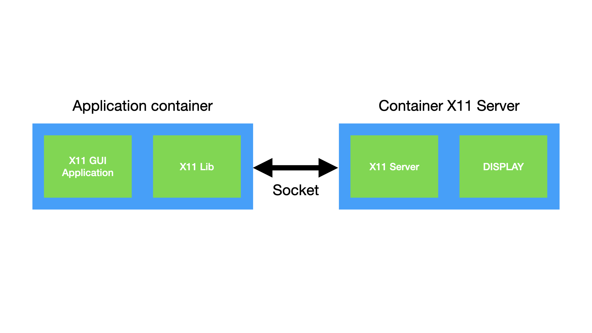
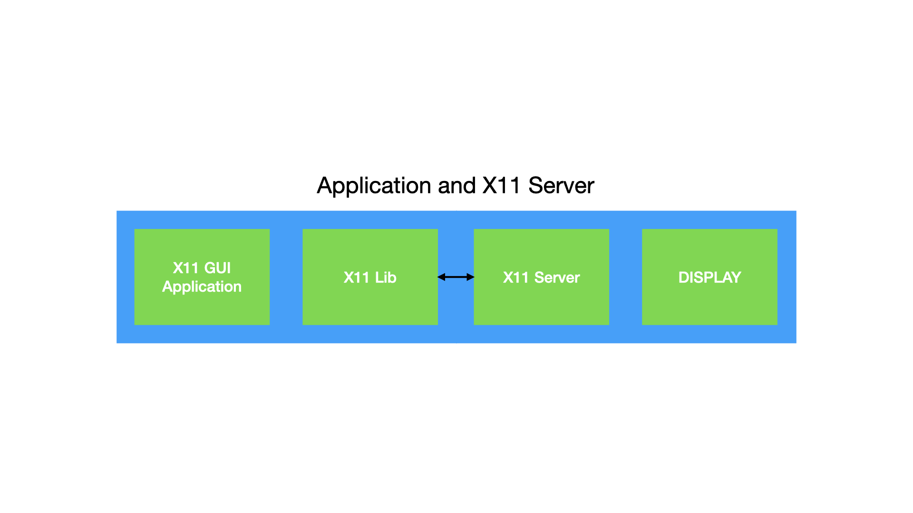
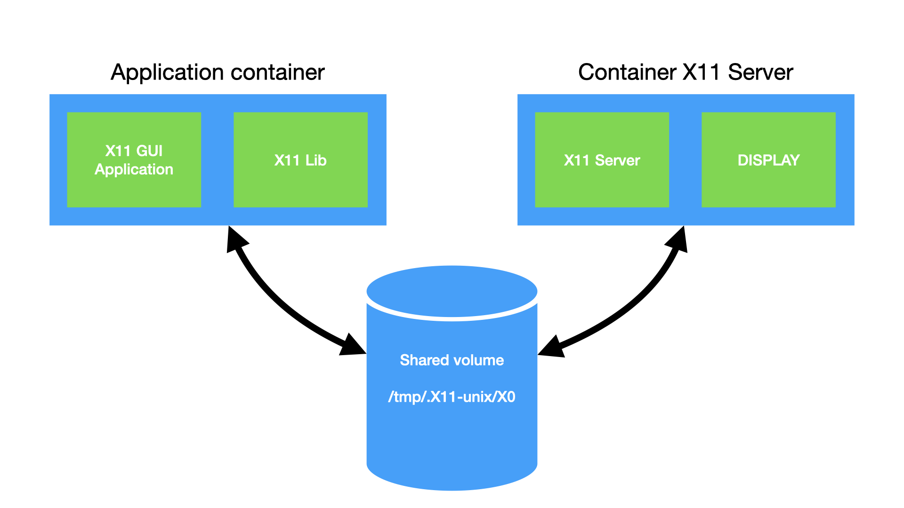
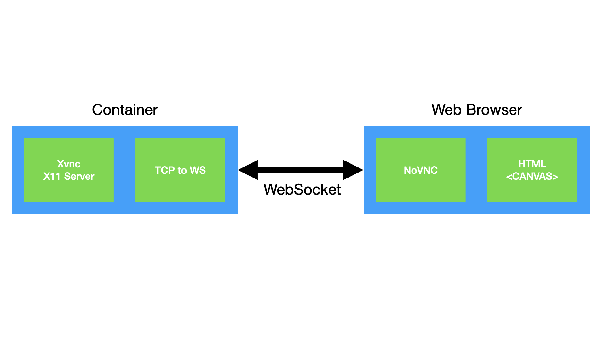

# GUI Application in docker 

## Related Projets on VDI with docker

abcdesktop, or Yet Another VDI docker projet...

A lot of different projets already exist using docker containers as a VDI. abcdesktop is just another one. I just write list of projets, you can explore them :


* [https://www.digitalocean.com/community/tutorials/how-to-remotely-access-gui-applications-using-docker-and-caddy-on-ubuntu-18-04](https://www.digitalocean.com/community/tutorials/how-to-remotely-access-gui-applications-using-docker-and-caddy-on-ubuntu-18-04) By using noVNC and TigerVNC, you can run native applications inside a Docker container and access them remotely using a web browser. 

* [HW accelerated GUI apps on Docker](https://medium.com/@pigiuz/hw-accelerated-gui-apps-on-docker-7fd424fe813e) Describe How to containerizing a GUI app. Really easy to understand, a good article.

* [https://github.com/fcwu/docker-ubuntu-vnc-desktop](https://github.com/fcwu/docker-ubuntu-vnc-desktop) docker-ubuntu-vnc-desktop is a Docker image to provide web VNC interface to access Ubuntu LXDE/LxQT desktop environment.

* [Dockerize GUI app](https://blog.nediiii.com/dockerize-gui-app/) This project dockerize typical GUI app so that you can visit it in browser. Really good technical solutions.
* [Docker and Wine](https://hub.docker.com/r/scottyhardy/docker-wine/) Docker image that includes Wine and Winetricks for running Windows applications on Linux and macOS 

## X window system architecture
In a *nix system a GUI application has the role of “X client”. Each time it redraws its content a sequence of graphics commands is encoded into the X protocol using a library (usually Xlib) and transmitted into the X11 socket.
At the other end an X server reads such commands from the socket and renders them onto a display. [ source [HW accelerated GUI apps on Docker](https://medium.com/@pigiuz/hw-accelerated-gui-apps-on-docker-7fd424fe813e)]


## Containerizing a GUI app
Taking a look at the X window system architecture it’s clear that in order to make our containerized GUI apps capable of drawing on a screen we need to give it write access to the X11 socket, and we need an X server to consume and render the graphics commands onto a display.

We can approach this problem from three angles:

### All in one container



* we can bundle X11 server with our container image. All process run inside the same container.

### Separated container


* we can share the X11 server socket with the X11 client container as unix file socket on an external shared volume. Applications and X11 server run in dedicated containers.

* we can share the X11 server socket with the container using TCP. X11 uses TCP as its transport protocol. Applications and X11 server run in dedicated containers.

### abcdesktop choice




To guarantee isolation, abcdesktop/io.io run X11 server and X11 client in separated container. X11 server and X11 client share the socket as unix file socket on a dedicated external shared volume.

* The unix file socket reduce the network tcp overhead.
 
* The unix file socket garantes no latency troubleshooting. X11 uses a chatty protocol so that the network latency has a large impact when using X11

**Local is best**, thus server and application need to run on the same node.


## HTML5 Web Browser as remote ```DISPLAY```



The Web Browser does not support X11 protocol. We need a graphical desktop system to paint the virtual ```DISPLAY``` in a ```<canvas>``` HTML element.

### Replace X11 Server from X.org, by a Xvnc. 
  
Xvnc is the X VNC (Virtual Network Computing) server. It is based on a standard X server, but it has a ```virtual screen``` rather than a physical one. X applications display themselves on it as if they were using a normal X display, but they can only be accessed via a VNC. So Xvnc is really two servers in one. To the applications it is an X server, and to the remote VNC users it is a VNC server.

### Convert VNC TCP socket in to a WebSocket
 
The web browser does not support VNC (RFB Protocol) and the TCP socket natively. We need to translate TCP socket, into a WebSocket.
This can be done using :

* [websockify](https://github.com/novnc/websockify) Websockify just translates WebSockets traffic to normal socket traffic. Websockify accepts the WebSockets handshake, parses it, and then begins forwarding traffic between the client and the target in both directions.

* [ws-tcp-bridge](https://www.npmjs.com/package/ws-tcp-bridge) A websocket to tcp proxy server, using nodejs which bridges websockets and tcp servers in either direction.


### Use a VNC Javascript client

The web browser receives the RFB protocol in the WebSocket and then paints the data into a canvas.

* [noVNC](https://novnc.com/) is VNC client JavaScript library. noVNC follows the standard VNC protocol, but unlike other VNC clients it requires WebSockets support.
