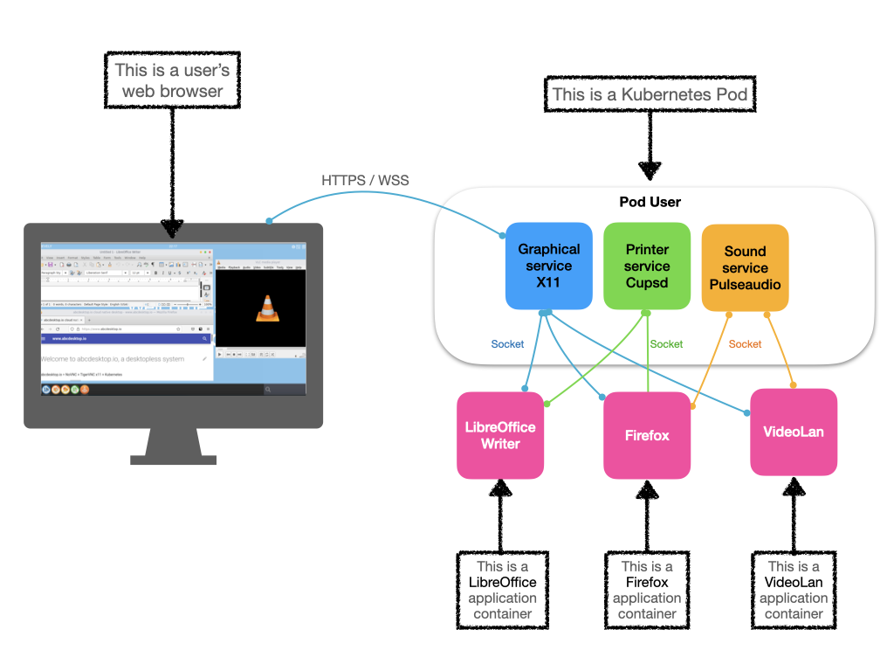
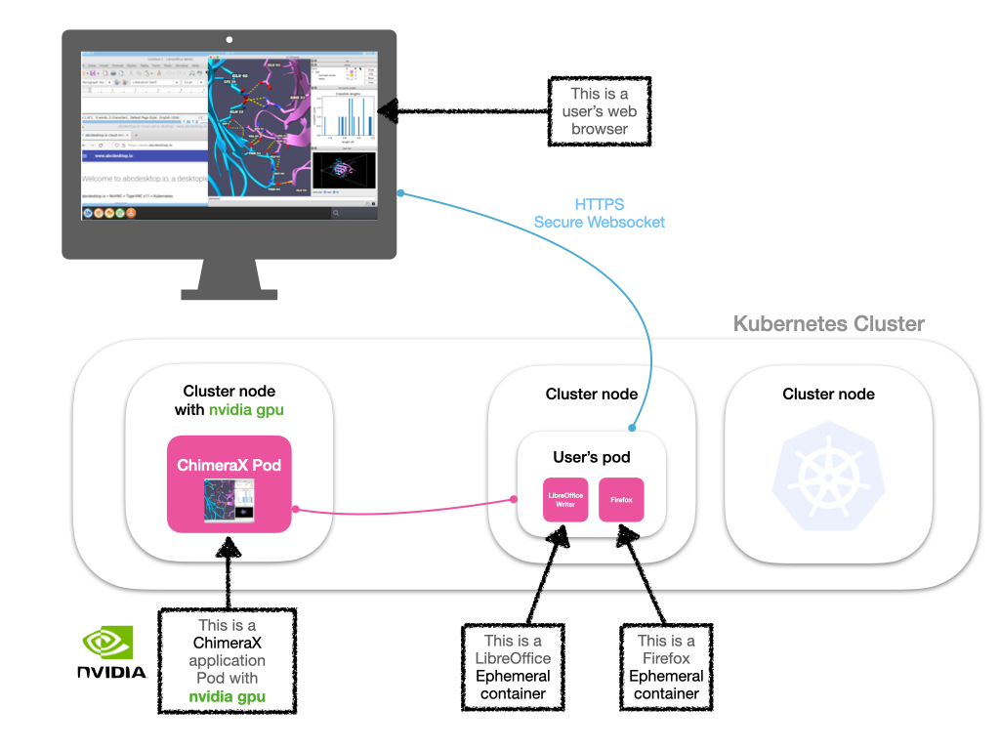
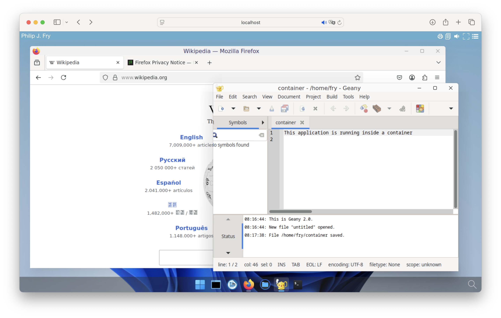
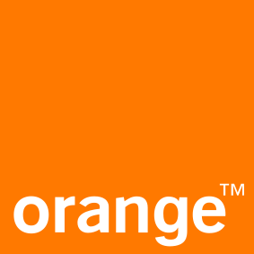

# abcdesktop.io is a cloud native desktop service built on and for Kubernetes.


abcdesktop.io is a cloud native desktop service built on and for [Kubernetes](https://kubernetes.io/). abcdesktop.io is also a complete work environment accessible from a simple HTML 5 web browser, without any installation. Like serverless does, desktopless computing allocates desktop resources on demand.  **Each user’s application runs as a container** to reduce attack surface.



abcdeskop.io is an open source and free solution that offers seamless access to secure desktops and applications on any device, follow the [https://github.com/abcdesktopio](https://github.com/abcdesktopio) links.

This flexible working environment simplifies usage like

- Telecommuting
- Remote virtual desktop 
- Give temporary access to other contractors or guests
- Training  
- BYOD, Bring Your Own Device
- Desktop On Demand, Desktop as a service


With abcdesktop, you can take advantage of all the power of your Kubernetes cluster for your virtual workstations. You can distribute user applications as `pods` or as `ephemeral containers` on all cluster nodes.




## Quick online preview

You can discover abcdesktop.io desktopless services on the demo website. [https://demo.abcdesktop.io](https://demo.abcdesktop.io) instance is a quick example to illustrate how the abcdesktop.io project works. Your desktopless is ready to run for 10 minutes, and will be terminated by the garbage collector after 10 minutes. It requires an OpenID Connect provider to sign-in like (Google, Facebook, Github). The security policy for Internet network prevents requests from your abcdesktop being allowed. Printer service (using cups) and sound service (using pulseaudio) inside the kubernetes pods are enabled.

To reach the demo website, follow the link [https://demo.abcdesktop.io](https://demo.abcdesktop.io)


## abcdesktop.io: a container VDI service

abcdesktop.io provides a way to run graphics software securely isolated in a container, and use a web browser HTML5 as display device. Because containers are lightweight and run without the extra load of an operating system, you can run many graphical applications on a single kernel or even on a kubernetes cluster.



## Quick installation using helm

You can watch the youtube video sample. This video describes the Quick installation process using `helm`.

<div style="display: flex; justify-content: center;"><iframe width="640" height="480" src="https://www.youtube.com/embed/86RLis48U0I" allow="accelerometer; autoplay; encrypted-media; gyroscope; picture-in-picture" allowfullscreen></iframe></div>

Add the `helm` repo and then install it on Linux or macOS or read the step by step installation process [abcdesktop for kubernetes](/4.1/setup/kubernetes_abcdesktop)

```
helm repo add abcdesktop https://abcdesktopio.github.io/helm/
helm install my-abcdesktop abcdesktop/abcdesktop --version 4.1.1 --create-namespace -n abcdesktop
```

When install your helm installation process is ready, you need to forward the pod's router tcp port 80 to your localhost port 30443 (for example)

```
LOCAL_PORT=30443
NAMESPACE=abcdesktop
kubectl port-forward $(kubectl get pods -l run=router-od -o jsonpath={.items..metadata.name} -n ${NAMESPACE} ) --address 0.0.0.0 "${LOCAL_PORT}:80" -n ${NAMESPACE} 
```


## Adopters

Here are some of the organizations we know are using abcdesktop.io.
If you’re using Abcdesktop and aren’t on this list, please submit a pull request!


| Adopters | Name     | Description | Public applications repository |
| -------- | -------- | ----------- | ----------------------- |
|  | [Embl](https://www.embl.org/) | The European Molecular Biology Laboratory is an intergovernmental organization dedicated to molecular biology research and is supported by 28 member states, one prospect state, and one associate member state | [https://git.embl.de/ysun/abcdesktop-apps/](https://git.embl.de/ysun/abcdesktop-apps/)|
|  | [Orange](https://www.orange.com/) | Telecommunications operator and digital service provider. Orange serves 287 million customers, individuals, professionals, and large companies | Orange uses common public and private business applications |


## Features

- Complete native cloud desktop, workspace environment
- Authentification OAuth 2.0, LDAP bind, LDAPS bind, Active Directory, Active Directory trust, Kerberos, NTLM 
- Access to the user home directory (homeDirectory support in Active Directory)
- Legacy CIFS FlexVolume using kubernetes driver 
- All graphical applications run inside containers, as pods or as ephermeral containers
- Local and remote printing support 
- Off-line sessions are maintained
- No need to install applications any more
- Application update, run latest image on your private registry 
- Accounting and reporting (Graylog, Prometheus Grafana)
- Clipboard syncing with https  
- Sound support with WebRTC signalling and gstreamer webrtcbin
- Nvidia GPU support for applications 
- Support RFC 2307 to use LDAP as a Network Information Service

### Applications

- Native support GNU/Linux console native support
- Native support GNU/Linux X11 applications native support
- Support Microsoft Windows applications using [Wine](https://www.winehq.org/)


### Supported web browser HTML

abcdesktop.io uses many modern web technologies. However these are the minimum versions we are currently aware of:

* Chrome 49, 
* Firefox 58, 
* Safari 11, 
* Opera 36,  
* Microsoft Edge (based on Chromium)

#### Copy and Paste features

To fully use `copy and paste` features, from your local device to your abcdesktop (and vice versa), choose `Chrome`, Chromium or  Microsoft Edge Chromium. The `copy and paste` feature is also supported on Firefox with a [dedicated abcdesktop extension](/common/firefox-extension).

| Web browser      | Clipboard sync                 |
|------------------|-------------------------------------|
|  Chrome     | Yes, built in support |
|  Chromium     | Yes, built in support  |
|  Microsoft Edge Chromium     | Yes, built in support  |
|  Firefox       | Yes, install the [dedicated abcdesktop extension](/common/firefox-extension)| 
|  Safari       | No, the clipboard access is not allowed by the user agent or the platform in the current context, possibly because the user denied permission| 

### Not supported web browser

abcdesktop.io does NOT support Microsoft Internet Explorer from version 1.x to 11.x. If you need a Microsoft web browser use Microsoft Edge. Edge is based on the Chromium open-source project. Chromium forms the basis of Google Chrome, so the new Edge feels very similar to Google Chrome.


## Release history

| Release  | Status     | Date       | Requirements               | Applications | Documentation  |
|----------|------------|------------|----------------------------|--------------|----------------| 
|  1.1     | deprecated | 09/15/2021 | dockerd for personnal use and kubernetes | An application is a docker container | removed |
|  2.9     | deprecated | 29/08/2022 | require kubernetes < 1.24 and dockerd as container engine  | An application is a pod or a docker container | removed | 
|  3.0     | deprecated | 09/03/2022 | kubernetes >= 1.24, all container engine  | An application is a pod or an ephemeral container |  Release | 
|  3.1     | deprecated | 10/03/2023 | kubernetes >= 1.24, all container engine  | An application is a pod or an ephemeral container, change PVC and PV support | Release | 
|  3.2     | deprecated | 01/02/2024 | kubernetes >= 1.24, all container engine  | An application is a pod or an ephemeral container, WebRTC sound support |  Release | 
|  3.4     | deprecated | 01/09/2024 | kubernetes >= 1.24, all container engine  | An application is a pod or an ephemeral container, WebRTC sound support |  Release | 
|  4.0     | stable     | 01/01/2025 | kubernetes >= 1.24, all container engine  | An application is a pod or an ephemeral container, MPEG sound support |  Release |
|  4.1     | stable     | 01/06/2025 | kubernetes >= 1.24, all container engine  | An application is a pod or an ephemeral container, MPEG sound support |  Release |

## Helm artifacthub report

<div class="artifacthub-widget" data-url="https://artifacthub.io/packages/helm/abcdesktop/abcdesktop" data-theme="light" data-header="true" data-stars="false" data-responsive="true"><blockquote><p lang="en" dir="ltr"><b>abcdesktop</b>: ABCDesktop helm chart</p>&mdash; Open in <a href="https://artifacthub.io/packages/helm/abcdesktop/abcdesktop">Artifact Hub</a></blockquote></div><script async src="https://artifacthub.io/artifacthub-widget.js"></script>

## Github repositories 

abcdesktop has 60 repositories available. Follow the code on GitHub [https://github.com/abcdesktopio](https://github.com/abcdesktopio) to get the source code.

