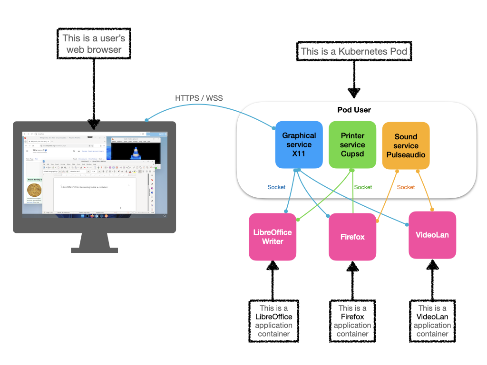
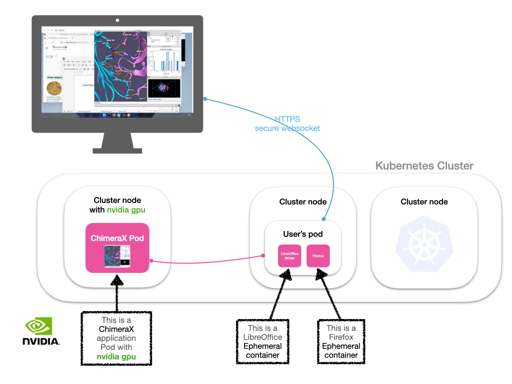
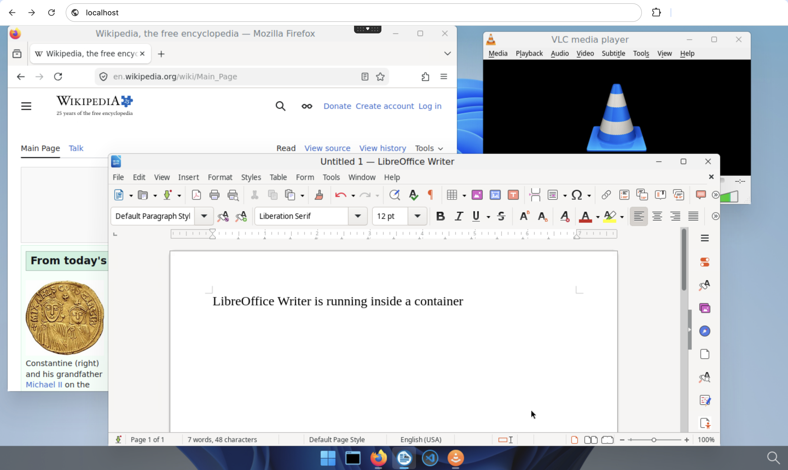

---
hide:
  - navigation
  - toc
title: abcdesktop.io — Cloud-Native Kubernetes Virtual Desktop
summary: Cloud-native, containerized graphical application desktop with remote browser isolation and remote application isolation
description: abcdesktop.io is a cloud-native, Kubernetes-native virtual desktop platform delivering remote browser isolation (RBI) and remote application isolation (RAI) accessible from any HTML5 web browser — no client-side installation required.
keywords: remote browser isolation, remote application isolation, graphical application container, desktopless, kubernetes, secure desktop, cloud native, telecommuting, virtual desktop infrastructure, VDI, VNC, digital workspace, reduce attack surface, BYOD, bring your own device, noVNC, RDP, citrix alternative, sovereign cloud, zero-trust desktop

tags:
  - home
---

# abcdesktop.io — Cloud-Native Kubernetes Virtual Desktop

**abcdesktop.io** is a cloud-native virtual desktop platform built on and for [Kubernetes](https://kubernetes.io/). It delivers **Remote Browser Isolation (RBI)** and **Remote Application Isolation (RAI)** — two core security paradigms that eliminate the traditional attack surface by running every application, including web browsers, inside isolated containers on the server side. The user's endpoint device acts as a pure display client, receiving only rendered pixels over an encrypted HTML5 WebSocket stream.

abcdesktop.io is also a complete workspace environment accessible from any HTML5-capable web browser, with no software installation required on the client device. Like the serverless computing model, **desktopless computing** dynamically allocates desktop resources on demand within the cluster, tearing them down when the session ends. Each user's desktop and every application runs as a dedicated Kubernetes pod or ephemeral container, enforcing strict workload isolation and dramatically reducing the blast radius of any potential compromise.

abcdesktop.io is a free, open-source solution that provides seamless, secure access to desktops and applications from any device or operating system. Source code and container images are published at [https://github.com/abcdesktopio](https://github.com/abcdesktopio).

---

## Remote Browser Isolation (RBI)

**Remote Browser Isolation** is a security architecture in which the web browser engine executes entirely within an isolated container on the server, rather than on the user's local device. Only the rendered visual output is transmitted to the client browser as a pixel stream over an encrypted WebSocket connection.

With abcdesktop.io, Firefox (or any other supported browser application) runs as a dedicated container inside the Kubernetes cluster. The user's local machine never directly executes any web content, scripts, or plugins. This architecture provides:

- **Zero local execution risk** — Malicious JavaScript, drive-by downloads, and browser exploits are fully contained within the isolated container, which is discarded at session end.
- **Centralized network traffic control** — All web traffic originates from the cluster's egress point, enabling centralized filtering, DLP inspection, and full audit logging.
- **Instant remediation** — Compromised browser containers are terminated and replaced in seconds, with no residual state on the endpoint.
- **Policy enforcement at scale** — Browser version, extensions, and security settings are enforced via the container image definition, not left to end-user discretion.
- **Clipboard isolation** — Clipboard content can be inspected and filtered before being passed to the client, preventing data exfiltration via copy-paste.
- **Zero-trust endpoint integration** — The client device executes no application code; it functions solely as a thin display terminal.

abcdesktop.io supports the complete Remote Browser Isolation use case, including clipboard isolation policies, file download controls, and session recording capabilities.

---

## Remote Application Isolation (RAI)

**Remote Application Isolation** extends the isolation paradigm beyond the web browser to **any X11 or GUI application** — office suites, CAD tools, IDEs, terminal emulators, media players, database clients, and Windows applications via Wine. With abcdesktop.io, every application runs as a discrete, ephemeral container inside the Kubernetes cluster. The endpoint receives only the rendered graphical output as a pixel stream.

Key RAI capabilities in abcdesktop.io:

- **Per-application containers** — Each application instance runs in its own container namespace, providing kernel-level isolation between applications and between users.
- **Ephemeral by design** — Application containers are created on launch and destroyed on exit, leaving no persistent footprint on the host node.
- **GPU acceleration support** — NVIDIA GPU resources can be assigned to specific application containers for compute-intensive and GPU-accelerated workloads.
- **Windows application support** — Legacy Windows applications run inside Wine-based containers, isolated from the host OS and from each other.
- **Kubernetes-native scheduling** — Application pods are scheduled across cluster nodes using standard Kubernetes mechanisms, enabling resource quotas, node affinity rules, taints, and tolerations.
- **Attack surface reduction** — Application vulnerabilities are contained within short-lived containers that are automatically discarded at session end.

---

## Architecture Overview

abcdesktop.io distributes workloads across the Kubernetes cluster. User applications are deployed as `pods` or as `ephemeral containers` on any cluster node, leveraging Kubernetes' built-in scheduling, autoscaling, and resource management capabilities. The control plane (`pyos`) manages the full lifecycle of user sessions and application containers.

---

## Quick Online Preview — Release {{ abcdesktop.latest_release }}

Explore abcdesktop.io's desktopless capabilities on the public demo instance at [https://demo.gcp.abcdesktop.com](https://demo.gcp.abcdesktop.com). The demo illustrates the complete desktop provisioning lifecycle: authentication via an OpenID Connect provider (Google, GitHub, or Facebook), pod creation, application launch, and automatic session termination by the garbage collector after a 10-minute idle period.

The demo enforces production-grade security policies: outbound network requests from the desktop pod are blocked by default, and clipboard isolation is active. The CUPS printing service and PulseAudio sound service are both enabled within the demo pod.

> **Note:** The demo instance is for evaluation purposes only. Desktop sessions are automatically terminated after 10 minutes by the garbage collector.

To access the demo, go to [https://demo.gcp.abcdesktop.com](https://demo.gcp.abcdesktop.com).

---

## Screenshot

---

## Feature Set

### Security and Isolation

- **Remote Browser Isolation (RBI)** — Browsers run entirely within isolated Kubernetes containers; only rendered pixels reach the client device.
- **Remote Application Isolation (RAI)** — Any GUI application runs in a dedicated, ephemeral container with full kernel-level workload isolation.
- **Zero-trust endpoint model** — The client device executes no application code and functions solely as a display terminal.
- **Per-user pod isolation** — Each authenticated user receives a dedicated pod with its own network namespace, preventing cross-user data leakage.
- **Attack surface reduction** — Application vulnerabilities are contained within short-lived containers that are discarded at session end.
- **Clipboard isolation and control** — Clipboard data is filtered and inspected server-side before being transmitted to the client.

### Authentication

- OAuth 2.0 / OpenID Connect (Google, GitHub, Facebook, and any OIDC-compliant provider)
- LDAP and LDAPS bind authentication
- Microsoft Active Directory authentication with Kerberos and NTLM support
- Active Directory domain trust and cross-forest authentication (via `metaexplicit` provider)
- Anonymous (implicit) authentication for open-access deployments
- SSL/TLS client certificate authentication

### Storage and Home Directory

- User home directory access with `homeDirectory` attribute support in Active Directory
- NFS, hostPath, and S3-compatible persistent volume support
- Legacy CIFS/SMB volume mounting via Kubernetes FlexVolume driver
- Shared volumes across user pods

### Application Runtime

- Native GNU/Linux X11 application support
- Native GNU/Linux console (terminal) application support
- Microsoft Windows application support via [Wine](https://www.winehq.org/)
- All applications run as containers — as Kubernetes `pods` or as `ephemeral containers`
- NVIDIA GPU assignment to application containers
- Application lifecycle managed via OCI image labels

### Workspace and Productivity

- Complete cloud-native desktop workspace environment
- No client-side installation required — accessible from any HTML5 web browser
- Offline session persistence — sessions survive transient network interruptions
- Application updates delivered via private container registry image updates
- Clipboard synchronization over HTTPS
- Audio streaming via FFmpeg/PulseAudio
- Local printing support via CUPS

### Observability and Reporting

- Audit logging via Syslog and Graylog
- Metrics export to Prometheus and Grafana dashboards
- Per-user session accounting and reporting
- RFC 2307 support for using LDAP as a Network Information Service (NIS)

---

## Use Cases

abcdesktop.io's RBI and RAI architecture addresses a broad range of enterprise, government, and cloud use cases:

| Use Case | Description |
|---|---|
| **Remote Browser Isolation (RBI)** | Run web browsers in isolated containers; protect endpoints from web-based threats without installing any security agent on the client device. |
| **Remote Application Isolation (RAI)** | Deliver any GUI application to any device with full server-side isolation and zero client footprint. |
| **Secure Zone Separation** | Enforce a hard boundary between production-grade secure zones and lower-trust user zones, analogous to a bastion host architecture. |
| **Telecommuting / Remote Work** | Provide employees with full desktop environments from any location and any device. |
| **BYOD (Bring Your Own Device)** | Enable corporate application access from personal, unmanaged devices without installing enterprise software on the endpoint. |
| **Temporary Contractor Access** | Grant time-limited, policy-controlled desktop access to external contractors or guests without provisioning full user accounts. |
| **Desktop as a Service (DaaS)** | Provision on-demand desktops at scale using Kubernetes resource management and autoscaling capabilities. |
| **Training Environments** | Deploy ephemeral training desktops pre-loaded with required applications; resources are reclaimed automatically after sessions end. |
| **Sovereign Cloud Desktop** | Retain full control over desktop infrastructure and user data within your own Kubernetes cluster and data center. |
| **Legacy Application Modernization** | Deliver legacy Windows or X11 applications to modern devices via containerized isolation, without refactoring the underlying application. |
