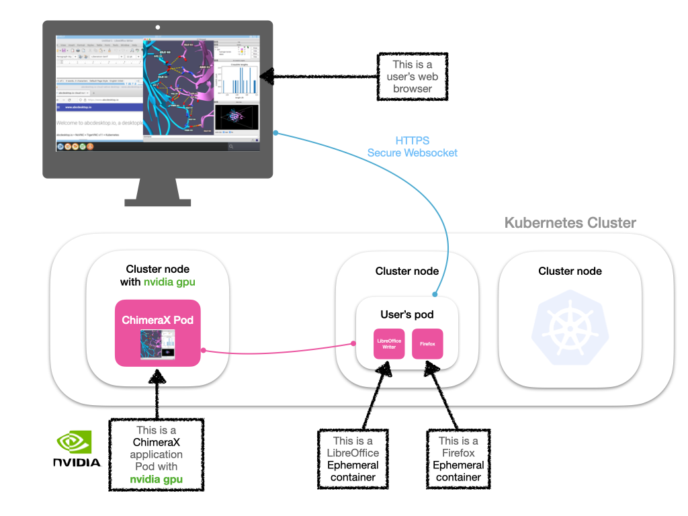
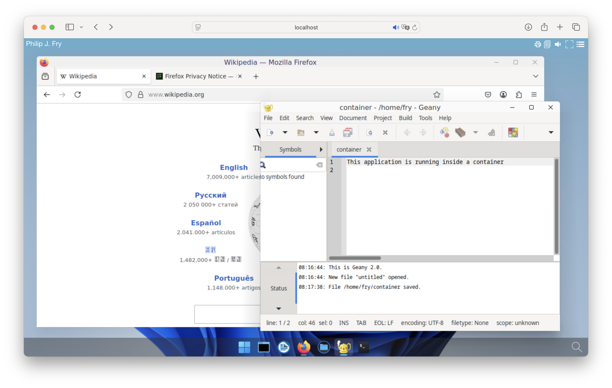

---
hide:
  - navigation
  - toc
title: abcdesktop.io cloud native desktop
summary: cloud container graphical application container desktop
description: cloud native desktop complete workspace environment accessible from a web browser
keywords: graphical application container desktopless kubernetes secure desktop container cloud native telecommuting remove virtual on demand vdi vnc digital workspace reduce attack surface byod bring your own device reduce attack surface novnc rdp citrix sovereign

tags:
  - (JFV) propositions de maj
  - (JFV) problèmes doc
---

# abcdesktop.io is a kubernetes virtual desktop service [VDI]

abcdesktop.io is a cloud native desktop service built on and for [Kubernetes](https://kubernetes.io/). abcdesktop.io is also a complete work environment accessible from a simple HTML 5 web browser, without any installation on client side. Like serverless does, desktopless computing allocates desktop resources dynamically on demand inside the cloud. Each user’s application runs as a container to reduce attack surface. With abcdesktop take the sovereignty of your virtual desktop.

abcdeskop.io is an open source and free solution that offers seamless access to secure desktops and applications on any device, follow the [https://github.com/abcdesktopio](https://github.com/abcdesktopio) links for more information.

This flexible working environment simplifies usage like

- Separation between production secure zone and less secured user zone, like a bastion does
- Telecommuting
- Remote virtual desktop
- Give temporary access to other contractors or guests
- Training
- BYOD, Bring Your Own Device
- Desktop On Demand, Desktop as a service

With abcdesktop, you can take advantage of all the power of your Kubernetes cluster for your virtual workstations. You can distribute user applications as `pods` or as `ephemeral containers` on all cluster nodes.

## Quick online preview latest release {{ abcdesktop.latest_release }}

You can discover abcdesktop.io desktopless services on the demo website. [https://demo.abcdesktop.io](https://demo.abcdesktop.io) instance is a quick example to illustrate how the abcdesktop.io project works. Your desktopless is ready to run up to 10 minutes, and will be terminated by the garbage collector after 10 minutes. It requires an OpenID Connect provider to sign-in like (Google, Facebook, Github). The security policy for Internet network prevents requests from your abcdesktop being allowed. Printer service (using cups) and sound service (using pulseaudio) inside the kubernetes pods are enabled.

To reach the demo website, follow the link [https://demo.abcdesktop.io](https://demo.abcdesktop.io)

## abcdesktop.io: a container VDI service

**[JFV] --> je suis géné, c'est une reformulation du paragraphe tout en haut.**

abcdesktop.io provides the easiest way to run graphics software securely isolated in a container, and use a web browser HTML5 as display device. Because containers are lightweight and run without the extra load of an operating system, you can run many graphical applications on a single kernel or even on a kubernetes cluster.

## Features

- Complete native cloud desktop, workspace environment
- Authentification OAuth 2.0, LDAP bind, LDAPS bind, Active Directory, Active Directory trust, Kerberos, NTLM
- Access to the user home directory (homeDirectory support in Active Directory)
- Legacy CIFS FlexVolume using kubernetes driver
- All graphical applications run inside containers, as pods or as ephermeral containers
- Local printing support
- Off-line sessions are maintained
- No need to install application on the local device
- Application update, run latest image on your private registry
- Accounting and reporting (Syslog, Graylog, Prometheus and Grafana)
- Clipboard syncing with https
- Sound support with ffmpeg
- Nvidia GPU support for applications
- Support RFC 2307 to use LDAP as a Network Information Service

### Applications

- Native support GNU/Linux console native support
- Native support GNU/Linux X11 applications native support
- Support Microsoft Windows applications using [Wine](https://www.winehq.org/)
