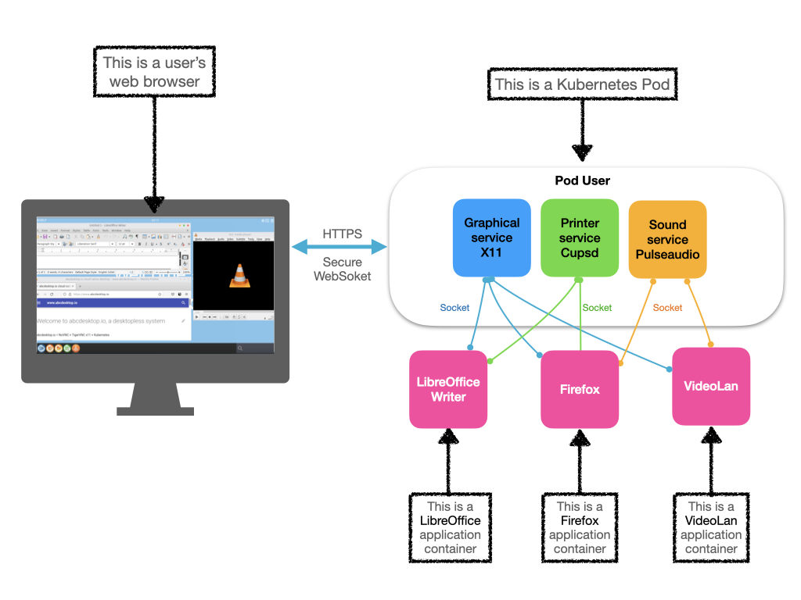

# abcdesktop.io is a desktopless system

abcdesktop.io is a cloud native desktopless system and a complete work environment accessible from a simple HTML 5 web browser, without any installation. Like serverless does, desktopless computing allocates desktop resources on demand.  **Each user’s application runs as a container** to reduce attack surface.



abcdeskop.io is an open source and free solution that offer seamless access to secure desktops and applications on any device, follow the [https://github.com/abcdesktopio](https://github.com/abcdesktopio) links.

This flexible working environment simplifies usage like

- Telecommuting
- Remote virtual desktop 
- Give temporary access to other contractors or guests
- Training  
- BYOD, Bring Your Own Device
- Desktop On Demand, Desktop as a service

## Quick online preview
You can discover abcdesktop.io desktopless services on the demo website. [https://demo.abcdesktop.io](https://demo.abcdesktop.io) instance is a quick example to illustrate how the abcdesktop.io project works. Your desktopless is ready to run for 10 minutes, and will be terminated by the garbage collector after 10 minutes. It requires an OpenID Connect provider to sign-in like (Google, Facebook, Github). The security policy for Internet network prevents requests from your abcdesktop being allowed. Printer service (using cups) and sound service (using pulseaudio) inside the kubernetes pods are enabled.

To reach the demo website, follow the link [https://demo.abcdesktop.io](https://demo.abcdesktop.io)


## abcdesktop.io: a docker VDI service

abcdesktop.io provides a way to run graphics software securely isolated in a docker container, and use a web browser HTML5 as display device. Because docker containers are lightweight and run without the extra load of an operating system, you can run many graphical applications on a single kernel or even on a kubernetes cluster.


## Quick installation for kubernetes
You can watch the youtube video sample. This video describes the Quick installation process.

<iframe width="640" height="480" src="https://www.youtube.com/embed/KpjG4ksoGNI" allow="accelerometer; autoplay; encrypted-media; gyroscope; picture-in-picture" allowfullscreen> </iframe>

Download and extract the latest release automatically (Linux or macOS) or read the step by step installation process [abcdesktop for kubernetes](/setup/kubernetes_abcdesktop/)

```
curl -sL https://raw.githubusercontent.com/abcdesktopio/conf/main/kubernetes/install.sh | sh -
```

## Quick installation for docker (personal use, Non-cluster mode)
You can watch the youtube video sample. This video describes the Quick installation process.

<iframe width="640" height="480" src="https://www.youtube.com/embed/_A80Sy9g28I" allow="accelerometer; autoplay; encrypted-media; gyroscope; picture-in-picture" allowfullscreen> </iframe>

Download and extract the latest release automatically (Linux or macOS) or read the step by step installation process [abcdesktop for docker](/setup/dockermode/)

```
curl -L https://raw.githubusercontent.com/abcdesktopio/conf/main/docker/install.sh | sh -
```


## Features

- Complete native cloud desktop, workspace environment
- Authentification OAuth 2.0, LDAP, LDAPS, Active Directory, Kerberos
- Access to the user home directory (homeDirectory support in Active Directory)
- Legacy CIFS FlexVolume using kubernetes driver 
- All applications run inside an isolated docker container
- Local and remote printing support 
- Off-line sessions are maintained
- No need to install applications any more
- Application update, run latest docker image
- Accounting and reporting (Graylog, Prometheus Grafana)
- Clipboard syncing
- Sound support with [Janus WebRTC Gateway](https://janus.conf.meetecho.com/) and RTP stream

### Applications

- Native support GNU/Linux console native support
- Native support GNU/Linux X11 applications native support
- Support Microsoft Windows applications using wine

### Supported web browser HTML

abcdesktop.io uses many modern web technologies. However these are the minimum versions we are currently aware of:

* Chrome 49, 
* Firefox 58, 
* Safari 11, 
* Opera 36,  
* Microsoft Edge (based on Chromium)

#### copy and paste features
To fully use `copy and paste` features, from your local device to your abcdesktop (and vice versa), choose `Chrome`, Chromium or  Microsoft Edge Chromium. The `copy and paste` feature is also supported on Firefox with a [dedicated abcdesktop extension](/common/firefox-extension).

| Web browser      | Clipboard sync                 |
|------------------|-------------------------------------|
|  Chrome     | Yes, built in support |
|  Chromium     | Yes, built in support  |
|  Microsoft Edge Chromium     | Yes, built in support  |
|  Firefox       | Yes, install the [dedicated abcdesktop extension](/common/firefox-extension)| 
|  Safari       | No, the clipboard access is not allowed by the user agent or the platform in the current context, possibly because the user denied permission| 

### Not supported web browser

abcdesktop.io does NOT support Microsoft Internet Explorer from version 1.x to 11.x. If you need a Microsoft web browser use Microsoft Edge. Edge is based on the Chromium open-source project. Chromium forms the basis of Google Chrome, so the new Edge feels very similar to Google Chrome.


## Release history

| Release  | Status |  Date  | Requirements               |
|----------|--------|--------|----------------------------|
|  1.1     | stable |  09/15/2021   | dockerd for personnal use and kubernetes |
|  2.9     | Release candidate 9 | 29/08/2022      | require kubernetes < 1.24 and dockerd as container engine  |
|  3.0     | Beta  | 09/03/2022 | kubernetes >= 1.24, all container engine  |

## Github repositories 

abcdesktop has 36 repositories available. Follow the code on GitHub [https://github.com/abcdesktopio](https://github.com/abcdesktopio) to get the source code.

