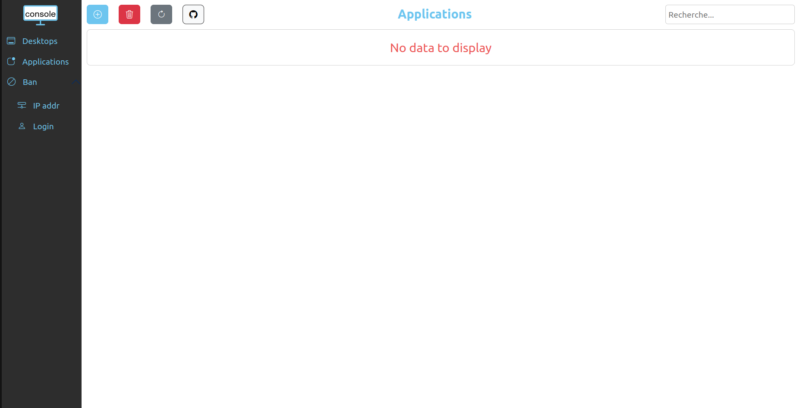
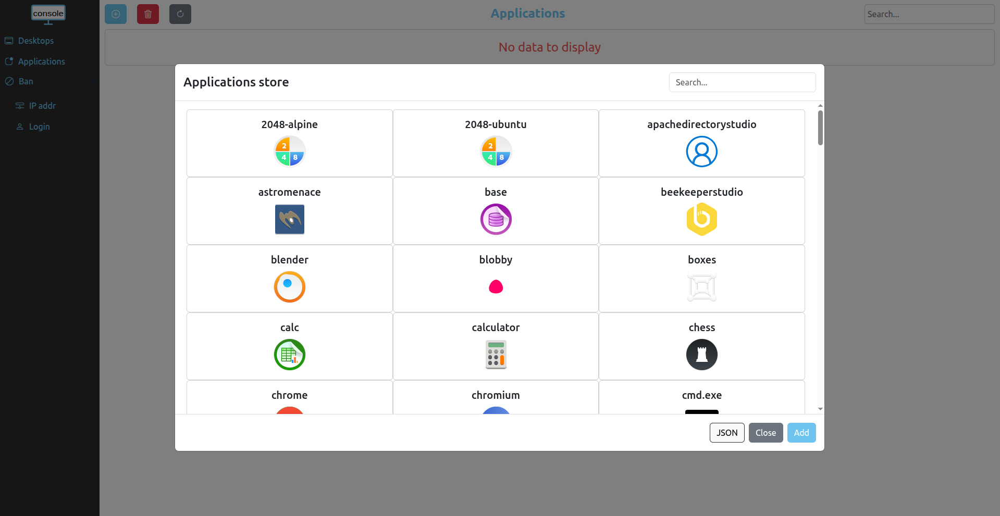
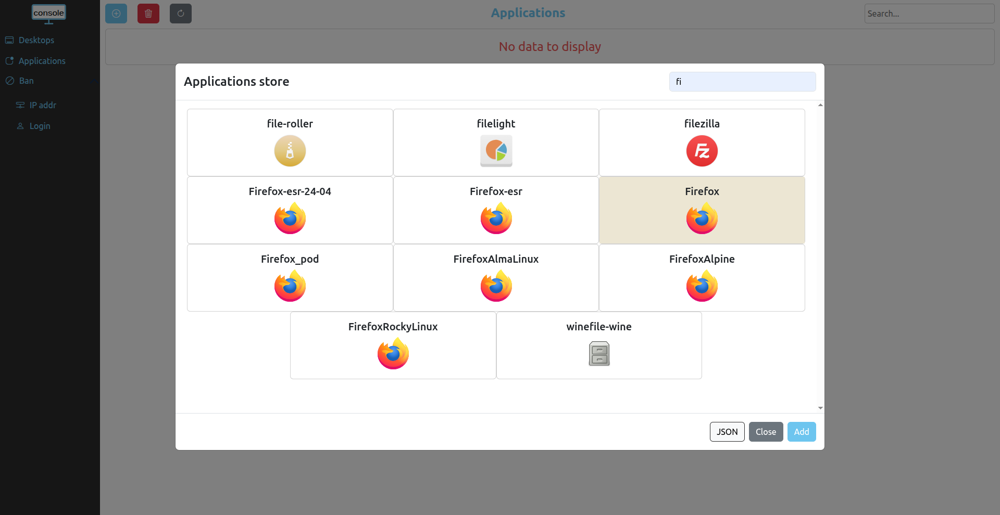
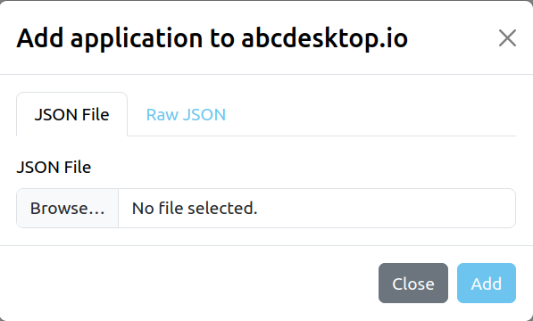
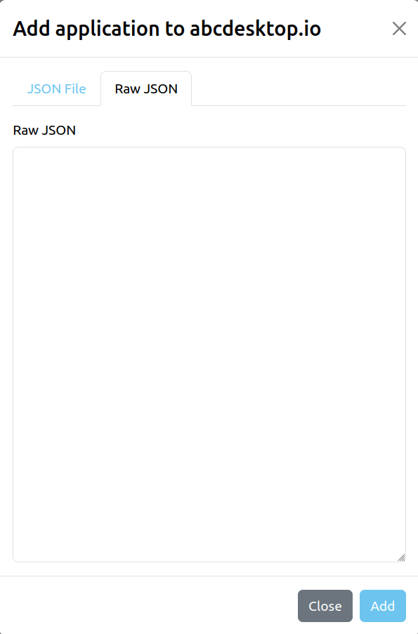
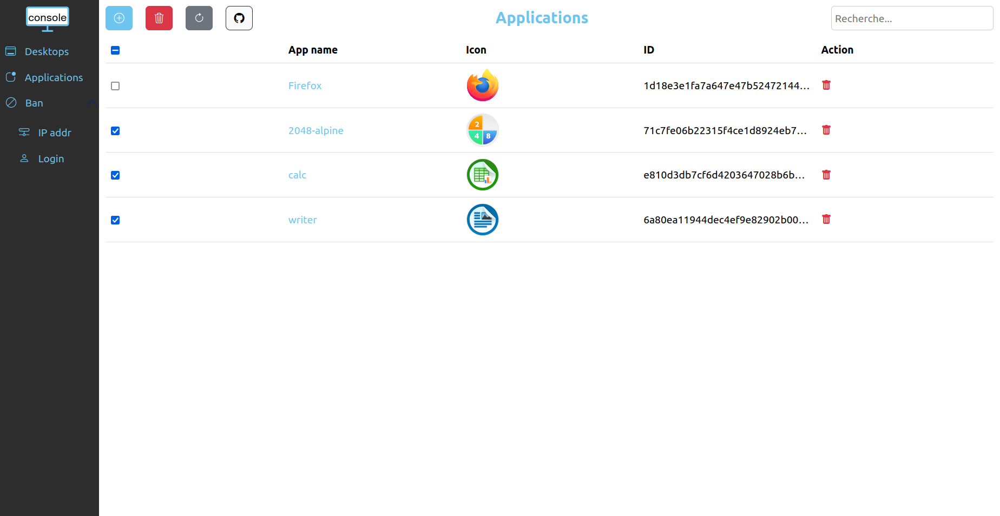
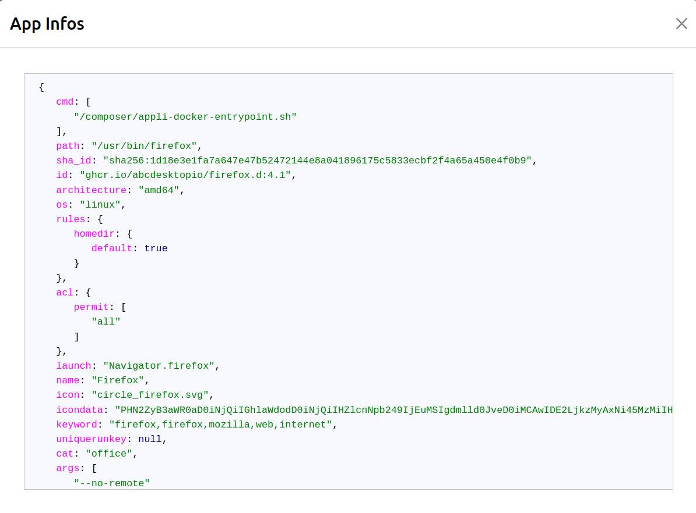

# Applications management with console

To access console applications management page, please connect to 

```
http://<YOUR_ABCDESKTOP_URL>:<YOUR_PORT>/console#/apps
```



## Add application

On the application page, click on the blue + button. You will have two possibilities :

- Add from the applications store
- Add from JSON file

#### Add from application store

Through this modal window, you can add application by exploring the application store, click on the app you want to add, its background color should change to indicate that the app has been selected, and finally click on the Add button.  

 

Also, as there are quite a few applications, you can use the search bar on the to right corner to help you find the app you are searching for.



Note that clicking on the JSON button will open a modal that allows you to add applications from JSON file as shown below.

#### Add from JSON file

Through this modal window, you can add applications by uploading a JSON file or by copy-pasting directly the JSON raw content in the text area.

 


Note that the github button will send you directly to the abcdesktop github applications page.

### Delete application

To delete applications one by one you can click on the red trash at the end oh the line on the row where the app you want to delete is located.  
Or if you want to delete several applications at the same time you can select them and click on the red trash button above the table to delete all the selected applications.



### Gathering more informations

If you want to get more informations about an application, just click on the name of the app to display the whole json file of the app.


