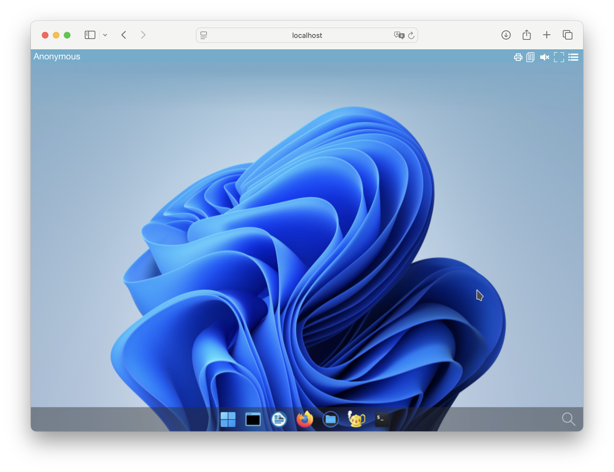
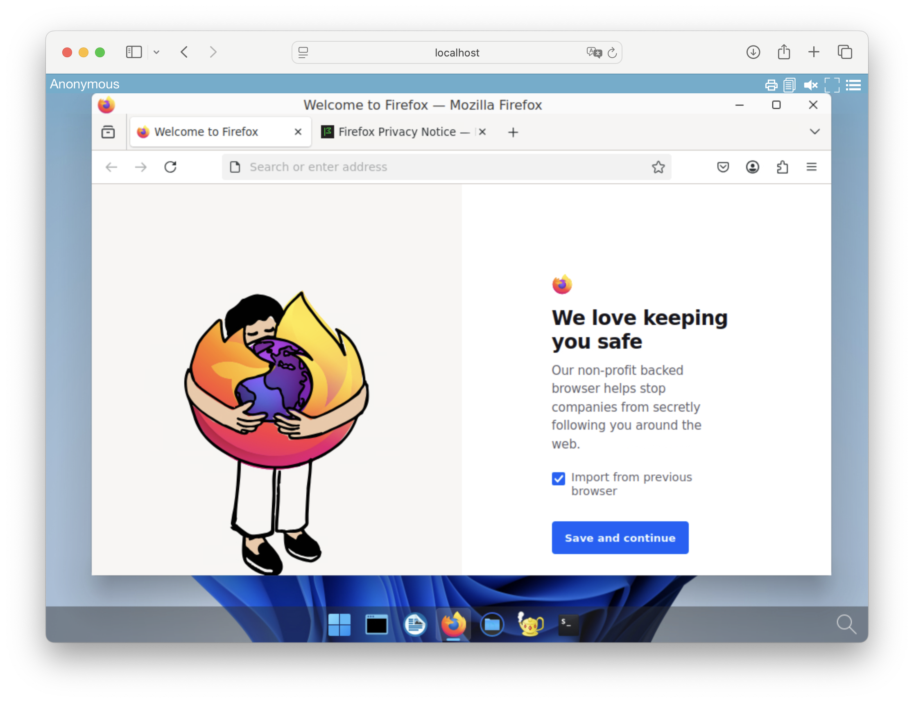

---
tags:
  - application
  - installation
  - bash
---

# Add applications with a script

=== "Linux or macOS"

    ## Quick application install

    > Quick installation can be run on Linux or macOS operation system.

    Download and run the `pullapps-{{ abcdesktop.latest_release }}.sh` script :

    ```bash
    curl -sL https://raw.githubusercontent.com/abcdesktopio/conf/main/kubernetes/pullapps-{{ abcdesktop.latest_release }}.sh | bash
    ```

    You can watch the youtube video sample. This video describes the application installation process on a fresh kubernetes cluster.

    <div style="display: flex; justify-content: center;"><iframe width="640" height="480" src="https://www.youtube.com/embed/JSIjnNA6kNE" allow="accelerometer; autoplay; encrypted-media; gyroscope; picture-in-picture" allowfullscreen> </iframe></div>


    ## Connect to your abcdesktop

    The API server receives a new image event from docker daemon. To run the new applications just refresh you web browser page.

    Now reconnect to your abcdesktop.

    Open your navigator to http://[your-ip-hostname]:30443/

    ```url
    http://localhost:30443/
    ```

    The new applications are installed, and ready to run.

    

    And then you can start new applications like `Firefox`

    

    Another example with console admin interface usage

    <div style="display: flex; justify-content: center;"><iframe width="640" height="480" src="https://www.youtube.com/embed/Dah78eAJykw" allow="accelerometer; autoplay; encrypted-media; gyroscope; picture-in-picture" allowfullscreen> </iframe></div>

=== "Windows"

    ## Quick application install

    > Quick installation can be run on Windows operation system.

    Download and run the `pullapps-{{ abcdesktop.latest_release }}.ps1` script :

    ```bash
    curl -sL https://raw.githubusercontent.com/abcdesktopio/conf/main/kubernetes/pullapps-{{ abcdesktop.latest_release }}.ps1 | bash
    ```

    You can watch the youtube video sample. This video describes the application installation process on a fresh kubernetes cluster.

    <div style="display: flex; justify-content: center;"><iframe width="640" height="480" src="https://www.youtube.com/embed/JSIjnNA6kNE" allow="accelerometer; autoplay; encrypted-media; gyroscope; picture-in-picture" allowfullscreen> </iframe></div>


    ## Connect to your abcdesktop

    The API server receives a new image event from docker daemon. To run the new applications just refresh you web browser page.

    Now reconnect to your abcdesktop.

    Open your navigator to http://[your-ip-hostname]:30443/

    ```bash
    http://localhost:30443/
    ```

    The new applications are installed, and ready to run.

    

    And then you can start new applications like `Firefox`

    

    Another example with console admin interface usage

    <div style="display: flex; justify-content: center;"><iframe width="640" height="480" src="https://www.youtube.com/embed/Dah78eAJykw" allow="accelerometer; autoplay; encrypted-media; gyroscope; picture-in-picture" allowfullscreen> </iframe></div>

