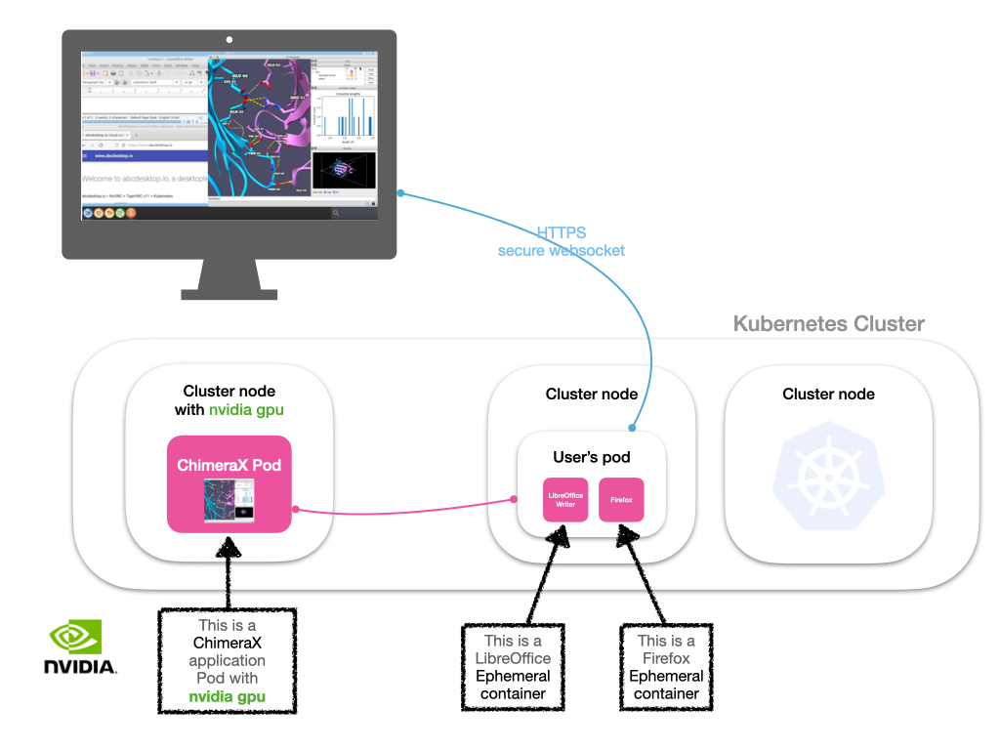
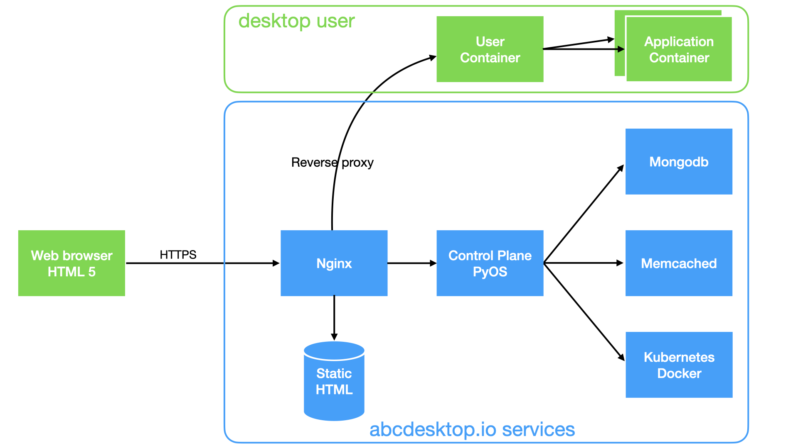

# abcdesktop overview

abcdesktop is based on kubernetes, from the abcdesktop infrastructure to the user applications.
At the login page, the user chooses a login provider and authenticates himself, then abcdesktop engine creates a pod for this user.

# abcdesktop applications

An application can run as ephemeral container or as pod.

## abcdesktop design

### abcdesktop services

* `nginx` : container act as static web server and reverse proxy router
* `pyos`  : container abcdesktop core control plane
* `memcached` : container cache service
* `mongo`     : container database service to store user profil data

### abcdesktop pod user

* `user` : pod user, one pod per connected user
* `applications` : each graphical application runs inside a dedicated container. You need to create an container image for each application

## applications

* An application can run as ephemeral container or as pod, it MUST be a container.
* An application can ask to start another container, like `application helper` for a web browser. By example, `firefox` container can ask to start `videolan` application. Then `firefox` is running inside a container, `videolan` is running inside another separated container. 
* abcdesktop manages a mimetype database for each application. The mimetype database is updated on the fly then new application is added.
* Application resource limit is supported (CPU, memory) on pod.
* The share memory `/dev/shm` between X.org and application is supported with the ephemeral container.
* Application support ACL (Access Control List). Access to an application can be allowed for a user and denied for another one, using group membership for example.
* Volumes can be mounted for an application or not for security reason.
* Application can bind a dedicated network by using annotations.
* Application can use GPU by using labels.
