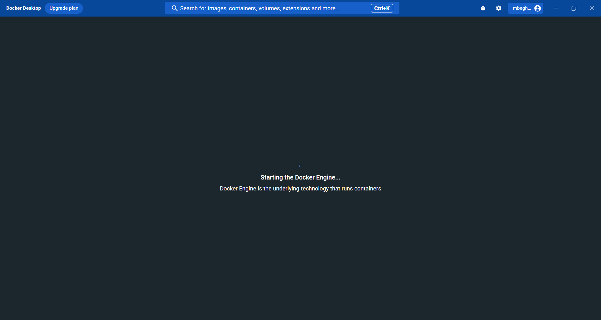
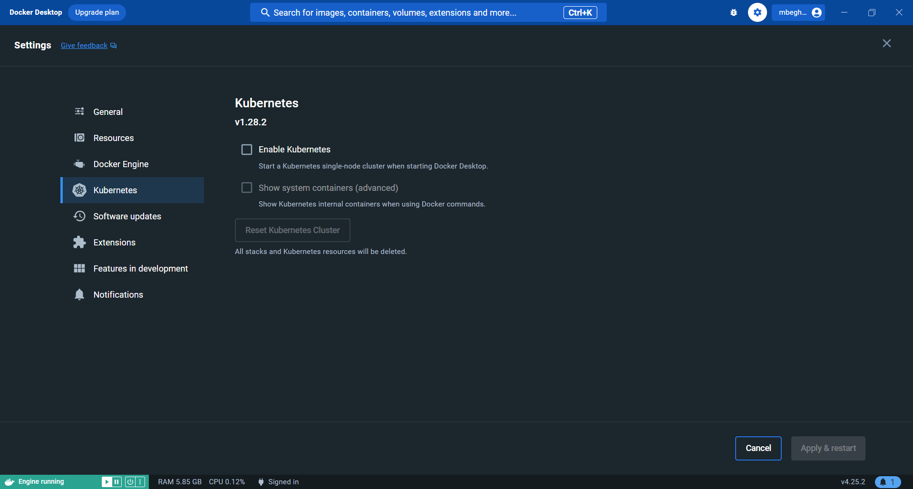
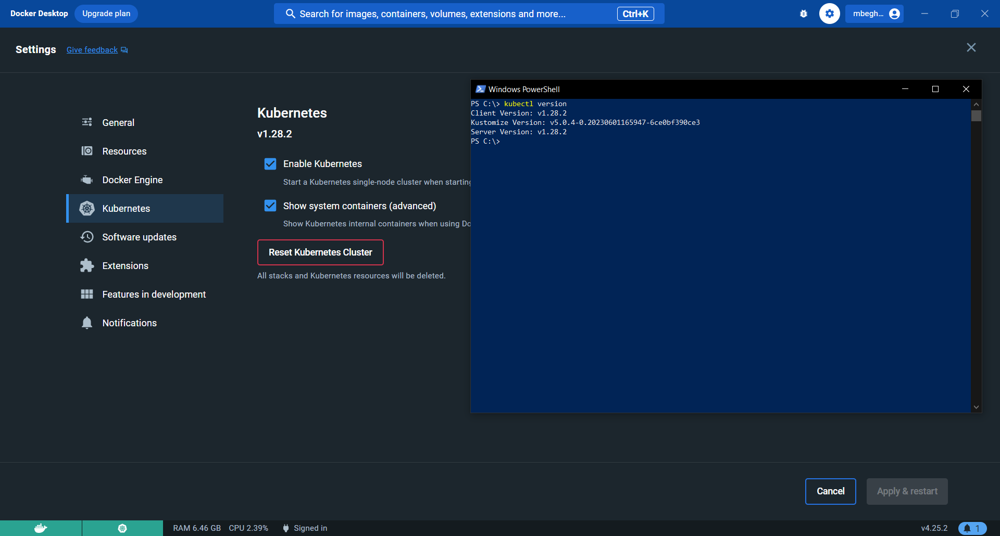
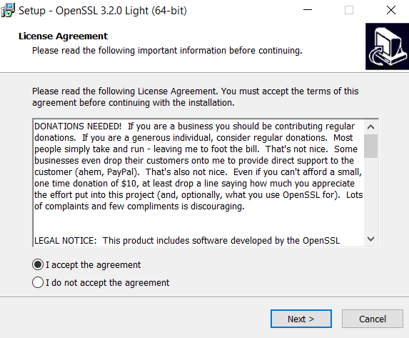
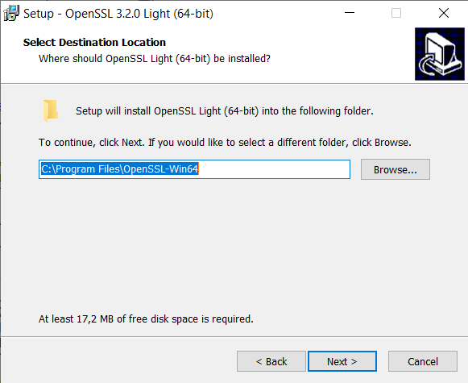
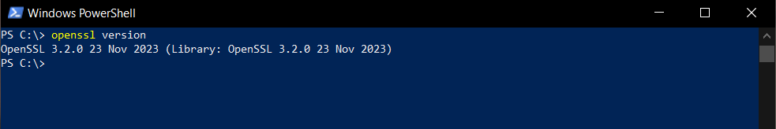

# Requirements

## General requirements

- kubernetes cluster `READY` to run
- `kubectl` or `minikube` command-line tool must be configured to communicate with your cluster. 
- `openssl` and `curl` command line must be installed too (only for install using kubectl). 

## Requirements for minikube 

To fix this issue

```
FailedScheduling 0/1 nodes are available: 1 Insufficient cpu. preemption: 0/1 nodes are available: 1 No preemption victims found for incoming pod
```

Start minikube with enough cpu and memory resources to start all abcdesktop's pods and the user's desktop

```
minikube start --cpus 4 --memory 4096
```

## Requirements for Windows

### Install and configure Docker Desktop

To run abcdesktop on Microsoft Windows plateform you need to use [docker desktop](https://www.docker.com/products/docker-desktop/)

Start `Docker Desktop` and wait for the docker engine to start.



Once started go to the `Settings | Kubernetes` and click on `Enable Kubernetes`, starting your cluster may take a while.



Now your cluster should be correctly initialized, you can check it by opening a new PowerShell and run the command `kubectl version`

```
kubectl version
client version: V1.40.4
Kustomise Version: V9-0-4-0.202506011699445602001590025
Server Version: v1.28.2
```



### Install OpenSSL

abcdesktop install process creates RSA keys using openssl, you need to install `openssl` command line.

Download the [OpenSSL v3.2.0 Light](https://www.openssl.org/source/) executable file.


Then follow the install process.



Make sure to keep in mind the path where OpenSSL will be installed.



Once installed, go to "Edit the system environement variables", and click on "Environement variables".


Go to the system variables section and search for `Path` 


Click on `Edit` and add a new `Path`, you have to paste the absolute path to the bin folder of OpenSSL.


Now `OpenSSL` should be correctly installed, you can check it by opening a new PowerShell and run the command 

```
openssl version
```


