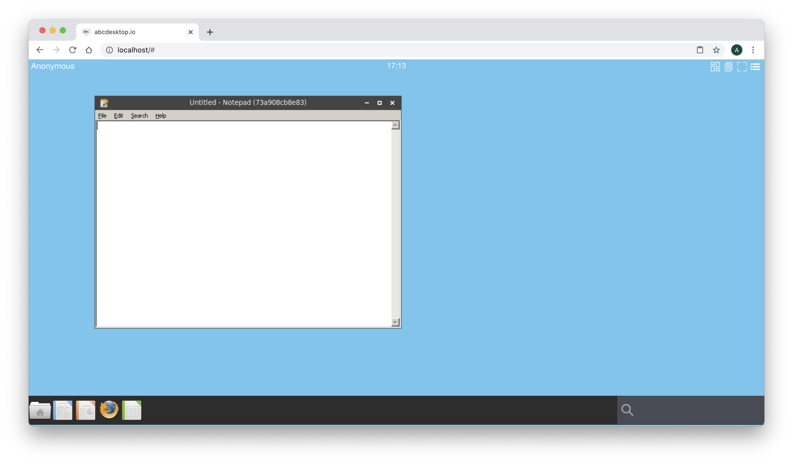

# Run docker image for Windows using Wine

## Requirements

- Read the previous chapter [Build abcdesktop docker image](applications.md)
- Read the [Chapter Authentification explicit for LDAP Directory Services](/config/authexplicit-ldap/) is recommended but not mandatory.

## WineHQ

[Wine](http://www.winehq.org) (originally an acronym for "Wine Is Not an Emulator") is a compatibility layer capable of running Windows applications on several POSIX-compliant operating systems, such as Linux, macOS, & BSD. Instead of simulating internal Windows logic like a virtual machine or emulator, Wine translates Windows API calls into POSIX calls on-the-fly, eliminating the performance and memory penalties of other methods and allowing you to cleanly integrate Windows applications into your desktop.

To run Windows applications abcdesktop.io use WineHQ. A dedicated image template source is ready to use as source of others Windows applications. This image template is named ```abcdesktopio/oc.template.gtk.wine.50```

Start pulling this template image :

```bash
docker pull abcdesktopio/oc.template.gtk.wine.50
```

Look at the Dockerfile writed to build the ```abcdesktopio/oc.template.gtk.wine.50``` on the ```https://hub.docker.com/``` web site.

For a better support, we are using the 32 bits library, as i386 libs on GNU/Linux.  Your can read in the Dockerfile, how the ```abcdesktopio/oc.template.gtk.wine.50``` is created.

> Dockerfile information :
> 
> ```dpkg --add-architecture i386```
> ```apt-add-repository 'deb https://dl.winehq.org/wine-builds/ubuntu/ bionic main'```
> ```aptitude install -y winehq-stable fonts-wine```


### Run notepad.exe for Windows in a Docker container

> In this chapter we are going to run ```notepad.exe``` for Windows inside a docker container for abcdesktop.io.

Start an abcdesktop session. You can use an authenticated session using an authentication provider ```external``` or ```explicit```, or you can do this exercice using Anonymous Authentification also know as the authentication provider ```implicit```.

>In this chapter we choose an Anonymous, **DO NOT CLOSE YOUR WEB BROWSER**, you should not be able de reconnect with the same user context, and have to restart this exercice at the begining, else you can choose to configure abcdesktop with ldap authentification.


Login using the ```Anonymous``` authentification provider.


Keep your web browser open, then on your host, open a terminal shell window and run the command 

```
docker ps --filter ancestor=abcdesktopio/oc.user.18.04
```

The option ```--filter ancestor=abcdesktopio/oc.user.18.04``` ask to filter only container with the image ```ancestor``` set with value ```abcdesktopio/oc.user.18.04```
You should read the container with the image named abcdesktopio/oc.user.18.04 

```
docker ps --filter ancestor=abcdesktopio/oc.user.18.04
CONTAINER ID   IMAGE                        COMMAND                  CREATED         STATUS         PORTS                                                            NAMES
86df3ff126ac   abcdesktopio/oc.user.18.04   "/composer/docker-en…"   3 minutes ago   Up 3 minutes   4714/tcp, 6081/tcp, 29780-29781/tcp, 29783-29784/tcp, 29786/tcp  g-5f4300d2-7c8e-43c6-89ab-f85bd8b68138
```

Read the values ```CONTAINER ID``` and ```NAMES```

In this example, the CONTAINER ID is ```86df3ff126ac``` and the NAME is ```g-5f4300d2-7c8e-43c6-89ab-f85bd8b68138```.

We are using the ```/tmp``` volume of this ```CONTAINER ID``` 86df3ff126ac

Using an anonymous authnetification, the name of your container id is an [UUID](https://en.wikipedia.org/wiki/Universally_unique_identifier), for example ```57be1e5b-0b14-4c05-ae79-75e9a03c77be```. The name of the ```tmp``` volume is  ```tmp-57be1e5b-0b14-4c05-ae79-75e9a03c77be```


Run a ```docker inspect -f "{{ .HostConfig.Binds }}" ``` and add your ```CONTAINER ID``` as parameter.

```
docker inspect -f "{{ .HostConfig.Binds }}" CONTAINER_ID
```

For example
```
docker inspect -f "{{ .HostConfig.Binds }}" 86df3ff126ac
```

You should read the volume name starting by ```tmp-``` with your uuid concatened

```
[tmp-5f4300d2-7c8e-43c6-89ab-f85bd8b68138:/tmp home-5f4300d2-7c8e-43c6-89ab-f85bd8b68138:/home/balloon]
```


> Note: if your are using an LDAP authentification, the name of your container id is the username, for example ```hermes```. The name of the ```tmp``` volume is  ```tmp-hermes```


Now, start a new docker container with the same HostConfig.Bings as your oc.user container. The ```-v``` parameter is the first entry of the result in the previous command ```docker inspect -f "{{ .HostConfig.Binds }}" ```

```
docker run -it -v TMP_VOLUMENAME:/tmp  --user balloon abcdesktopio/oc.template.gtk.wine.50 bash
```

For example with an ```Anonymous``` user:

```
docker run -it -v  tmp-5f4300d2-7c8e-43c6-89ab-f85bd8b68138:/tmp --user balloon abcdesktopio/oc.template.gtk.wine.50 bash 
```

Great, you have started a new docker container. The oc.user containter and your new container are sharing the same volume mounted as ```/tmp```. You get a prompt inside the new docker container.

```
To run a command as administrator (user "root"), use "sudo <command>".
See "man sudo_root" for details.

balloon@8684ae888f74:~$
```

Set the ```DISPLAY``` environment variable to ```:0.0```

```
balloon@8684ae888f74:/$ export DISPLAY=:0.0
```

And now start the ```notepad.exe``` with wine

```
balloon@8684ae888f74:/$ wine notepad
```

After few seconds you should read on the standard error

```
balloon@8684ae888f74:/$  wine notepad
wine: created the configuration directory '/home/balloon/.wine'
0024:err:environ:run_wineboot boot event wait timed out
002c:err:winediag:nodrv_CreateWindow Application tried to create a window, but no driver could be loaded.
002c:err:winediag:nodrv_CreateWindow The explorer process failed to start.
0048:err:winediag:nodrv_CreateWindow Application tried to create a window, but no driver could be loaded.
0048:err:winediag:nodrv_CreateWindow The explorer process failed to start.
0024:err:winediag:nodrv_CreateWindow Application tried to create a window, but no driver could be loaded.
0024:err:winediag:nodrv_CreateWindow The explorer process failed to start.
balloon@8684ae888f74:/$ 0058:err:winediag:nodrv_CreateWindow Application tried to create a window, but no driver could be loaded.

```

Go back to you web browser with the abcdesktop window, ```Wine``` has opened a new window, and ask you to install ```wine-mono package``` which is need for .NET applications. 

Do not install the ```wine-mono package```, because we are only use ```notepad.exe``` and ```notepad.exe``` doesn't need .Net package (it should only use Win32 libs, i hope so).

Press ```Cancel``` button


Do not install the ```wine-gecko package```, we are only use ```notepad.exe``` and ```notepad.exe``` doesn't need HTML package. Press ```Cancel``` button.


And the notepad.exe should appears inside your Web browser



This Windows application is running inside a docker container on abcdesktop.io desktop.

In the Terminal shell press ```CTRL+C``` to stop the ```wine notepad``` process, then type ```exit``` to quit your shell in container.

```bash
^C0032:fixme:console:CONSOLE_DefaultHandler Terminating process 8 on event 0
balloon@4c4d806557dc:~$ exit
exit
```

It's time to build your own abcdesktop application image. Read the next chapter [Build abcdesktop.io docker image for Windows using Wine](buildapplications.wine.md).


