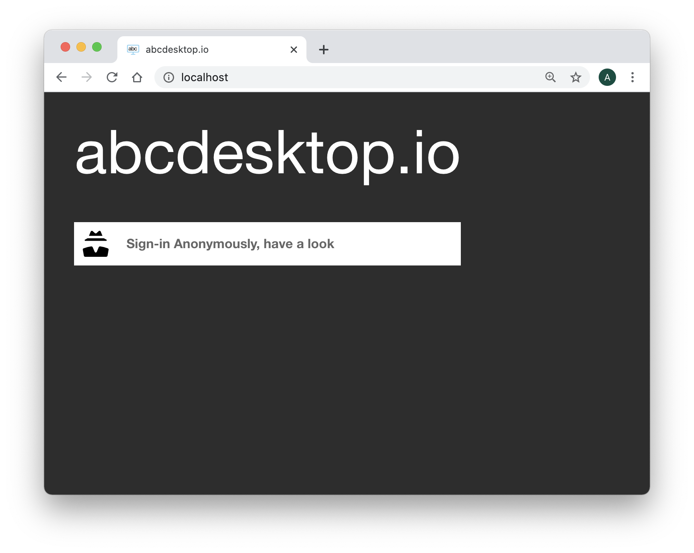
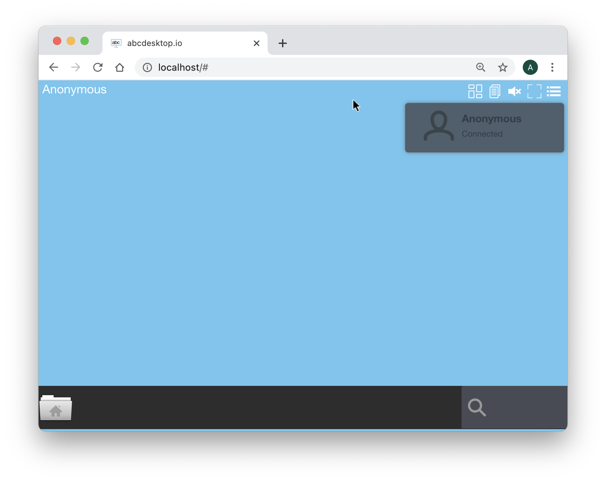
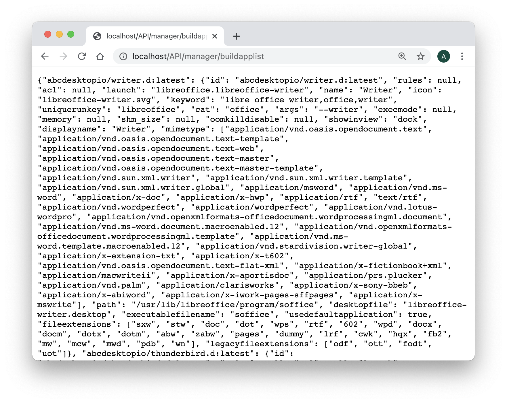

# abcdesktop.io for Non-cluster hosts

abcdesktop.io support Non-cluster hosts and kubernetes cluster hosts. In this section we will study how abcdesktop.io works in Non-cluster hosts with only one dockerd installed. The abcdesktop.io for Non-cluster hosts is recommended for personal use, all applications container are created on the same host.

In all configuration, the abcdesktop.io infrastructure uses six containers, each container has a specific role : 


| Container  | Role             | Image         | From         |
|------------|------------------|---------------|--------------|
| oc.user    | User container  |	 abcdesktopio/oc.user.18.04 | abcdesktop.io |
| oc.pyos    | API Server | abcdesktopio/oc.pyos | abcdesktop.io |
| oc.nginx | Web Service (http proxy and http server)  |  abcdesktopio/oc.nginx  | [nginx](https://www.nginx.com/)  abcdesktop.io |
| oc.speedtest | http benchmarch | abcdesktopio/oc.speedtest  | [LibreSpeed](https://librespeed.org/) |
| mongodb     | json database server | mongodb |  [MongoDB](https://www.mongodb.com/) |
| memcached     | cache server | memcached | [Memcached](https://memcached.org/) |

 	
> This page contains hands-on to learn step by step how to use docker-compose with abcdesktop.io.

## Requirements for Non-cluster hosts

### docker-compose
The command docker-compose is used in this hands-on, to run each containers together.

* On desktop systems like Docker Desktop for Mac and Windows, Docker Compose is included as part of those desktop installs.

* On Linux systems, first install the Docker for your OS as described on the [Get Docker page](https://docs.docker.com/compose/install/), then come back here for instructions on installing Compose on Linux systems.


## Quick installation

You can watch the [youtube video sample](https://www.youtube.com/watch?v=_A80Sy9g28I&feature=youtu.be
). This video describes the Quick installation process.

<iframe width="640" height="480" src="http://www.youtube.com/embed/_A80Sy9g28I" allowfullscreen>
</iframe>


Download and extract the latest release automatically (Linux or macOS):

```
curl -L https://raw.githubusercontent.com/abcdesktopio/conf/main/docker/install.sh | sh -
```

The command above downloads the latest release (numerically) of abcdesktop.io. 
The quick installation process runs the all commands step by step:

* download user's core images: oc.user
* download some applications images sample: the LibreOffice suite (calc, writer, impress), Firefox, Gimp, and gnome-terminal.
* download the [docker-compose.yml](https://raw.githubusercontent.com/abcdesktopio/conf/main/reference/docker-compose.yml) YAML file
* run ```docker-compose -p abcdesktop up```

 

## Manually installation step by step

The following commands will let you prepare and build abcdesktop plateform on the master node. All applications run on a single server.  


### Pull user container image

The user container is named ```abcdesktopio/oc.user.18.04```. The size of the ```abcdesktopio/oc.user.18.04``` image is up to 2 GB. Download the user container image, using the docker pull commmand : 

```
docker pull abcdesktopio/oc.user.18.04
```


### docker-compose

Create a docker-compose.yml file, and copy & paste this YAML file into.

```
version: '3'
services:
  pyos:
    depends_on:
      - memcached
      - mongodb
    image: 'abcdesktopio/oc.pyos'
    networks:
      - netback
    volumes:
      - /var/run/docker.sock:/var/run/docker.sock
  speedtest:
    image: 'abcdesktopio/oc.speedtest'
    networks:
      - netuser
  nginx:
    depends_on:
      - memcached
      - pyos
    image: 'abcdesktopio/oc.nginx'
    ports:
      - '80:80'
      - '443:443'
    networks:
      - netuser
      - netback
  memcached:
    image: memcached
    networks:
      - netback
  mongodb:
    image: mongo
    networks:
      - netback
networks:
  netuser:
    driver: bridge
  netback:
    internal: true
```

>
> Run the docker-compose up command with projet name option set to ```abcdesktop``` value.
> The projet name ```abcdesktop``` is use by pyos to reference the network set by default to ```abcdesktop_netuser```  
> 

```
docker-compose -p abcdesktop up 
```


docker downloads all container images, it could take a while

```
Pulling speedtest (abcdesktopio/oc.speedtest:)...
latest: Pulling from oc.speedtest
....
Status: Downloaded newer image for abcdesktopio/oc.speedtest:latest
Pulling memcached (memcached:)...
latest: Pulling from library/memcached
....
Status: Downloaded newer image for memcached:latest
Pulling mongodb (mongo:)...
latest: Pulling from library/mongo
....
Status: Downloaded newer image for mongo:latest
Pulling pyos (abcdesktopio/oc.pyos:)...
latest: Pulling from oc.pyos
....
Status: Downloaded newer image for abcdesktopio/oc.pyos:latest
Pulling nginx (abcdesktopio/oc.nginx:)...
latest: Pulling from oc.nginx
....
Status: Downloaded newer image for abcdesktopio/oc.nginx:latest
```


You should read the output to the standard output

```
docker-compose -p abcdesktop  up      
Starting abcdesktop_memcached_1 ... done
Starting abcdesktop_mongodb_1   ... done
Starting abcdesktop_speedtest_1 ... done
Starting abcdesktop_pyos_1      ... done
Starting abcdesktop_nginx_1     ... done
Attaching to abcdesktop_speedtest_1, abcdesktop_mongodb_1, abcdesktop_memcached_1, abcdesktop_pyos_1, abcdesktop_nginx_1
mongodb_1    | {"t":{"$date":"2020-10-02T12:54:15.087+00:00"},"s":"I",  "c":"CONTROL",  "id":23285,   "ctx":"main","msg":"Automatically disabling TLS 1.0, to force-enable TLS 1.0 specify --sslDisabledProtocols 'none'"}
nginx_1      | Kubernetes is not detected
nginx_1      | Using default config file
pyos_1       | Kubernetes is not detected
pyos_1       | Using default config file
mongodb_1    | {"t":{"$date":"2020-10-02T12:54:15.093+00:00"},"s":"W",  "c":"ASIO",     "id":22601,   "ctx":"main","msg":"No TransportLayer configured during NetworkInterface startup"}
speedtest_1  | AH00558: apache2: Could not reliably determine the server's fully qualified domain name, using 172.20.0.2. Set the 'ServerName' directive globally to suppress this message
pyos_1       | total 24
pyos_1       | drwxr-xr-x 2 root root 4096 Sep 19 17:44 .
pyos_1       | drwxr-xr-x 1 root root 4096 Oct  2 12:43 ..
pyos_1       | -rw-r--r-- 1 root root 1679 May 14 17:54 abcdesktop_jwt_desktop_signing_private_key.pem
pyos_1       | -rw-r--r-- 1 root root  452 May 14 17:54 abcdesktop_jwt_desktop_signing_public_key.pem
pyos_1       | -rw-r--r-- 1 root root  891 May 15 09:59 abcdesktop_jwt_user_signing_private_key.pem
pyos_1       | -rw-r--r-- 1 root root  272 May 15 09:59 abcdesktop_jwt_user_signing_public_key.pem
speedtest_1  | AH00558: apache2: Could not reliably determine the server's fully qualified domain name, using 172.20.0.2. Set the 'ServerName' directive globally to suppress this message
mongodb_1    | {"t":{"$date":"2020-10-02T12:54:15.093+00:00"},"s":"I",  "c":"NETWORK",  "id":4648601, "ctx":"main","msg":"Implicit TCP FastOpen unavailable. If TCP FastOpen is required, set tcpFastOpenServer, tcpFastOpenClient, and tcpFastOpenQueueSize."}
pyos_1       | total 24
pyos_1       | drwxr-xr-x 2 root root 4096 Sep 19 17:44 .
pyos_1       | drwxr-xr-x 1 root root 4096 Oct  2 12:43 ..
pyos_1       | -rw-r--r-- 1 root root 1679 May 14 17:54 abcdesktop_jwt_desktop_signing_private_key.pem
pyos_1       | -rw-r--r-- 1 root root  452 May 14 17:54 abcdesktop_jwt_desktop_signing_public_key.pem
pyos_1       | -rw-r--r-- 1 root root  891 May 15 09:59 abcdesktop_jwt_user_signing_private_key.pem
pyos_1       | -rw-r--r-- 1 root root  272 May 15 09:59 abcdesktop_jwt_user_signing_public_key.pem
pyos_1       | starting od.py
speedtest_1  | [Fri Oct 02 12:54:15.121521 2020] [mpm_prefork:notice] [pid 1] AH00163: Apache/2.4.25 (Debian) PHP/5.6.36 configured -- resuming normal operations
speedtest_1  | [Fri Oct 02 12:54:15.121740 2020] [core:notice] [pid 1] AH00094: Command line: 'apache2 -D FOREGROUND'
mongodb_1    | {"t":{"$date":"2020-10-02T12:54:15.094+00:00"},"s":"I",  "c":"STORAGE",  "id":4615611, "ctx":"initandlisten","msg":"MongoDB starting","attr":{"pid":1,"port":27017,"dbPath":"/data/db","architecture":"64-bit","host":"a466db429025"}}
mongodb_1    | {"t":{"$date":"2020-10-02T12:54:15.094+00:00"},"s":"I",  "c":"CONTROL",  "id":23403,   "ctx":"initandlisten","msg":"Build Info","attr":{"buildInfo":{"version":"4.4.1","gitVersion":"ad91a93a5a31e175f5cbf8c69561e788bbc55ce1","openSSLVersion":"OpenSSL 1.1.1  11 Sep 2018","modules":[],"allocator":"tcmalloc","environment":{"distmod":"ubuntu1804","distarch":"x86_64","target_arch":"x86_64"}}}}
mongodb_1    | {"t":{"$date":"2020-10-02T12:54:15.094+00:00"},"s":"I",  "c":"CONTROL",  "id":51765,   "ctx":"initandlisten","msg":"Operating System","attr":{"os":{"name":"Ubuntu","version":"18.04"}}}
mongodb_1    | {"t":{"$date":"2020-10-02T12:54:15.094+00:00"},"s":"I",  "c":"CONTROL",  "id":21951,   "ctx":"initandlisten","msg":"Options set by command line","attr":{"options":{"net":{"bindIp":"*"}}}}
mongodb_1    | {"t":{"$date":"2020-10-02T12:54:15.095+00:00"},"s":"W",  "c":"STORAGE",  "id":22271,   "ctx":"initandlisten","msg":"Detected unclean shutdown - Lock file is not empty","attr":{"lockFile":"/data/db/mongod.lock"}}
mongodb_1    | {"t":{"$date":"2020-10-02T12:54:15.095+00:00"},"s":"I",  "c":"STORAGE",  "id":22270,   "ctx":"initandlisten","msg":"Storage engine to use detected by data files","attr":{"dbpath":"/data/db","storageEngine":"wiredTiger"}}
mongodb_1    | {"t":{"$date":"2020-10-02T12:54:15.095+00:00"},"s":"W",  "c":"STORAGE",  "id":22302,   "ctx":"initandlisten","msg":"Recovering data from the last clean checkpoint."}
mongodb_1    | {"t":{"$date":"2020-10-02T12:54:15.095+00:00"},"s":"I",  "c":"STORAGE",  "id":22297,   "ctx":"initandlisten","msg":"Using the XFS filesystem is strongly recommended with the WiredTiger storage engine. See http://dochub.mongodb.org/core/prodnotes-filesystem","tags":["startupWarnings"]}
mongodb_1    | {"t":{"$date":"2020-10-02T12:54:15.096+00:00"},"s":"I",  "c":"STORAGE",  "id":22315,   "ctx":"initandlisten","msg":"Opening WiredTiger","attr":{"config":"create,cache_size=483M,session_max=33000,eviction=(threads_min=4,threads_max=4),config_base=false,statistics=(fast),log=(enabled=true,archive=true,path=journal,compressor=snappy),file_manager=(close_idle_time=100000,close_scan_interval=10,close_handle_minimum=250),statistics_log=(wait=0),verbose=[recovery_progress,checkpoint_progress,compact_progress],"}}
mongodb_1    | {"t":{"$date":"2020-10-02T12:54:15.602+00:00"},"s":"I",  "c":"STORAGE",  "id":22430,   "ctx":"initandlisten","msg":"WiredTiger message","attr":{"message":"[1601643255:602890][1:0x7f1abada1a80], txn-recover: [WT_VERB_RECOVERY_PROGRESS] Recovering log 3 through 4"}}
mongodb_1    | {"t":{"$date":"2020-10-02T12:54:15.644+00:00"},"s":"I",  "c":"STORAGE",  "id":22430,   "ctx":"initandlisten","msg":"WiredTiger message","attr":{"message":"[1601643255:644351][1:0x7f1abada1a80], txn-recover: [WT_VERB_RECOVERY_PROGRESS] Recovering log 4 through 4"}}
mongodb_1    | {"t":{"$date":"2020-10-02T12:54:15.701+00:00"},"s":"I",  "c":"STORAGE",  "id":22430,   "ctx":"initandlisten","msg":"WiredTiger message","attr":{"message":"[1601643255:701929][1:0x7f1abada1a80], txn-recover: [WT_VERB_RECOVERY | WT_VERB_RECOVERY_PROGRESS] Main recovery loop: starting at 3/256 to 4/256"}}
mongodb_1    | {"t":{"$date":"2020-10-02T12:54:15.702+00:00"},"s":"I",  "c":"STORAGE",  "id":22430,   "ctx":"initandlisten","msg":"WiredTiger message","attr":{"message":"[1601643255:702746][1:0x7f1abada1a80], txn-recover: [WT_VERB_RECOVERY_PROGRESS] Recovering log 3 through 4"}}
mongodb_1    | {"t":{"$date":"2020-10-02T12:54:15.757+00:00"},"s":"I",  "c":"STORAGE",  "id":22430,   "ctx":"initandlisten","msg":"WiredTiger message","attr":{"message":"[1601643255:757732][1:0x7f1abada1a80], file:index-3--1134620176205790706.wt, txn-recover: [WT_VERB_RECOVERY_PROGRESS] Recovering log 4 through 4"}}
mongodb_1    | {"t":{"$date":"2020-10-02T12:54:15.793+00:00"},"s":"I",  "c":"STORAGE",  "id":22430,   "ctx":"initandlisten","msg":"WiredTiger message","attr":{"message":"[1601643255:793168][1:0x7f1abada1a80], file:index-3--1134620176205790706.wt, txn-recover: [WT_VERB_RECOVERY | WT_VERB_RECOVERY_PROGRESS] Set global recovery timestamp: (0, 0)"}}
mongodb_1    | {"t":{"$date":"2020-10-02T12:54:15.793+00:00"},"s":"I",  "c":"STORAGE",  "id":22430,   "ctx":"initandlisten","msg":"WiredTiger message","attr":{"message":"[1601643255:793225][1:0x7f1abada1a80], file:index-3--1134620176205790706.wt, txn-recover: [WT_VERB_RECOVERY | WT_VERB_RECOVERY_PROGRESS] Set global oldest timestamp: (0, 0)"}}
mongodb_1    | {"t":{"$date":"2020-10-02T12:54:15.801+00:00"},"s":"I",  "c":"STORAGE",  "id":4795906, "ctx":"initandlisten","msg":"WiredTiger opened","attr":{"durationMillis":705}}
mongodb_1    | {"t":{"$date":"2020-10-02T12:54:15.802+00:00"},"s":"I",  "c":"RECOVERY", "id":23987,   "ctx":"initandlisten","msg":"WiredTiger recoveryTimestamp","attr":{"recoveryTimestamp":{"$timestamp":{"t":0,"i":0}}}}
mongodb_1    | {"t":{"$date":"2020-10-02T12:54:15.814+00:00"},"s":"I",  "c":"STORAGE",  "id":22262,   "ctx":"initandlisten","msg":"Timestamp monitor starting"}
mongodb_1    | {"t":{"$date":"2020-10-02T12:54:15.816+00:00"},"s":"W",  "c":"CONTROL",  "id":22120,   "ctx":"initandlisten","msg":"Access control is not enabled for the database. Read and write access to data and configuration is unrestricted","tags":["startupWarnings"]}
nginx_1      | nginx: [warn] duplicate MIME type "text/html" in /etc/nginx/nginx.conf:68
mongodb_1    | {"t":{"$date":"2020-10-02T12:54:15.824+00:00"},"s":"I",  "c":"STORAGE",  "id":20536,   "ctx":"initandlisten","msg":"Flow Control is enabled on this deployment"}
mongodb_1    | {"t":{"$date":"2020-10-02T12:54:15.826+00:00"},"s":"I",  "c":"FTDC",     "id":20625,   "ctx":"initandlisten","msg":"Initializing full-time diagnostic data capture","attr":{"dataDirectory":"/data/db/diagnostic.data"}}
mongodb_1    | {"t":{"$date":"2020-10-02T12:54:15.829+00:00"},"s":"I",  "c":"NETWORK",  "id":23015,   "ctx":"listener","msg":"Listening on","attr":{"address":"/tmp/mongodb-27017.sock"}}
mongodb_1    | {"t":{"$date":"2020-10-02T12:54:15.829+00:00"},"s":"I",  "c":"NETWORK",  "id":23015,   "ctx":"listener","msg":"Listening on","attr":{"address":"0.0.0.0"}}
mongodb_1    | {"t":{"$date":"2020-10-02T12:54:15.829+00:00"},"s":"I",  "c":"NETWORK",  "id":23016,   "ctx":"listener","msg":"Waiting for connections","attr":{"port":27017,"ssl":"off"}}
pyos_1       | /usr/lib/python3/dist-packages/requests/__init__.py:80: RequestsDependencyWarning: urllib3 (1.25.10) or chardet (3.0.4) doesn't match a supported version!
pyos_1       |   RequestsDependencyWarning)
pyos_1       | 2020-10-02 12:54:16,239 [INFO   ] oc.logging.init_logging: Initializing logging subsystem
pyos_1       | 2020-10-02 12:54:16,239 [INFO   ] oc.logging.load_config: Reading cherrypy configuration section 'global/logging': path = od.config
pyos_1       | 2020-10-02 12:54:16,244 [INFO   ] oc.logging.init_logging: Applying configuration
pyos_1       | 2020-10-02 12:54:16 settings [INFO   ] oc.od.settings.init:internal Init configuration --- 
pyos_1       | 2020-10-02 12:54:16 settings [INFO   ] oc.od.settings.load:internal Loading configuration file 'od.config'
pyos_1       | 2020-10-02 12:54:16 settings [WARNING] oc.od.settings.init_tls:internal SECURITY Warning clienttlskey is not set
pyos_1       | 2020-10-02 12:54:16 settings [WARNING] oc.od.settings.init_tls:internal SECURITY Warning clienttlscert is not set
pyos_1       | 2020-10-02 12:54:16 settings [WARNING] oc.od.settings.init_tls:internal SECURITY Warning tlscacert is not set
pyos_1       | 2020-10-02 12:54:16 settings [WARNING] oc.od.settings.init_tls:internal SECURITY Warning connection to docker dameon on host may failed or is insecure
pyos_1       | 2020-10-02 12:54:16 settings [WARNING] oc.od.settings.init_tls:internal Read HOWTO-configure documentation
pyos_1       | 2020-10-02 12:54:16 settings [INFO   ] oc.od.settings.init_config_mail_shared:internal Missing mail shared gconfig parameters, shared sendmail is disabled
pyos_1       | 2020-10-02 12:54:16 settings [INFO   ] oc.od.settings.init_config_mail_support:internal Missing mail support gconfig parameters, support sendmail is disabled
pyos_1       | 2020-10-02 12:54:16 settings [INFO   ] oc.od.settings.init_defaulthostfqdn:internal default_host_url: http://localhost
pyos_1       | 2020-10-02 12:54:16 settings [INFO   ] oc.od.settings.init_defaulthostfqdn:internal default_server_ipaddr: 127.0.0.1
pyos_1       | 2020-10-02 12:54:16 settings [DEBUG  ] oc.od.settings.init_config_auth:internal {}
pyos_1       | 2020-10-02 12:54:16 settings [INFO   ] oc.od.settings.get_mongoconfig:internal MONGODB_URL: None
pyos_1       | 2020-10-02 12:54:16 settings [INFO   ] oc.od.settings.get_mongoconfig:internal mongodburl is mongodb://mongodb:27017
pyos_1       | 2020-10-02 12:54:16 settings [INFO   ] oc.od.settings.get_mongoconfig:internal host mongodb resolved as 172.21.0.3
pyos_1       | 2020-10-02 12:54:16 settings [INFO   ] oc.od.settings.get_mongoconfig:internal mongodburl is set to: mongodb://mongodb:27017
pyos_1       | 2020-10-02 12:54:16 datastore [INFO   ] oc.datastore.MongoClientConfig.__init__:internal mongodb client config server mongodb://mongodb:27017
pyos_1       | 2020-10-02 12:54:16 settings [INFO   ] oc.od.settings.init_config_mongodb:internal MongoDB connection string: mongodb://mongodb:27017
pyos_1       | 2020-10-02 12:54:16 settings [INFO   ] oc.od.settings.init_config_memcached:internal stackmode is standalone
pyos_1       | 2020-10-02 12:54:16 settings [INFO   ] oc.od.settings.init_config_memcached:internal memcachedhostname is memcached
pyos_1       | 2020-10-02 12:54:16 settings [INFO   ] oc.od.settings.init_config_memcached:internal host memcached resolved as 172.21.0.2
pyos_1       | 2020-10-02 12:54:16 settings [INFO   ] oc.od.settings.init_config_memcached:internal Memcached connection string is set to: 172.21.0.2:11211
pyos_1       | 2020-10-02 12:54:16 settings [INFO   ] oc.od.settings.init_webdav:internal webdav support is : False
pyos_1       | 2020-10-02 12:54:16 settings [INFO   ] oc.od.settings.init_websocketrouting:internal mode is http_origin
pyos_1       | 2020-10-02 12:54:16 settings [INFO   ] oc.od.settings.init_policy:internal User Execute Policy is False
pyos_1       | 2020-10-02 12:54:16 settings [INFO   ] oc.od.settings.init_policy:internal Network Control Policy is False
pyos_1       | 2020-10-02 12:54:16 settings [INFO   ] oc.od.settings.init_locales:internal Supported local language is set to  ['af_ZA', 'am_ET', 'an_ES', 'ar_AE', 'ar_BH', 'ar_DZ', 'ar_EG', 'ar_IN', 'ar_IQ', 'ar_JO', 'ar_KW', 'ar_LB', 'ar_LY', 'ar_MA', 'ar_OM', 'ar_QA', 'ar_SA', 'ar_SD', 'ar_SY', 'ar_TN', 'ar_YE', 'as_IN', 'ast_ES', 'az_AZ', 'be_BY', 'bg_BG', 'bn_BD', 'bn_IN', 'bo_CN', 'bo_IN', 'br_FR', 'bs_BA', 'ca_AD', 'ca_ES', 'ca_FR', 'ca_IT', 'crh_UA', 'cs_CZ', 'cy_GB', 'da_DK', 'de_AT', 'de_BE', 'de_CH', 'de_DE', 'de_LI', 'de_LU', 'dz_BT', 'el_CY', 'el_GR', 'en_AG', 'en_AU', 'en_BW', 'en_CA', 'en_DK', 'en_GB', 'en_HK', 'en_IE', 'en_IN', 'en_NG', 'en_NZ', 'en_PH', 'en_SG', 'en_US', 'en_ZA', 'en_ZM', 'en_ZW', 'eo', 'eo_US', 'es_AR', 'es_BO', 'es_CL', 'es_CO', 'es_CR', 'es_CU', 'es_DO', 'es_EC', 'es_ES', 'es_GT', 'es_HN', 'es_MX', 'es_NI', 'es_PA', 'es_PE', 'es_PR', 'es_PY', 'es_SV', 'es_US', 'es_UY', 'es_VE', 'et_EE', 'eu_ES', 'eu_FR', 'fa_IR', 'fi_FI', 'fr_BE', 'fr_CA', 'fr_CH', 'fr_FR', 'fr_LU', 'ga_IE', 'gd_GB', 'gl_ES', 'gu_IN', 'he_IL', 'hi_IN', 'hr_HR', 'hu_HU', 'id_ID', 'is_IS', 'it_CH', 'it_IT', 'ja_JP', 'ka_GE', 'kk_KZ', 'km_KH', 'kn_IN', 'ko_KR', 'ku_TR', 'lt_LT', 'lv_LV', 'mai_IN', 'mk_MK', 'ml_IN', 'mn_MN', 'mr_IN', 'ms_MY', 'my_MM', 'nb_NO', 'nds_DE', 'nds_NL', 'ne_NP', 'nl_AW', 'nl_BE', 'nl_NL', 'nn_NO', 'oc_FR', 'or_IN', 'pa_IN', 'pa_PK', 'pl_PL', 'pt_BR', 'pt_PT', 'ro_RO', 'ru_RU', 'ru_UA', 'si_LK', 'sk_SK', 'sl_SI', 'sq_AL', 'sq_MK', 'sr_ME', 'sr_RS', 'sv_FI', 'sv_SE', 'ta_IN', 'ta_LK', 'te_IN', 'tg_TJ', 'th_TH', 'tr_CY', 'tr_TR', 'ug_CN', 'uk_UA', 'uz_UZ', 'vi_VN', 'xh_ZA', 'zh_CN', 'zh_HK', 'zh_SG', 'zh_TW']
pyos_1       | 2020-10-02 12:54:16 settings [INFO   ] oc.od.settings.init:internal Init configuration done.
pyos_1       | 2020-10-02 12:54:16 services [INFO   ] oc.od.services.init_messageinfo:internal 
pyos_1       | 2020-10-02 12:54:16 services [INFO   ] oc.od.services.init_accounting:internal 
pyos_1       | 2020-10-02 12:54:16 services [INFO   ] oc.od.services.init_datastore:internal 
pyos_1       | 2020-10-02 12:54:16 services [INFO   ] oc.od.services.init_datacache:internal 
pyos_1       | 2020-10-02 12:54:16 services [INFO   ] oc.od.services.init_auth:internal 
pyos_1       | 2020-10-02 12:54:16 authservice [INFO   ] oc.auth.authservice.__init__:internal Adding Auth manager external
pyos_1       | 2020-10-02 12:54:16 authservice [INFO   ] oc.auth.authservice.__init__:internal Adding Auth manager explicit
pyos_1       | 2020-10-02 12:54:16 authservice [INFO   ] oc.auth.authservice.__init__:internal Adding Auth manager implicit
pyos_1       | 2020-10-02 12:54:16 authservice [INFO   ] oc.auth.authservice.initproviders:internal Adding provider name anonymous 
pyos_1       | 2020-10-02 12:54:16 services [INFO   ] oc.od.services.init_internaldns:internal 
pyos_1       | 2020-10-02 12:54:16 services [INFO   ] oc.od.services.init_resolvnetbios:internal 
pyos_1       | 2020-10-02 12:54:16 services [INFO   ] oc.od.services.init_jwtdesktop:internal 
pyos_1       | 2020-10-02 12:54:16 services [INFO   ] oc.od.services.init_locator:internal 
pyos_1       | 2020-10-02 12:54:16 services [INFO   ] oc.od.services.init_webrtc:internal 
pyos_1       | 2020-10-02 12:54:16 services [INFO   ] oc.od.services.init_infra:internal 
pyos_1       | 2020-10-02 12:54:16 services [INFO   ] oc.od.services.init_infra:internal Configuration file stack_mode is set to standalone
pyos_1       | 2020-10-02 12:54:16 infra [INFO   ] oc.od.infra.ODInfra.__init__:internal nodehostname=None
pyos_1       | 2020-10-02 12:54:16 infra [INFO   ] oc.od.infra.ODInfra.getdockerClient:internal Creating client: base_url = 'unix://var/run/docker.sock'
pyos_1       | 2020-10-02 12:54:16 orchestrator [DEBUG  ] oc.od.orchestrator.ODOrchestratorKubernetes.__init__:internal config.load_kube_config not in cluster mode
pyos_1       | 2020-10-02 12:54:16 orchestrator [WARNING] oc.od.orchestrator.ODOrchestratorKubernetes.__init__:internal Invalid kube-config file. No configuration found.
pyos_1       | 2020-10-02 12:54:16 orchestrator [DEBUG  ] oc.od.orchestrator.ODOrchestratorKubernetes.__init__:internal ODOrchestratorKubernetes __init__ done configure=False
pyos_1       | 2020-10-02 12:54:16 services [INFO   ] oc.od.services.init_infra:internal abcdesktop mode is using mode : standalone
pyos_1       | 2020-10-02 12:54:16 infra [INFO   ] oc.od.infra.ODInfra.__init__:internal nodehostname=None
pyos_1       | 2020-10-02 12:54:16 infra [INFO   ] oc.od.infra.ODInfra.getdockerClient:internal Creating client: base_url = 'unix://var/run/docker.sock'
pyos_1       | 2020-10-02 12:54:16 services [INFO   ] oc.od.services.init_infra:internal default overlay network: abcdesktop_netuser - id ae6fbd05f88267783ff4910570e83d1a30d3fbe2e07c766632296e2707f56836
pyos_1       | 2020-10-02 12:54:16 services [INFO   ] oc.od.services.init_appscache:internal 
pyos_1       | 2020-10-02 12:54:16 apps [DEBUG  ] oc.od.apps.build_applist:internal 
pyos_1       | 2020-10-02 12:54:16 infra [INFO   ] oc.od.infra.ODInfra.__init__:internal nodehostname=None
pyos_1       | 2020-10-02 12:54:16 infra [DEBUG  ] oc.od.infra.ODInfra.getdockerClientAPI:internal Creating client: base_url = 'unix://var/run/docker.sock
pyos_1       | 2020-10-02 12:54:16 apps [DEBUG  ] oc.od.apps.build_applist:internal end
pyos_1       | 2020-10-02 12:54:16 od [INFO   ] __main__.run_server:internal Starting cherrypy service...
pyos_1       | 2020-10-02 12:54:16 pyutils [DEBUG  ] oc.pyutils.import_classes:internal Importing module 'controllers.accounting_controller'
pyos_1       | 2020-10-02 12:54:16 pyutils [DEBUG  ] oc.pyutils.import_classes:internal Importing module 'controllers.auth_controller'
pyos_1       | 2020-10-02 12:54:17 pyutils [DEBUG  ] oc.pyutils.import_classes:internal Importing module 'controllers.composer_controller'
pyos_1       | 2020-10-02 12:54:17 pyutils [DEBUG  ] oc.pyutils.import_classes:internal Importing module 'controllers.core_controller'
pyos_1       | 2020-10-02 12:54:17 pyutils [DEBUG  ] oc.pyutils.import_classes:internal Importing module 'controllers.directory_controller'
pyos_1       | 2020-10-02 12:54:17 pyutils [DEBUG  ] oc.pyutils.import_classes:internal Importing module 'controllers.key_controller'
pyos_1       | 2020-10-02 12:54:17 pyutils [DEBUG  ] oc.pyutils.import_classes:internal Importing module 'controllers.manager_controller'
pyos_1       | 2020-10-02 12:54:17 pyutils [DEBUG  ] oc.pyutils.import_classes:internal Importing module 'controllers.printer_controller'
pyos_1       | 2020-10-02 12:54:17 pyutils [DEBUG  ] oc.pyutils.import_classes:internal Importing module 'controllers.store_controller'
pyos_1       | 2020-10-02 12:54:17 pyutils [DEBUG  ] oc.pyutils.import_classes:internal Importing module 'controllers.user_controller'
pyos_1       | 2020-10-02 12:54:17 pyutils [DEBUG  ] oc.pyutils.import_classes:internal Importing module 'controllers.webrtc_controller'
pyos_1       | 2020-10-02 12:54:17 cherrypy [DEBUG  ] oc.cherrypy.create_controllers:internal instancing class AccountingController
pyos_1       | 2020-10-02 12:54:17 cherrypy [DEBUG  ] oc.cherrypy.create_controllers:internal instancing class AuthController
pyos_1       | 2020-10-02 12:54:17 cherrypy [DEBUG  ] oc.cherrypy.create_controllers:internal instancing class ComposerController
pyos_1       | 2020-10-02 12:54:17 cherrypy [DEBUG  ] oc.cherrypy.create_controllers:internal instancing class CoreController
pyos_1       | 2020-10-02 12:54:17 cherrypy [DEBUG  ] oc.cherrypy.create_controllers:internal instancing class DirectoryController
pyos_1       | 2020-10-02 12:54:17 cherrypy [DEBUG  ] oc.cherrypy.create_controllers:internal instancing class KeyController
pyos_1       | 2020-10-02 12:54:17 cherrypy [DEBUG  ] oc.cherrypy.create_controllers:internal instancing class ManagerController
pyos_1       | 2020-10-02 12:54:17 cherrypy [DEBUG  ] oc.cherrypy.create_controllers:internal instancing class PrinterController
pyos_1       | 2020-10-02 12:54:17 cherrypy [DEBUG  ] oc.cherrypy.create_controllers:internal instancing class StoreController
pyos_1       | 2020-10-02 12:54:17 cherrypy [DEBUG  ] oc.cherrypy.create_controllers:internal instancing class UserController
pyos_1       | 2020-10-02 12:54:17 cherrypy [DEBUG  ] oc.cherrypy.create_controllers:internal instancing class WebRTCController
pyos_1       | 2020-10-02 12:54:17 od [INFO   ] __main__.run_server:anonymous Waiting for requests...
```

Check that the last pyos line is Waiting for requests...


### Start your web browser

Start a web browser and go to your host where the docker-compose is running, in this example i run abcdesktopio on my laptop, ```http://localhost``` 

abcdesktopio use websockets, by default websocket connection establishment is permit to localhost. 
 

```
http://localhost
```

You should see the authentication HTML page with the **Sign-in Anonymously** button



Click on the **Sign-in Anonymously, have a look** access button. Pyos is creating a new desktop using the user container docker image oc.user.18.04.

Few seconds later, processes are ready to run. You should see the abcdesktop main screen, with only one application **File Manager**.



Great you have installed abcdesktop.io in Docker mode.
You just need a web browser to reach your web workspace.

#### Networks ```abcdesktop_netuser``` and ```abcdestkop_netback```

abcdesktop.io in docker mode use two docker networks ```abcdesktop_netuser``` and ```abcdesktop_netback```. 
 
* ```abcdesktop_netuser ``` is a dedicated network between nginx and the user containers. 
* ```abcdesktop_netback``` is a dedicated network nginx, pyos, mongodb and memcache

By design, and for security reasons, the user containers can not (and never) reach the netback network. If a process running inside the user container have to send a message to the API server, the message is send to the user's web browser and then forwarded to the API Server.


> The ```abcdesktop_netuser``` bridge your local interface has defined in the docker-compose file, so you can reach the nginx website using ```http://localhost```
>
```
 netuser:
    driver: bridge
```


### List all docker containers

Start a new shell and run the docker ps -a command to list all the containers

```
docker ps -a
```

You should read the output

```
CONTAINER ID        IMAGE                           COMMAND                  CREATED             STATUS                        PORTS                                                                              NAMES
9376fc4e571e        abcdesktopio/oc.user.18.04   "/composer/docker-en…"   40 seconds ago      Up 39 seconds                 4714/tcp, 6081/tcp, 29780-29781/tcp, 29783-29784/tcp, 29786/tcp, 55556-55557/tcp   g-340cabd2-6509-4609-8f82-3a713900be1f
0fcd8663d02c        abcdesktopio/oc.nginx        "/composer/docker-en…"   13 minutes ago      Up 2 minutes                  0.0.0.0:80->80/tcp, 554/tcp, 8554/tcp, 0.0.0.0:443->443/tcp, 9000/tcp              abcdesktop_nginx_1
83d1c047cbf0        abcdesktopio/oc.pyos         "/composer/docker-en…"   13 minutes ago      Up 2 minutes                                                                                                     abcdesktop_pyos_1
a466db429025        mongo                           "docker-entrypoint.s…"   13 minutes ago      Up 2 minutes                                                                                                     abcdesktop_mongodb_1
219eb62a89a4        abcdesktopio/oc.speedtest    "docker-php-entrypoi…"   13 minutes ago      Up 2 minutes                  80/tcp                                                                             abcdesktop_speedtest_1
676ca0fcf3a5        memcached                       "docker-entrypoint.s…"   13 minutes ago      Up 2 minutes                                                                                                     abcdesktop_memcached_1

```

The new abcdesktop user container has been created

```
9376fc4e571e        abcdesktopio/oc.user.18.04:latest   "/composer/docker-en…" 
```


### Add new applications to your desktop

There is only one application on your desktop the File Manager. It's now time to add new application. Each application is a docker container, to install new docker container run the docker pull command :

Install LibreOffice Suite 

```
docker pull abcdesktopio/base.d
docker pull abcdesktopio/calc.d
docker pull abcdesktopio/impress.d
docker pull abcdesktopio/math.d
docker pull abcdesktopio/writer.d 
```

Install Mozilla Suite 

```
docker pull abcdesktopio/firefox.d
docker pull abcdesktopio/thunderbird.d
```

Install Gnome games 

```
docker pull abcdesktopio/mines.d
docker pull abcdesktopio/tetravex.d
```

Install Gnome tools 

```
docker pull abcdesktopio/calculator.d
docker pull abcdesktopio/terminal.d
```


### Update the cache application list 

The API server does not know that new docker images has been downloaded.  
You have to send a message to the API server, to update the API Server images cache list.

Using your browser or a curl command, call a http request to notify the API Server

```	
http://localhost/API/manager/buildapplist
```

This http request returns a json object, with all docker images details. This json file contains all this docker image installed on the host.


 

### Use the new applications

Reload your web browser page or start a new session. It's time to run the LibreOffice applications. 


New applications appears in the dock, start the application ```Firefox``` for example.


Firefox application is running inside a container.

## Ready to use for a personal usage

Great, you have installed abcdesktop.io in Non-cluster hosts, and pull images for your workspace. You can build and add your application. 


