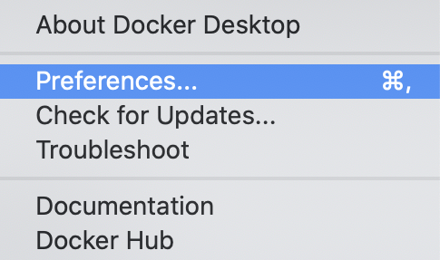
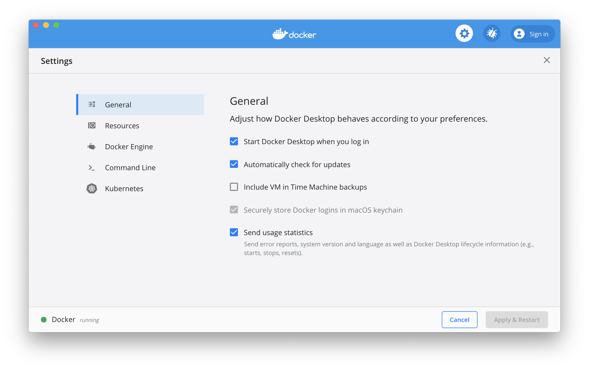
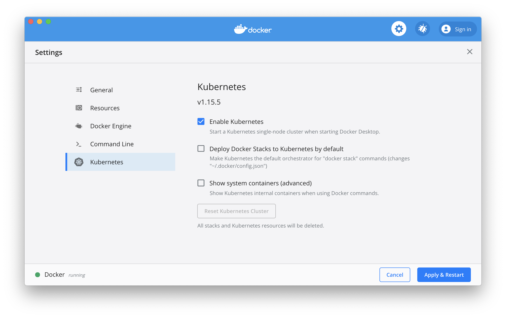
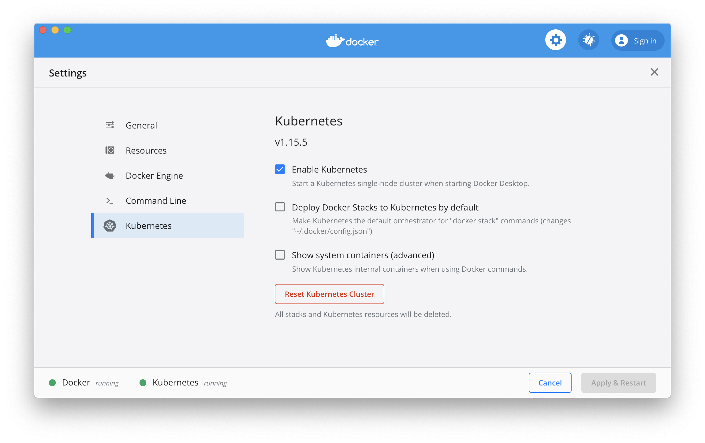
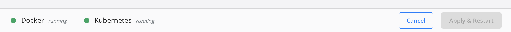

# MacOS/X Kubernetes

## Enable Kubernetes on MacOS/X 

Click on the Docker icon in MacOS/X menu bar.


Then choose ```Preferences...``` 




The following window should appear :



Choose ```Kubernetes```, then check the  ```Enable Kubernetes ``` 



Kubernetes stay in ```Starting``` state during few minutes.
Please wait to download all container images and for kubernetes installation process.



On the bottom you should read next ```Docker Running``` ```Kubernetes Running```



Great, you have installed Kubernetes on MacOS/X.


## Run the new ```kubectl``` command

Open a Terminal, then run the command ```kubectl version``` 

``` 
% kubectl version
Client Version: version.Info{Major:"1", Minor:"15", GitVersion:"v1.15.5", GitCommit:"20c265fef0741dd71a66480e35bd69f18351daea", GitTreeState:"clean", BuildDate:"2019-10-15T19:16:51Z", GoVersion:"go1.12.10", Compiler:"gc", Platform:"darwin/amd64"}
Server Version: version.Info{Major:"1", Minor:"15", GitVersion:"v1.15.5", GitCommit:"20c265fef0741dd71a66480e35bd69f18351daea", GitTreeState:"clean", BuildDate:"2019-10-15T19:07:57Z", GoVersion:"go1.12.10", Compiler:"gc", Platform:"linux/amd64"}
``` 

Run the command ```kubectl get pods``` 

``` 
% kubectl get pods
No resources found.
``` 

Great, the kubectl command works. It's time to deploy abcdesktop.io