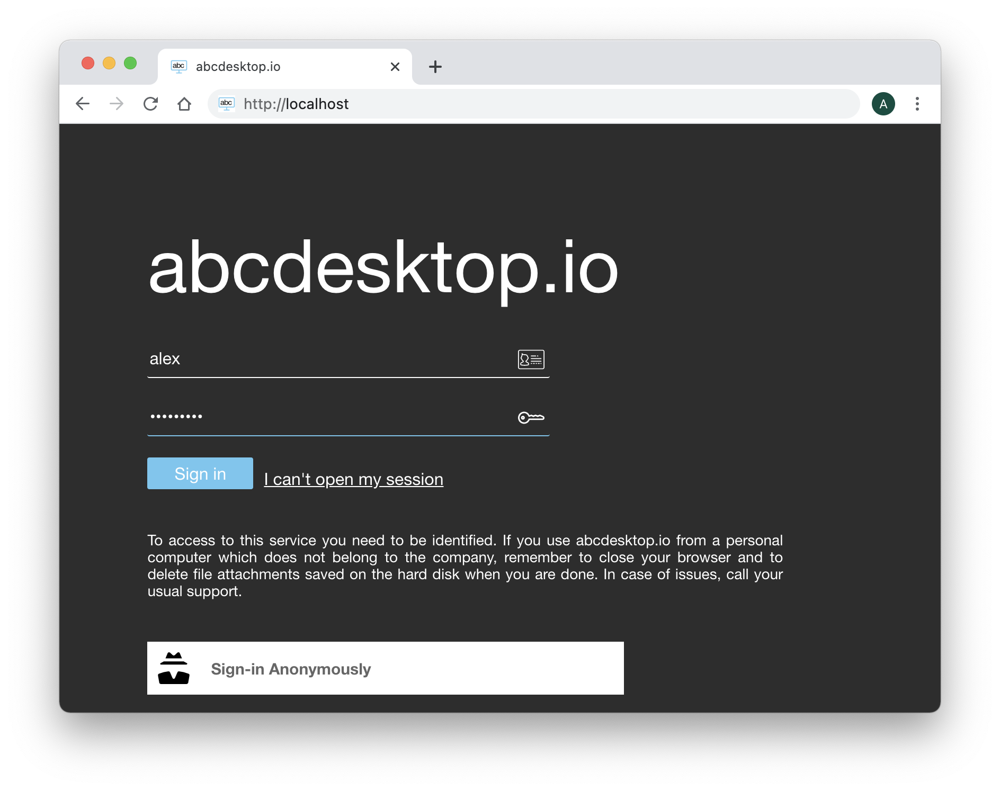
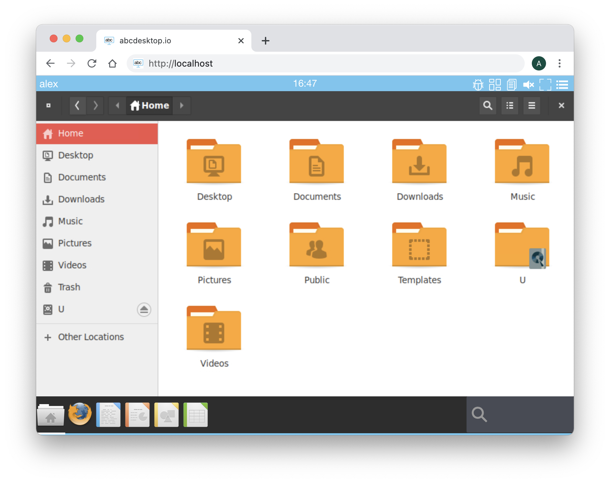
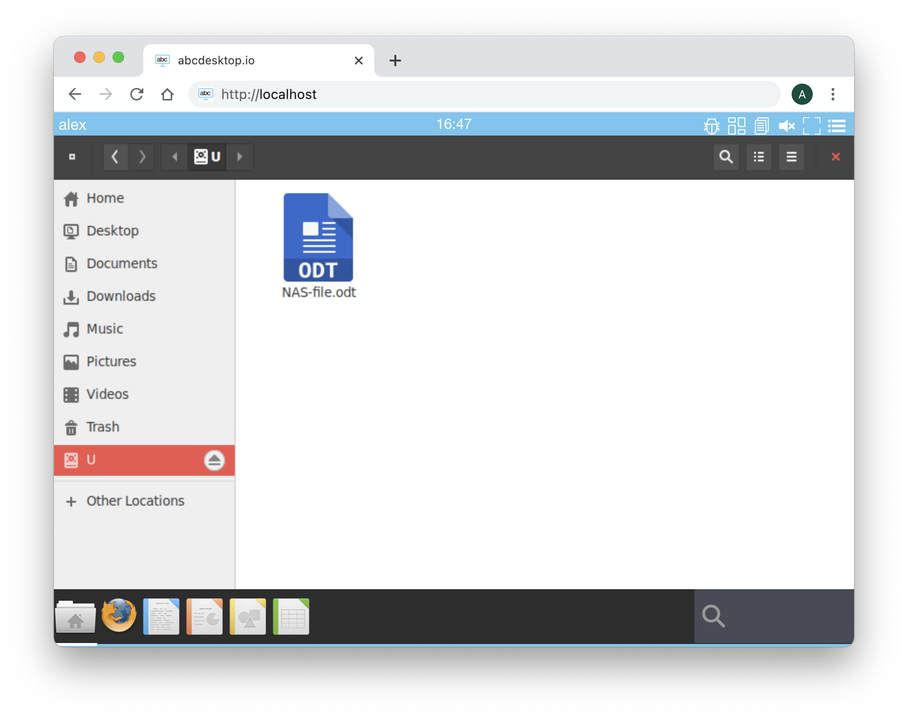

# CIFS Flexvolume Plugin for Kubernetes

Driver for [CIFS](https://en.wikipedia.org/wiki/Server_Message_Block) (SMB, Samba, Windows Share) network filesystems as [Kubernetes volumes](https://kubernetes.io/docs/concepts/storage/volumes/).

abcdesktop team is not the authors of the CIFS Flexvolume Plugin for kubernetes. This file is an update from the original source file [https://raw.githubusercontent.com/fstab/cifs/](https://raw.githubusercontent.com/fstab/cifs/master/README.md). The original source code is [https://github.com/fstab/cifs](https://raw.githubusercontent.com/fstab/cifs/master/README.md)
The author is [Fabian Stäber](https://github.com/fstab).
The update is part for abcdesktop.io

This article is just an update from [Fabian Stäber](https://github.com/fstab) work.

## Background 

Docker containers running in Kubernetes have an ephemeral file system: Once a container is terminated, all files are gone. In order to store persistent data in Kubernetes, you need to mount a [Persistent Volume](https://kubernetes.io/docs/concepts/storage/volumes/) into your container. Kubernetes has built-in support for network filesystems found in the most common cloud providers, like [Amazon's EBS](https://aws.amazon.com/ebs), [Microsoft's Azure disk](https://azure.microsoft.com/en-us/services/storage/unmanaged-disks/), etc. However, some cloud hosting services, like the [Hetzner cloud](https://hetzner.cloud), provide network storage using the CIFS (SMB, Samba, Windows Share) protocol, which is not natively supported in Kubernetes.

Fortunately, Kubernetes provides [Flexvolume](https://github.com/kubernetes/community/blob/master/contributors/devel/flexvolume.md), which is a plugin mechanism enabling users to write their own drivers. There are a few flexvolume drivers for CIFS out there, but for different reasons none of them seemed to work for me. So [Fabian Stäber](https://github.com/fstab) wrote this driver.

## Installing

The flexvolume plugin is a single shell script named [cifs](https://github.com/abcdesktopio/cifs). This shell script must be available on the Kubernetes master and on each of the Kubernetes nodes. By default, Kubernetes searches for third party volume plugins in ```/usr/libexec/kubernetes/kubelet-plugins/volume/exec/```. 

The plugin directory can be configured with the kubelet's ```--volume-plugin-dir``` parameter, run ```ps aux | grep kubelet``` to learn the location of the plugin directory on your system (see [#1][9]). The `cifs` script must be located in a subdirectory named `abcdesktop~cifs/`. The directory name `abcdesktop~cifs/` will be [mapped](https://github.com/kubernetes/community/blob/master/contributors/devel/flexvolume.md#prerequisites) to the Flexvolume driver name `abcdesktop/cifs`.

On the Kubernetes master and on each Kubernetes node run the following commands:


```bash
VOLUME_PLUGIN_DIR="/usr/libexec/kubernetes/kubelet-plugins/volume/exec"
mkdir -p "$VOLUME_PLUGIN_DIR/abcdesktop~cifs"
cd "$VOLUME_PLUGIN_DIR/abcdesktop~cifs"
curl -L -O https://raw.githubusercontent.com/abcdesktop/cifs/main/cifs
chmod 755 cifs
```

The `cifs` script requires a few executables to be available on each host system:

* `mount.cifs`, on Ubuntu this is in the [cifs-utils](https://packages.ubuntu.com/bionic/cifs-utils) package.
* `jq`, on Ubuntu this is in the [jq](https://packages.ubuntu.com/bionic/jq) package.
* `mountpoint`, on Ubuntu this is in the [util-linux](https://packages.ubuntu.com/bionic/util-linux) package.
* `base64`, on Ubuntu this is in the [coreutils](https://packages.ubuntu.com/bionic/coreutils) package.

 
```bash
apt-get install cifs-utils jq util-linux coreutils

```

To check if the installation was successful, run the following command:

```bash
VOLUME_PLUGIN_DIR="/usr/libexec/kubernetes/kubelet-plugins/volume/exec"
$VOLUME_PLUGIN_DIR/abcdestkop~cifs/cifs init

```

It should output a JSON string containing `"status": "Success"`. This command is also run by Kubernetes itself when the cifs plugin is detected on the file system.


## Update your od.config file

In this example, we use a Microsoft Active Directory as a LDAP Server.

> CIFS is supported with kubernetes configuration, CIFS is not supported in docker non-cluster mode

Add a new policy to add a label ```TAG``` during the user's authentification process.
 
```

# Add an explicit authmanagers
authmanagers: {	
	'explicit': {
	    'show_domains': True,
	    'default_domain': 'AD',
	    'providers': {
	      'AD': { 
	        'config_ref': 'adconfig', 
	        'enabled': True
	       }
	    }
	}
}


# add the configuration reference for adconfig
adconfig : { 'AD': {   'default'       : True, 
                       'ldap_timeout'  : 15,
                       'ldap_protocol' : 'ldap',
                       'ldap_basedn'   : 'DC=ad,DC=domain,DC=local',
                       'ldap_fqdn'     : '_ldap._tcp.ad.domain.local',
                       'domain'        : 'AD',
                       'domain_fqdn'   : 'AD.DOMAIN.LOCAL',
                       'servers'       : [ '192.168.7.12' ],
                       'kerberos_realm': 'AD.DOMAIN.LOCAL',
                       'policies'      : { 'acls': None,
                                           'rules' : { 'rule-domainuser' : {
                                                  'conditions' : [ { 'primarygroupid': '513', 'expected' : True  } ],
                                                  'expected'   : True,
                                                  'label'      : 'domainuser' } 
} } } } } } }

```

In this example :

* To verify that a user is member of ```DOMAIN USER``` group, we check that the user's ```primaryGroupID``` is equal to ```513```
* If the ```primaryGroupID``` is equal to ```513``` the authentification process add the label ```domainuser```


Then in the same od.config file, add rules to the desktop object to match this label ```domainuser```

```
desktop.policies: { 'rules': { 'volumes': { 'domainuser':  { 'type': 'cifs', 'name': 'homedirectory', 'volumename': 'homedir' } } },
						'acls' : {} }
 
```
 
In this example :

* If the user's label is equal ```domainuser```, then the user attribut ```homeDir``` is mounted to the ```homeDirectory``` by the CIFS flexvolume plugin.


## Testing

### Apply new configuration file

```
kubectl apply -f abcdesktop.yml
```

Open you abcdesktop website and fill the authentation form with your  Microsoft Active Direcotry Service or Samba server credentials.



Run authentification on the Microsoft Active Direcotry Service or on your Samba server

Start the File Manager application. In this example, the ```homeDir``` is set to ```U:```, the mount entry become the letter ```U```.



Click on the ```homeDir``` to read the CIFS ressource data. In this example, the shared ressource ```//192.168.7.101/alex``` contains a file ```NAS-file.ods'



## Troubleshooting

Logs files are stored in host directory ```/var/log/abcdesktop/cifs``` 

```
# ls -la /var/log/abcdesktop/cifs
total 36
drwxr-xr-x 2 root root 4096 janv. 28 16:39 .
drwxr-xr-x 3 root root 4096 déc.   1 12:00 ..
-rw-r--r-- 1 root root  288 janv. 28 16:39 alex.log
-rw-r--r-- 1 root root  832 janv. 28 16:39 cifs.log
-rw-r--r-- 1 root root 1264 déc.   1 14:25 error.alex.json
-rw-r--r-- 1 root root  834 déc.   1 14:25 error.alex.log
-rw-r--r-- 1 root root   50 janv. 28 16:39 mount.counter
-rw-r--r-- 1 root root   44 déc.  22 12:20 umount.counter
```

Check the file sAMAccountName.log, cifs.log

If there is an error, look at the ```error.$sAMAccountName.json``` and 
```error.$sAMAccountName.log```

Example 

```
-rw-r--r-- 1 root root 1264 déc.   1 14:25 error.alex.json
-rw-r--r-- 1 root root  834 déc.   1 14:25 error.alex.log
```

Run mount command 

```mount```

In this example :

* ```192.168.7.101``` is the IP Address of the NAS server
* ```//192.168.7.101/alex``` is the shared ressource
* ```alex``` is the sAMAccountName

```
# mount | grep 192.168.7.101
//192.168.7.101/alex on /var/lib/kubelet/pods/b7530cc0-6903-458a-a133-d8a8450e3af4/volumes/abcdesktop~cifs/flexvol-cifs-homedir-alex type cifs (rw,relatime,vers=1.0,cache=strict,username=alex,uid=4096,forceuid,gid=4096,forcegid,addr=192.168.7.101,soft,unix,posixpaths,serverino,mapposix,acl,rsize=1048576,wsize=1048576,bsize=1048576,echo_interval=60,actimeo=1)
```


Check that the kubernetes secrets exist 

```
kubectl get secrets -n abcdesktop
NAME                                  TYPE                                  DATA   AGE
abcdesktopjwtdesktoppayload           Opaque                                2      65d
abcdesktopjwtdesktopsigning           Opaque                                2      65d
abcdesktopjwtusersigning              Opaque                                2      65d
auth-cifs-alex-flexvol-cifs-homedir   abcdesktop/cifs                       4      10m
auth-ldif-alex                        abcdesktop/ldif                       11     10m
```


