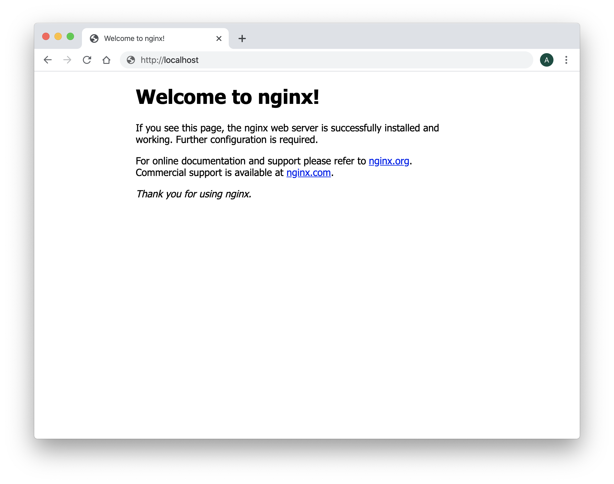
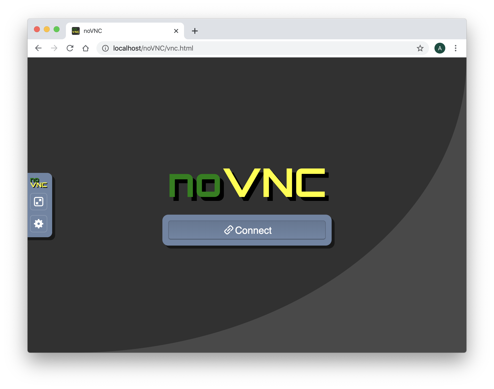
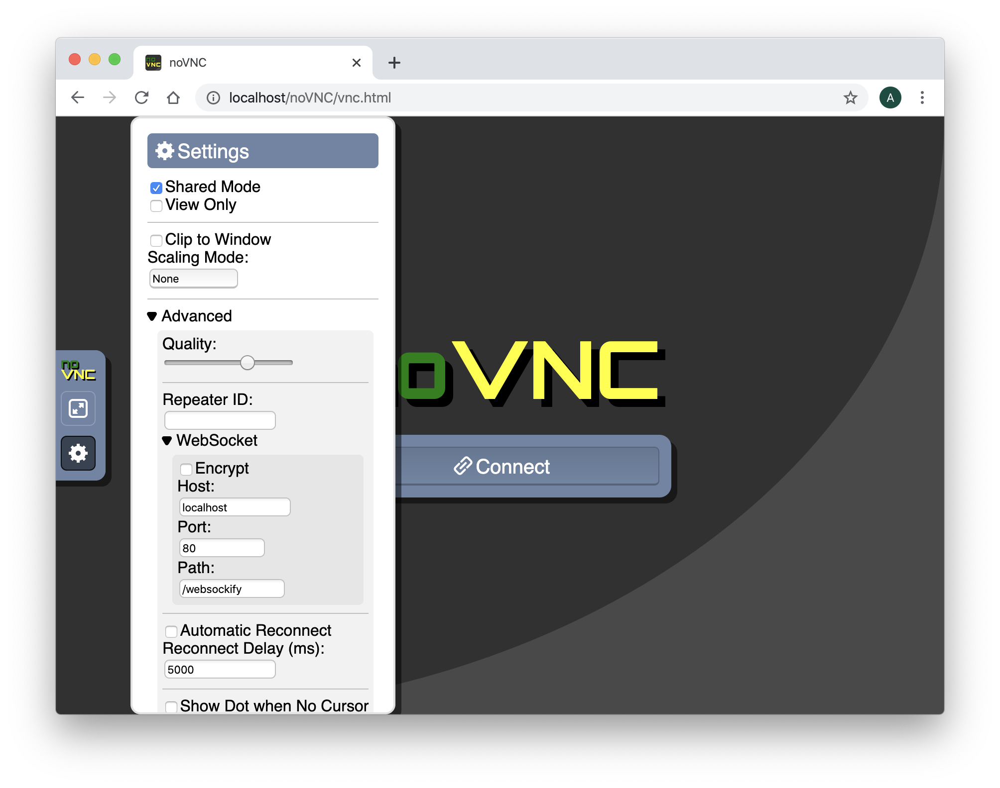
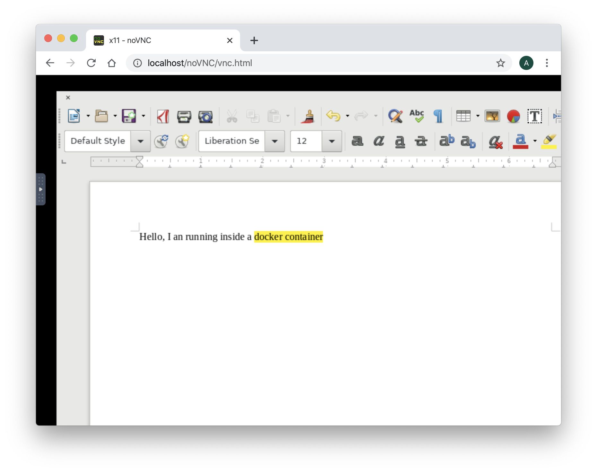

# Use noVNC as VNC Client


## Requirements

- A running dockerd last version
- An access to the docker public registry
- An access to the ubuntu repository 
- An access to the github website to run git clone command
- An access to the bintray.com website to download a file


AbcDeskopio use the amazing projet noVNC. noVNC is a VNC client JavaScript library. Before you start using noVNC get some information about it:

## noVNC description

[noVNC](https://novnc.com/) is an open source VNC client. 
noVNC is both a VNC client JavaScript library as well as an application built on top of that library. noVNC runs well in any modern browser including mobile browsers (iOS and Android).
Many companies, projects and products have integrated noVNC including
[OpenStack](http://www.openstack.org),
[OpenNebula](http://opennebula.org/),
[LibVNCServer](http://libvncserver.sourceforge.net), and
[ThinLinc](https://cendio.com/thinlinc). See
[the Projects and Companies wiki page](https://github.com/novnc/noVNC/wiki/Projects-and-companies-using-noVNC)
for a more complete list with additional info and links.

### Browser Requirements

noVNC uses many modern web technologies so a formal requirement list is
not available. However these are the minimum versions we are currently
aware of:

* Chrome 49, Firefox 44, Safari 11, Opera 36, IE 11, Edge 12

### Features

* Supports all modern browsers including mobile (iOS, Android)
* Supported VNC encodings: raw, copyrect, rre, hextile, tight, tightPNG
* Supports scaling, clipping and resizing the desktop
* Local cursor rendering
* Clipboard copy/paste
* Translations
* Licensed mainly under the [MPL 2.0](http://www.mozilla.org/MPL/2.0/), see
  [the license document](https://raw.githubusercontent.com/novnc/noVNC/master/LICENSE.txt) for details


## Create a shared volume myshared

Before creating containers, we need a shared volume, to share data and unix socket between containers.
Run the docker volume create command.

```
docker volume create myshared 
```


## Start the first container myx11server

Start the first graphical container named **myx11server** and forward the tcp port 6081 to the 6081 container tcp port.

* The tcp port 6081 will be use later by ws2tcp nodejs server.
* The volume myshared is mounted to /tmp

Note: We do not need the default 5900 VNC tcp port any more.


```
docker run -it -v myshared:/tmp --name myx11server -p 6081:6081 ubuntu:latest bash

```

You should see a prompt like :

```
root@6de36e574877:/#
```

Install the package wget 
Install the library files for tigervnc. 

Package list:

* libx11-6 xkb-data x11-xkb-utils xauth libfile-readbackwards-perl netbase libaudit1 libbsd0 libgcrypt20 libgl1 libgnutls30 libjpeg8 libpam0g libpixman-1-0 libselinux1 libstdc++6 libsystemd0 libunwind8 libxau6 libxdmcp6 libxfont2 zlib1g libgl1-mesa-dri xfonts-base x11-xserver-utils xfonts-100dpi xfonts-scalable 

Those packages are used by tigervnc. We need to install them.

```
apt-get update
apt-get install -y wget
apt-get install -y libx11-6 xkb-data x11-xkb-utils xauth libfile-readbackwards-perl netbase libaudit1 libbsd0 libgcrypt20 libgl1 libgnutls30 libjpeg8 libpam0g libpixman-1-0 libselinux1 libstdc++6 libsystemd0 libunwind8 libxau6 libxdmcp6 libxfont2 zlib1g libgl1-mesa-dri xfonts-base x11-xserver-utils xfonts-100dpi xfonts-scalable 
```

Download the last tigervnc X11 graphics server from the bintray.com web site

```
 wget "https://bintray.com/tigervnc/stable/download_file?file_path=tigervnc-1.10.1.x86_64.tar.gz" -O tigervnc-1.10.1.x86_64.tar.gz
```

Untar the tigervnc-1.10.1.x86_64.tar.gz file in the container's root file system 

```
cd /
tar -xvf tigervnc-1.10.1.x86_64.tar.gz
cp -r /tigervnc-1.10.1.x86_64/usr/* /usr/
```

Start the tigervnc release 1.10.
The tigervnc release 1.10 support the option rfbunixpath used by ws-tcp-bridge in next section

```
Xvnc :0 -rfbunixpath /tmp/.x11vnc -SecurityTypes=none &
```

You should read the output 

```
Xvnc TigerVNC 1.10.0 - built Dec 20 2019 07:12:07
Copyright (C) 1999-2019 TigerVNC Team and many others (see README.rst)
See https://www.tigervnc.org for information on TigerVNC.
Underlying X server release 12001000, The X.Org Foundation


Tue Mar  3 11:05:48 2020
 vncext:      VNC extension running!
 vncext:      Listening for VNC connections on /tmp/.x11vnc (mode 0600)
 vncext:      created VNC server for screen 0
```

Check that the Xvnc TigerVNC release is **1.10.0**. 

Great, you have installed an X11 server inside a docker container, and the Xvnc server is listening for VNC connections on /tmp/.x11vnc. 


## Install the ws-tcp-bridge 

ws-tcp-bridge translate websocket to tcp and have to listen on websocket tcp port 6081 and forward to local unix socket unix:/tmp/.x11vnc.

ws-tcp-bridge is a nodejs server, then we need to install nodejs and npm.


Before, install the package gcc g++ make curl 

```
apt-get install -y gcc g++ make curl 
```


Install nodejs and npm

```
curl -sL https://deb.nodesource.com/setup_13.x | bash -
```

```
apt-get install -y nodejs
```

Install ws-tcp-bridge

```
npm install ws-tcp-bridge -g
```

Start ws-tcp-bridge with the parameters --method=ws2tcp --lport 6081 --rhost=unix:/tmp/.x11vnc in background 

> Add the ```&``` at the end of the command line to run this process in background

```
/usr/bin/ws-tcp-bridge --method=ws2tcp --lport 6081 --rhost=unix:/tmp/.x11vnc &
```

You should read on the standard output

```
proxy mode ws -> tcp
forwarding port 6081 to unix:/tmp/.x11vnc
```

Great, ws-tcp-bridge is running and forward websocket to Xvnc unix socket 


## Get the ip address on your first container myx11server

On the container myx11server, to get the container local IP Address, install the package net-tools package


```
apt-get install -y net-tools
```

And run the ifconfig command 

```
ifconfig eth0
eth0: flags=4163<UP,BROADCAST,RUNNING,MULTICAST>  mtu 1500
        inet 172.17.0.2 netmask 255.255.0.0  broadcast 172.17.255.255
        ether 02:42:ac:11:00:02  txqueuelen 0  (Ethernet)
        RX packets 65149  bytes 95569807 (95.5 MB)
        RX errors 0  dropped 0  overruns 0  frame 0
        TX packets 20880  bytes 1159982 (1.1 MB)
        TX errors 0  dropped 0 overruns 0  carrier 0  collisions 0
```


Write here the ip address of your container myx11server:


IP Address of myx11server ____ . ____ . ____ . ____


## Create a new container webserver

Open a new shell window and start a new docker container named mywebserver, forward the tcp port 80 to the container tcp port 80.

```
docker run -it --name mywebserver -p 80:80 ubuntu:latest
```

You should see a prompt like:

```
root@96df62a73e4f:/# 
```

Install nginx webserver, run the command

```
apt-get update
apt-get install -y nginx-extras
```


Install the git and vim package, run the command

```
apt-get install -y git vim
```

Clone the novnc git on github.com, inside the nginx's root directory.

```
cd /var/www/html
git clone https://github.com/novnc/noVNC.git
```

You should read on the standart output 

```
Cloning into 'noVNC'...
remote: Enumerating objects: 26, done.
remote: Counting objects: 100% (26/26), done.
remote: Compressing objects: 100% (21/21), done.
remote: Total 10395 (delta 8), reused 13 (delta 5), pack-reused 10369
Receiving objects: 100% (10395/10395), 9.01 MiB | 7.15 MiB/s, done.
Resolving deltas: 100% (7310/7310), done.
```

Start the nginx web server

```
nginx
```

The web server nginx is running in backgound. 

Great, nginx web server is running, now we need to configure the proxy pass rule with the myx11server container's ip address.


## Check that the container webserver can ping the container myx11server


Install the ping command, run the command

```
apt-get install -y iputils-ping
```

Get the myx11server container's ip address write before and replace 
xxx.xxx.xxx.xxx with the myx11server container's ip address

```
ping -c 5 xxx.xxx.xxx.xxx
```

In this example, i replace xxx.xxx.xxx.xxx by 172.17.0.2

```
ping -c 5 172.17.0.2
PING 172.17.0.2 (172.17.0.2) 56(84) bytes of data.
64 bytes from 172.17.0.2: icmp_seq=1 ttl=64 time=0.108 ms
64 bytes from 172.17.0.2: icmp_seq=2 ttl=64 time=0.365 ms
64 bytes from 172.17.0.2: icmp_seq=3 ttl=64 time=0.206 ms
64 bytes from 172.17.0.2: icmp_seq=4 ttl=64 time=0.181 ms
64 bytes from 172.17.0.2: icmp_seq=5 ttl=64 time=0.206 ms

--- 172.17.0.2 ping statistics ---
5 packets transmitted, 5 received, 0% packet loss, time 4074ms
rtt min/avg/max/mdev = 0.108/0.213/0.365/0.084 ms
```

The container webserver should receive package from the myx11server container


## Edit the nginx configuration file


Edit the nginx configuration file **/etc/nginx/sites-enabled/default** with the vim editor.

```
vim /etc/nginx/sites-enabled/default
```

In the **server** section, after the line location you should found :

```
	location / {
		# First attempt to serve request as file, then
		# as directory, then fall back to displaying a 404.
		try_files $uri $uri/ =404;
	}
```
	
Add a **/websockify** route to proxyfied the websocket http request to your myx11server container. 

```
	location = /websockify {
		proxy_buffering     		 off;
		proxy_set_header X-Forwarded-For $proxy_add_x_forwarded_for;
		proxy_set_header Upgrade         $http_upgrade;
		proxy_set_header Connection      "upgrade";
		proxy_pass                       http://XXX.XXX.XXX.XXX:6081/;
	}
```

You have to replace the line  

```
proxy_pass 		 http://XXX.XXX.XXX.XXX:6081/;
```

by the ip address of your myx11server container, for example replace **http://XXX.XXX.XXX.XXX:6081/** with **http://172.17.0.2:6081/** 

```
proxy_pass 		 http://172.17.0.2:6081/;
```

The complete server section in the nginx file is for example

```
server {
	listen 80 default_server;
	listen [::]:80 default_server;

	# SSL configuration
	#
	# listen 443 ssl default_server;
	# listen [::]:443 ssl default_server;
	#
	# Note: You should disable gzip for SSL traffic.
	# See: https://bugs.debian.org/773332
	#
	# Read up on ssl_ciphers to ensure a secure configuration.
	# See: https://bugs.debian.org/765782
	#
	# Self signed certs generated by the ssl-cert package
	# Don't use them in a production server!
	#
	# include snippets/snakeoil.conf;

	root /var/www/html;

	# Add index.php to the list if you are using PHP
	index index.html index.htm index.nginx-debian.html;

	server_name _;

	location / {
		# First attempt to serve request as file, then
		# as directory, then fall back to displaying a 404.
		try_files $uri $uri/ =404;
	}

	location = /websockify {
		proxy_buffering     		 off;
		proxy_set_header X-Forwarded-For $proxy_add_x_forwarded_for;
		proxy_set_header Upgrade         $http_upgrade;
		proxy_set_header Connection      "upgrade";
		proxy_pass 			 http://172.17.0.2:6081/; # change this line 
	}


	# pass PHP scripts to FastCGI server
	#
	#location ~ \.php$ {
	#	include snippets/fastcgi-php.conf;
	#
	#	# With php-fpm (or other unix sockets):
	#	fastcgi_pass unix:/var/run/php/php7.0-fpm.sock;
	#	# With php-cgi (or other tcp sockets):
	#	fastcgi_pass 127.0.0.1:9000;
	#}

	# deny access to .htaccess files, if Apache's document root
	# concurs with nginx's one
	#
	#location ~ /\.ht {
	#	deny all;
	#}
}
```

Now, it's time to reload your nginx configuration, by running the command

```
nginx -s reload
```

## Connect to your nginx website

Run a web browser like Google Chrome or Firefox and go to your nginx website. If you run the nginx website on a separated host replace the name with your hostname or his ip address.

Go to the URL http://localhost or the ip address of your own server


> In this exercice in use ```localhost``` in the screenshot because all containers are running on my desktop, you may have to replace localhost by ip address, or the ```fully qualified domain name``` of your own server.


```
http://localhost
```
or

```
http://YOUR_SERVER_IP_ADDRESS
```


You should read the **Welcome to nginx!** message in your web browser



Go to the noVNC URL http://localhost/noVNC/vnc.html

```
http://localhost/noVNC/vnc.html
```
> Remember, remplace localhost by your ```fully qualified domain name``` if need

You should read the **Welcome to nginx!** message in your web browser



To change the connection settings, click on the settings icon and choose **Advanced** 
You have to fill the WebSocket properties as follow:

* The Encrypt is ```not checked```
* Set the **Host** as ```localhost``` (or your host ip address where your contianers are running )
* Set the **Port** to ```80```
* Set the **Path** to ```/websockify```





Then, press the ```Connect``` Button


## Install libreoffice as a docker application

On your host, where your container myx11server is running.
Open a new shell window and start a new docker container named mylibreoffice.

```
docker run -it -v myshared:/tmp --name mylibreoffice ubuntu:latest
```

You should see a prompt like :

```
root@96df62a73e4f:/# 
```

To install libreoffice application, run the install libreoffice command in your mylibreoffice container.

```
apt-get update
apt-get install -y libreoffice
```

Run the soffice command to start Libreoffice

```
export DISPLAY=:0.0
soffice --writer
```

You should read the output 

```
(soffice:7412): dbind-WARNING **: 16:32:03.928: Couldn't connect to accessibility bus: Failed to connect to socket /tmp/dbus-HN3KrNpoAq: Connection refused
```

On the web browser, the application ```Libreoffice Writer``` should appear. 


Type some text data like 'Hello, I am running inside a docker container'




## Install the windows manager openbox on your myx11server container

To move, resize, close, the windows applications, we need a windows manager. ```abcdesktop``` is the windows manager. [OpenBox](http://www.http://openbox.org/) is a lightweight, powerful, and highly configurable stacking window manager with extensive standards support. 

Run the install **openbox** command in your myx11server container.

```
apt-get install -y openbox
```

Set the DISPLAY environment variable to :0.0 and start openbox in background

```
export DISPLAY=:0.0
openbox &
```


Now, you can move the ```Libreoffice``` windows. All windows are decorated. 


Great you have installed the novnc gateway, and you just need a HTML Web browser to use a ```Libreoffice``` 
