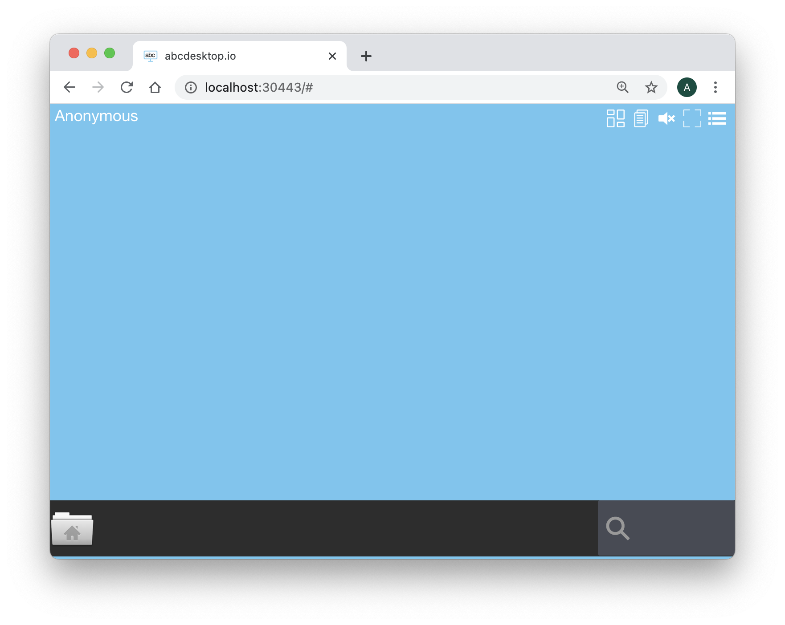

# Secure your dockerd to run in production with kubernetes and abcdesktop.io

## Goals 

Protect your docker daemon socket. 

## Requirements

You need to have a running abcdesktop.io Kubernetes cluster, and the kubectl command-line tool must be configured to communicate with your cluster. If you do not already have a cluster, you can create one by reading [Kubernetes Setup](kubernetesmode.md).

You need a previous installation of abcdesktop

## Installation

The following commands will let you update abcdesktop plateform on the master node. All applications run on a single server.  


## Enable TLS at the dockerd start-up


THIS SECTION AS TO BE WRITTEN

### Locate the kubernetes CA Root and the X-509 certificats

```
/var/lib/kubelet/pki
```

### Custom Docker daemon options

There are a number of ways to configure the daemon flags and environment variables for your Docker daemon. The recommended way is to use a systemd drop-in file (as described in the systemd.unit documentation). These are local files named <something>.conf in the /etc/systemd/system/docker.service.d directory. 
On ubuntu 18.04 use the filename /etc/systemd/system/multi-user.target.wants/docker.service.

Edit this file and change the ExecStart line 

```
ExecStart=/usr/bin/dockerd -H unix://
```

Add the TLS option string 

```
ExecStart=/usr/bin/dockerd --tlsverify --tlscacert=/etc/docker/ssl/ca.pem --tlscert=/etc/docker/ssl/$HOSTNAME.cert.pem --tlskey=/etc/docker/ssl/$HOSTNAME.pem -H=0.0.0.0:2376 -H unix://
```


Example

```
[Unit]
Description=Docker Application Container Engine
Documentation=https://docs.docker.com
After=network.target docker.socket firewalld.service
Requires=docker.socket

[Service]
Type=notify
# the default is not to use systemd for cgroups because the delegate issues still
# exists and systemd currently does not support the cgroup feature set required
# for containers run by docker
# ExecStart=/usr/bin/dockerd -H unix://
ExecReload=/bin/kill -s HUP $MAINPID
ExecStart=/usr/bin/dockerd --tlsverify --tlscacert=/etc/docker/ssl/ca.pem --tlscert=/etc/docker/ssl/host.domain.local.cert.pem --tlskey=/etc/docker/ssl/host.domain.local.pem -H=0.0.0.0:2376 -H unix://

LimitNOFILE=1048576
# Having non-zero Limit*s causes performance problems due to accounting overhead
# in the kernel. We recommend using cgroups to do container-local accounting.
LimitNPROC=infinity
LimitCORE=infinity
# Uncomment TasksMax if your systemd version supports it.
# Only systemd 226 and above support this version.
TasksMax=infinity
TimeoutStartSec=0
# set delegate yes so that systemd does not reset the cgroups of docker containers
Delegate=yes
# kill only the docker process, not all processes in the cgroup
KillMode=process

[Install]
WantedBy=multi-user.target
```


### Apply changes

Flush changes

```
sudo systemctl daemon-reload
```

Restart Docker daemon:

```
systemctl restart docker
```


### Check your dockerd

Check that your dockerd is listenning on TCP port 2376

```
# netstat -anp |grep 2376
tcp6       0      0 :::2376                 :::*                    LISTEN      27553/dockerd
```


### Connect your local abcdesktop
Open your navigator to http://[your-ip-hostname]:30443/

You can get your ip hostname by running
```
ifconfig
```

abcdesktop homepage should be available :


Click on the **Connect with Anonymous** access button. Pyos is creating a new desktop using the user container docker image oc.user.18.04.

Few seconds later, processes are ready to run. You should see the abcdesktop main screen, with only one application **File Manager**.



Great you have installed abcdesktop.io in Kubernetes mode.
You just need a web browser to reach your web workspace.


### Troubleshoot
All kubernetes resources can be inspected to get more informations.

First list elements you want to verify, in the following case, we will inspect pods :

    sudo kubectl get pods

    NAME                            READY   STATUS             RESTARTS   AGE
    daemonset-nginx-qnd4n           1/1     Running            0          92s
    daemonset-pyos-6mgq4            1/1     Running            0          92s
    memcached-od-db69c45fb-mqt4n    1/1     Running            0          92s
    mongodb-od-ff874fcb5-sm6f7      1/1     Running            0          92s
    speedtest-od-55c58fdd69-5znpr   0/1     ImagePullBackOff   0          92s

As we can see, status is "ImagePullBackOff" for speedtest-od pod.  
We will then ask kubernetes to describe the pod with the following command :

    sudo kubectl describe pod speedtest-od-55c58fdd69-t99ck
    
In this case, the important information part is at the end (it's not always the case, you can also look at "Conditions:" section) : 


    Events:
      Type     Reason   Age                    From             Message
      ----     ------   ----                   ----             -------
      Warning  Failed   7m6s (x4837 over 18h)  kubelet, cube05  Error: ImagePullBackOff
      Normal   BackOff  2m9s (x4860 over 18h)  kubelet, cube05  Back-off pulling image "registry.mydomain.local:443/oc.speedtest"

As we can see, in this case, Kubernetes had a problem to pull oc.speedtest image from registry.


### View Pyos logs
    sudo kubectl logs daemonset-pyos-tklg8 --follow

Note that you also can view logs using docker command


