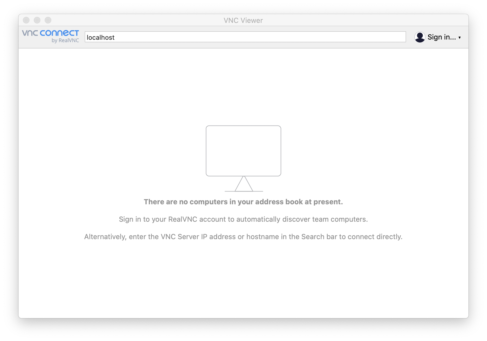
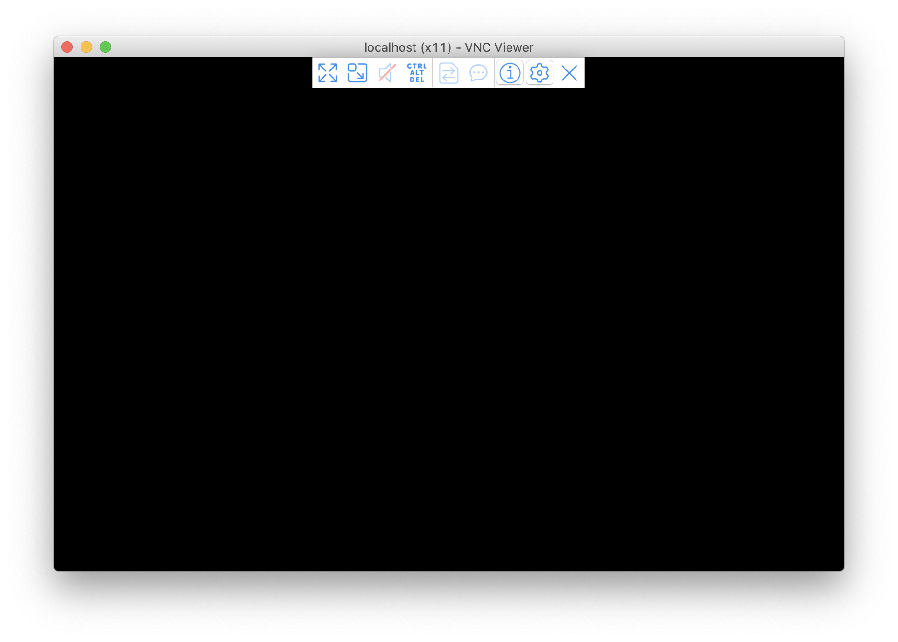
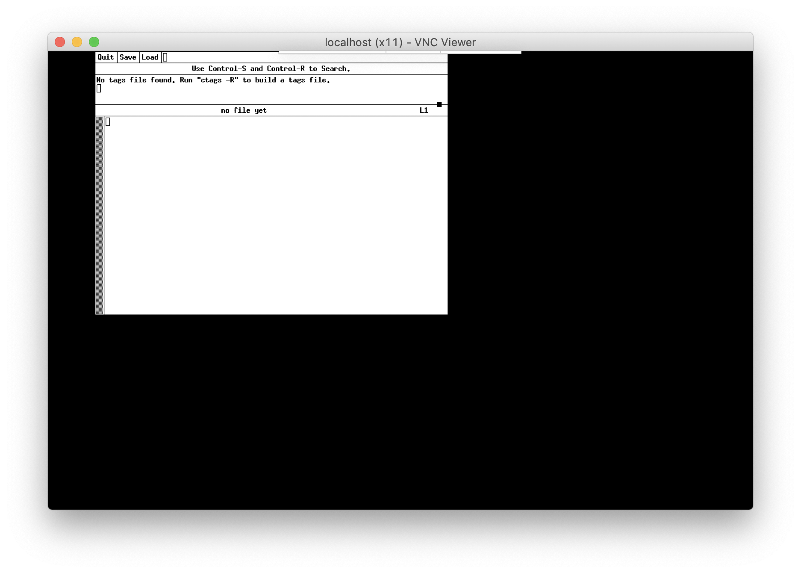
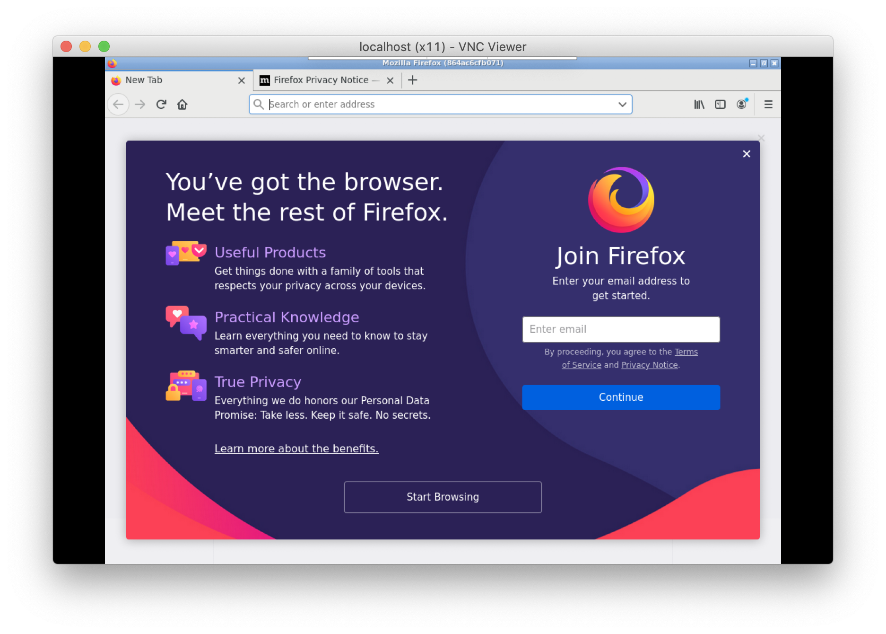

# abcdesktop.io from scratch 


The goal of this chapter is to learn how abcdesktop.io works. 
You should not repeat the process in production, but prefer use a Dockerfile and the docker build command.     


## Requirements

- A running dockerd last version 
- A VNC Client 
- An access to the docker public registry
- An access to the ubuntu repository 


## Create a shared volume myshared

Before creating containers, we need a shared volume, to share data and unix socket between containers.
Run the docker volume create command.

```
docker volume create myshared 
```


## Start the first container myx11server

Start the first graphical container named **myx11server**, forward the tcp port 5900 to the container.

* The tcp port 5900 will be use later by the vnc server.
* The volume myshared is mounted to /tmp


```
docker run -it -v myshared:/tmp --name myx11server -p 5900:5900 ubuntu:latest bash

```

You should see a prompt like :

```
root@6de36e574877:/#
```

Install the X11 graphics server tigervnc

```
apt-get update
apt-get install -y tigervnc-standalone-server tigervnc-xorg-extension
```

Start the X11 graphics server tigervnc

```
 Xvnc :0 -SecurityTypes=none &
```

You should read the output 

```
Xvnc TigerVNC 1.7.0 - built Dec  5 2017 09:25:01
Copyright (C) 1999-2016 TigerVNC Team and many others (see README.txt)
See http://www.tigervnc.org for information on TigerVNC.
Underlying X server release 11905000, The X.Org Foundation


Mon Mar  2 11:43:56 2020
 vncext:      VNC extension running!
 vncext:      Listening for VNC connections on all interface(s), port 5900
 vncext:      created VNC server for screen 0
```

Great, you have installed an X11 server inside a docker container, and the Xvnc server is listening for VNC connections on the tcp port 5900. Keep this container running.

We will use the host tcp port **5900** to connect VNC Client.


## Use VNC client to connect to your first container myx11server


From your host or from another host, install a VNC client. You can use your prefered VNC Client for your operating system or the RealVNC's VNC Viewer. You can download the RealVNC's VNC Client, by following the link [https://www.realvnc.com/fr/connect/download/viewer/](https://www.realvnc.com/fr/connect/download/viewer/)

Run the VNC Viewer, and set the hostname where the container myx11server is running. 
In the following example.

Here I am using VNC Viewer on Mac OS/X and I did set the hostname to localhost.





This is a getting started guide to understand how abcdesktop works, so we did not set a password to protect the VNC access.
This is not the best practices guide for production installations. 
As we did not set a password to protect the VNC access, you have to confirm the uncrypted connection warning dialog box and then press the `Continue` button.

This is just an example to understand how abcdesktop works, so we did not set a password to protect the VNC access. 


You need to confirm the uncrypted connection warning dialog box. Press the Continue button.

A black screen should appear :



Keep this VNC Client running, we will use this display to show our applications later.


## Install an x11 application as a docker application

On your host, where your container myx11server is running.
Open a new shell window and start a new docker container named myapp. The myapp container access to the volume myshared and mount it to /tmp.

```
docker run -it -v myshared:/tmp --name myapp ubuntu:latest
```

You should see a prompt like :

```
root@96df62a73e4f:/# 
```
To install standart application like xedit, xman or xeyes. Install the package x11-apps.

Run those commands in your myx11server container.

```
apt-get update
apt-get install -y x11-apps
```

Set the DISPLAY environment variable to :0.0 and then start the **xedit** command.

```
export DISPLAY=:0.0
xedit
```

On the VNC Viewer, the application xedit should appear. 




Great, you can run a X11 application inside a dedicated docker container, and use your myx11server as DISPLAY. But you can't move, resize or close the xedit window.


## Install the windows manager openbox on your myx11server container

To move, resize, close, the windows applications, we need a windows manager. abcdesktop use the windows manager openbox. OpenBox is a lightweight, powerful, and highly configurable stacking window manager with extensive standards support. 

Run the install **openbox** command in your myx11server container.

```
apt-get install -y openbox
```

Set the DISPLAY environment variable to :0.0 and then start openbox.

```
export DISPLAY=:0.0
openbox
```

The Openbox message appear to the sdterr 

```
Openbox-Message: Unable to find a valid menu file "/var/lib/openbox/debian-menu.xml"
```


Now, you can move the window xedit. The windows are decorated. 


## Remove the myapp container

Activate the window shell with your myapp running container, and press CTRL+C

```
root@9abc7da524a5:/# xedit 
^C
root@9abc7da524a5:/# exit
exit
```

You can remove your docker container, to clean up your environment

```
docker rm myapp
```
 

## Install another x11 application as a docker application

On your host, where your container myx11server is running, open a new shell window and start a new docker container named myapp.

```
docker run -it -v myshared:/tmp --name myfirefox ubuntu:latest
```

You should see a prompt like :

```
root@96df62a73e4f:/# 
```

To install firefox application, run the install firefox command in your myfirefox container.

```
apt-get update
apt-get install -y firefox
```

Run the firefox command
```
export DISPLAY=:0.0
firefox
```

You should read the output 

```

(firefox:1831): LIBDBUSMENU-GLIB-WARNING **: 14:42:14.737: Unable to get session bus: Failed to execute child process ?dbus-launch? (No such file or directory)
```

On the VNC Viewer, the application firefox should appear. 



Check that firefox works and go to your favorite web site.


## Clean your setup

To clean your work space, stop the running contianer myapp myfirefox myx11server, then remove it.
We also need to remove the shared volume myshared

Run the command :


```
docker stop myfirefox myx11server
docker rm myfirefox myx11server
docker volume rm myshared

```

Keep the docker images ubuntu, we will use it in next chapter


## Next Chapter

In the next chapter, we will replace the VNC Client by a web browser.


Licence
abcdesktop is released under the terms of MIT License. For more details take a look at the [README](https://github.com/OpenDestkop/README.md).


