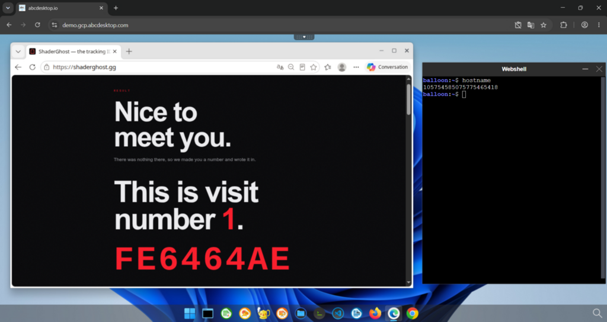
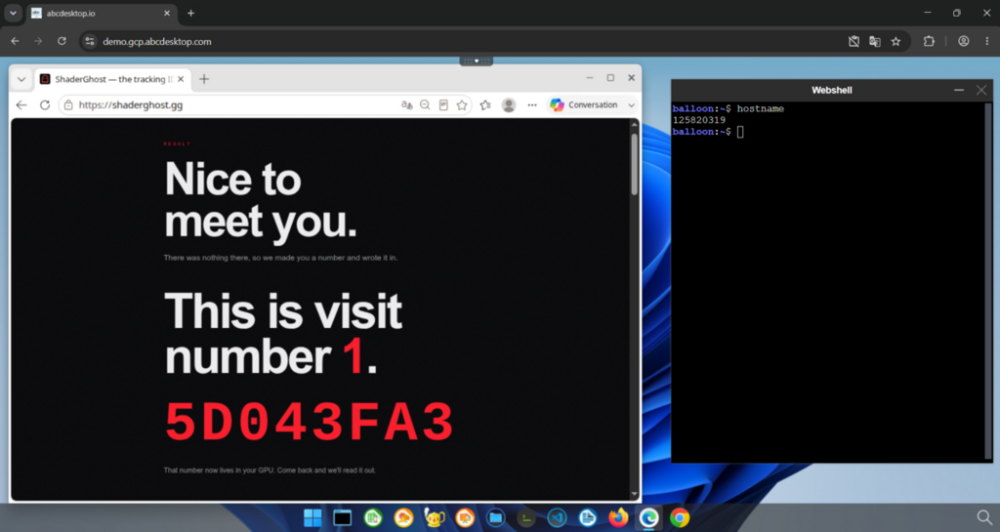
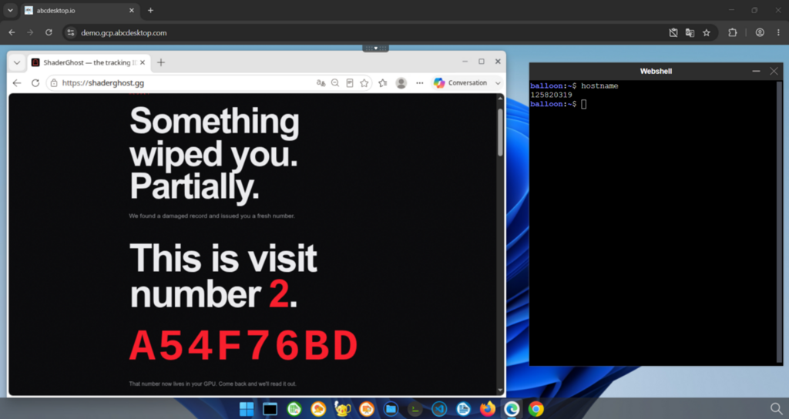
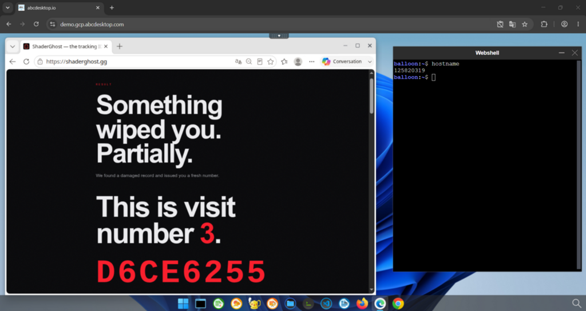
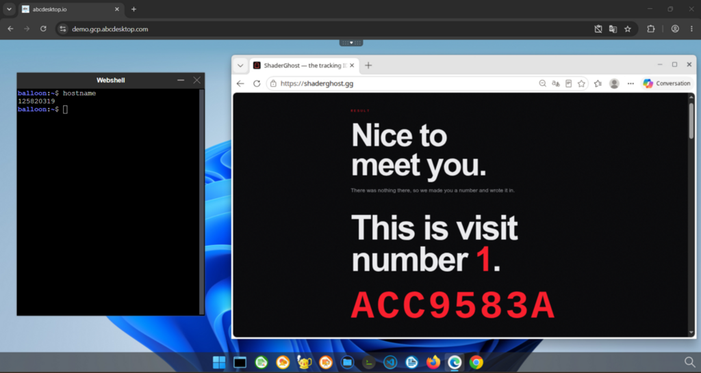
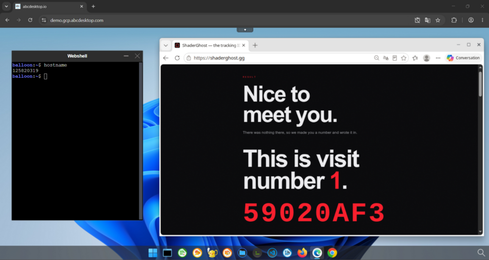
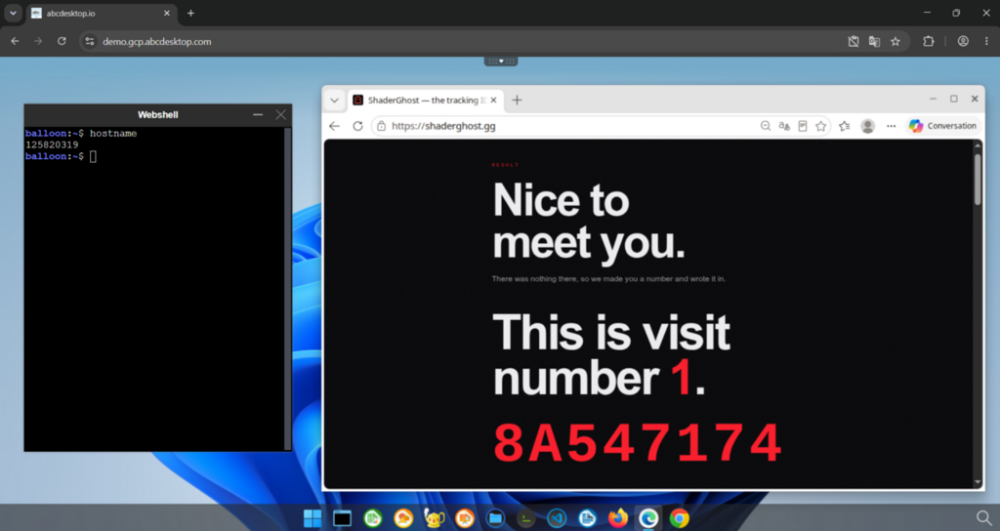

# Make your web browser secure again - How abcdesktop.io protects you from stealth fingerprints

## The "silent cookie" that isn't a cookie

In August 2026, a developer noticed his Bluetooth headphones behaving strangely every time he opened a specific e-commerce site. Digging into the site's code, he found it was running an inaudible audio signal purely to fingerprint his device, silently, without cookies, without permission, and without any way to detect or block it from the browser settings.

This is what the press nicknamed a "silent cookie": no cookie is actually stored anywhere. Instead, the site measures small, device-specific side effects of the browser's audio, graphics, and rendering stack to build a unique identifier, an identifier that survives cookie deletion, private browsing, and even VPNs.

!!! note "Want the full technical breakdown?"
    This page focuses on how abcdesktop.io protects you from this technique. For a detailed, in-depth explanation of how audio/canvas/WebGL fingerprinting actually works under the hood, read the original article: [AliExpress Got Caught Playing Silent Audio in Your Browser](https://medium.com/@rajkanjariya2020/aliexpress-got-caught-playing-silent-audio-in-your-browser-6e220df69b8d).

The one thing every fingerprinting technique has in common, regardless of the API it exploits, is this precondition: **the script must run against your real browser, on your real device.**

Check `You have no cookies. We know who you are anyway.` by yourself the on [https://shaderghost.gg](https://shaderghost.gg) 

## Why abcdesktop.io breaks that precondition

With abcdesktop.io, the browser never runs on your endpoint. Your device only displays a video stream over an encrypted WebSocket, while the actual browser executes inside an isolated [Remote Browser Isolation](remote-browser-isolation.md) session in the Kubernetes cluster.

A fingerprinting script can still run, but it only ever measures the isolated container's virtual CPU, audio stack, and GPU, never your laptop's, your phone's, or your desktop's real hardware. Since that container is standardized and shared across the fleet of users, the resulting "fingerprint" no longer identifies *you*, it identifies an interchangeable, disposable execution environment.

As you can see hostnames are different, thats means these are two different sessions running on different pods but the counter stays at 1.

## One step further: the browser must be its own pod, not just a ephemeral container in your desktop

In abcdesktop.io, an application is not necessarily just a container living inside your desktop pod. Starting with [Remote Application Isolation](kubernetes-vdi.md) (RAI), any application, including the web browser itself, can be scheduled as its **own dedicated Kubernetes pod**, separate from the pod hosting your desktop session.

This distinction matters a lot for fingerprinting resilience:

- If the browser only ran as an ephemeral container **inside** your desktop pod, getting rid of a persistent fingerprint would mean tearing down and recreating your *entire* desktop pod. This happens because the Kubernetes API has no way to remove a single ephemeral container from a running pod: once added, it stays tied to the pod's lifecycle, and it keeps sharing the pod's network namespace and mounted resources (X11 socket, PulseAudio socket, D-Bus) with your desktop session.

Let's try that on the last opened session :

The counter increments itself, confirming that running different ephemeral containers on the same desktop pod does not allow us to get rid of the "silent cookie"  

- Because the browser can instead be its **own pod**, closing that browser is enough: killing the browser pod is killing everything the fingerprinting script ever touched. Your desktop pod, and your session, are never affected.  

Let's check this : 

Now we can see that the "cookie ID" in red is changing but the counter stays at 1, even though our pod desktop is the same.

In practice, this means a fresh, un-fingerprinted browser environment is just a browser restart away, with no need to log out, no need to recreate a desktop, and no interruption to the rest of your session.

## Key takeaway

A "silent cookie" only works because the tracking script shares your device's real execution environment. abcdesktop.io removes that shared environment entirely: the browser runs remotely, in its own disposable pod, so any fingerprint collected describes a container that can be discarded in seconds, not the person using it.

[:material-rocket-launch-outline: **Try it yourself 'Microsoft Edge in a pod' on demo !**](https://demo.gcp.abcdesktop.com){ .md-button .md-button--primary }
