# Configure Keycloak with external LDAP for abcdesktop

## Prerequisites

- a Kubernetes cluster with abcdesktop installed
- `helm` command line
- an LDAP server

!!! note
    In this example, we will use [docker-test-openldap](https://github.com/rroemhild/docker-test-openldap)

    ??? note "show details"
        This image uses standard static groups based on `RFC LDAP 4519` 

        Below is the `ship_crew` group file

        ```
        dn: cn=ship_crew,ou=people,dc=planetexpress,dc=com
        objectclass: Group
        objectclass: top
        groupType: 2147483650
        cn: ship_crew
        member: cn=Philip J. Fry,ou=people,dc=planetexpress,dc=com
        member: cn=Turanga Leela,ou=people,dc=planetexpress,dc=com
        member: cn=Bender Bending Rodriguez,ou=people,dc=planetexpress,dc=com
        ```

        Below is the `admin_staff` group file

        ```
        dn: cn=admin_staff,ou=people,dc=planetexpress,dc=com
        objectclass: Group
        objectclass: top
        groupType: 2147483650
        cn: admin_staff
        member: cn=Hubert J. Farnsworth,ou=people,dc=planetexpress,dc=com
        member: cn=Hermes Conrad,ou=people,dc=planetexpress,dc=com
        ```


## Install

There are multiple ways to install a Keycloak server. In this tutorial, Keycloak is deployed on the same Kubernetes cluster that hosts abcdesktop, using the Helm command-line tool.

!!! note 
    If you are curious about other ways to get started, please refer to the [keycloak documentation](https://www.keycloak.org/guides)

Connect to your control plane node and run the following commands to install Keycloak.

```
helm repo add codecentric https://codecentric.github.io/helm-charts
helm repo update
```

```
helm install keycloak codecentric/keycloak \
  --namespace keycloak \
  --set postgresql.enabled=false \
  --set database.vendor=h2 \
  --set service.type=NodePort 
```

Once the installation completes, run the following command to verify that the Keycloak pod is running.

```
kubectl get pods -n keycloak
NAME         READY   STATUS    RESTARTS   AGE
keycloak-0   1/1     Running   0          32s
```

Inspect the Keycloak service to determine which NodePort has been assigned to the web UI.

```
NAME                TYPE        CLUSTER-IP       EXTERNAL-IP   PORT(S)                                      AGE
keycloak-headless   ClusterIP   None             <none>        80/TCP                                       47s
keycloak-http       NodePort    10.111.139.181   <none>        80:31846/TCP,8443:30806/TCP,9990:32562/TCP   47s
```

In this example, the assigned port is `31846`. Connect to `http://<YOUR_MASTER_IP>:<YOUR_KEYCLOAK_PORT>`.

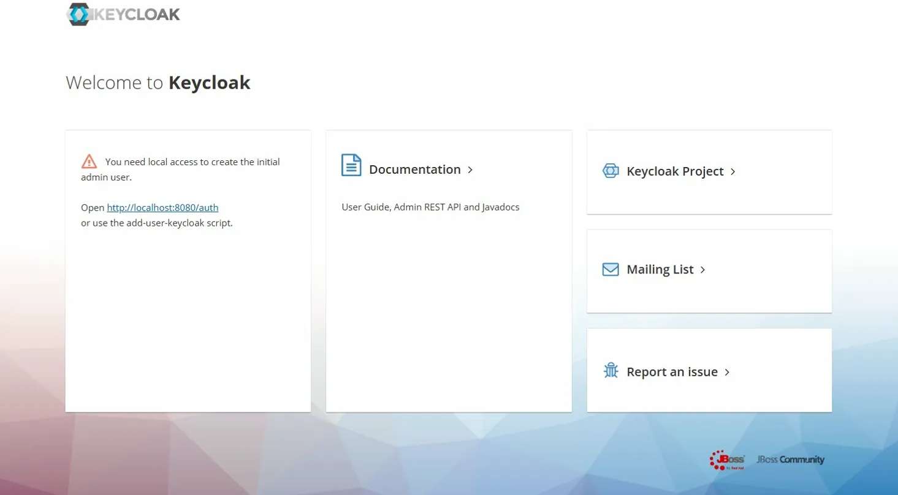

## Create admin user

To access the Keycloak administration console, you must first create an admin user locally, directly on the Keycloak pod.

Open a shell session inside the pod.

```
kubectl exec -it keycloak-0 -n keycloak -- bash
```

Once inside, run the following commands to create the admin user.

```
# You can replace admin and admin123 by the credentials of your choice
/opt/jboss/keycloak/bin/add-user-keycloak.sh \
  -u admin \
  -p admin123

# Then reload keycloak 
/opt/jboss/keycloak/bin/jboss-cli.sh --connect command=:reload
```

Reconnect to the web UI. You should now be able to access the administration console.

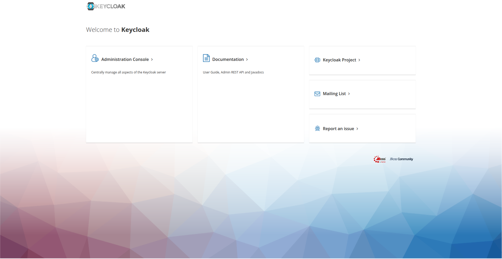
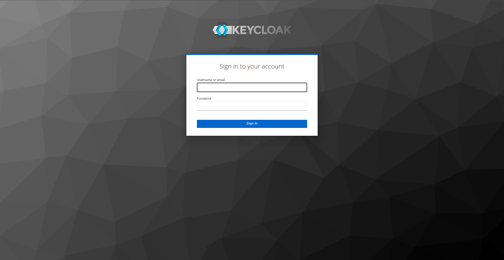
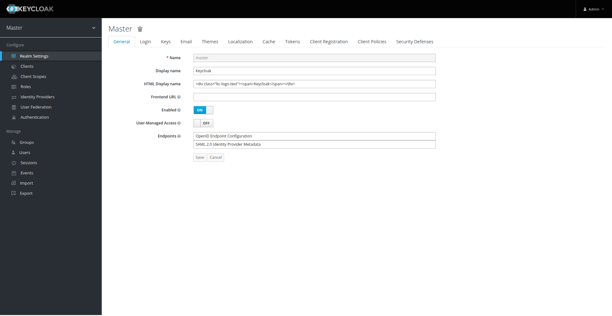

## Import LDAP users

In the administration console, navigate to **User Federation** and click **Add provider > ldap**.

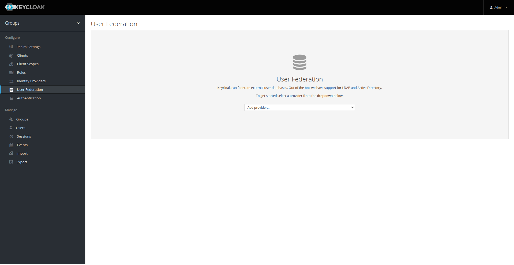

Complete the fields according to your LDAP server configuration.


For this example, the configuration appears as follows.

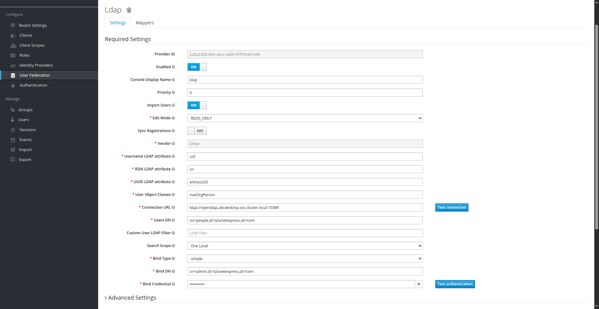

After completing the form, click **Synchronize all users** to import users from LDAP. Verify the import by navigating to the Users page.

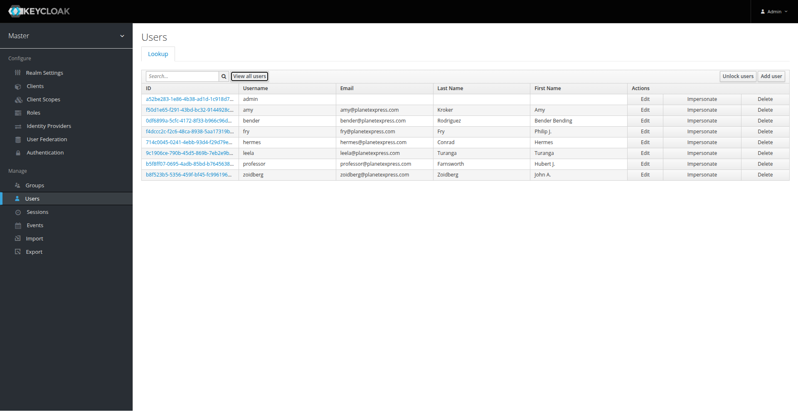

## Add mappers to User federation (Optional)

By default, Keycloak imports only the following attributes for each user during synchronization:

- `full name`
- `modify date`
- `email`
- `creation date`
- `last name`
- `username`

You may need to import additional attributes from your LDAP server. To do so, you must create additional attribute mappers. Navigate to the **Mappers** tab on the **User Federation** page and create one mapper per attribute you want to import.

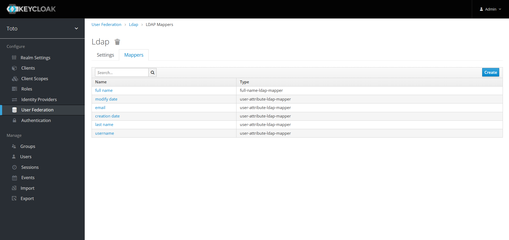
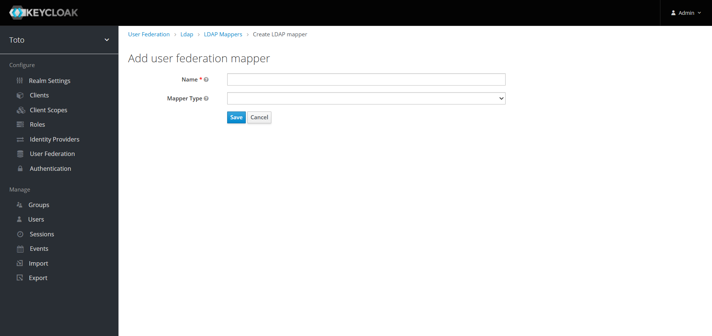

In this example, the `groups` and `uid` attributes are required.

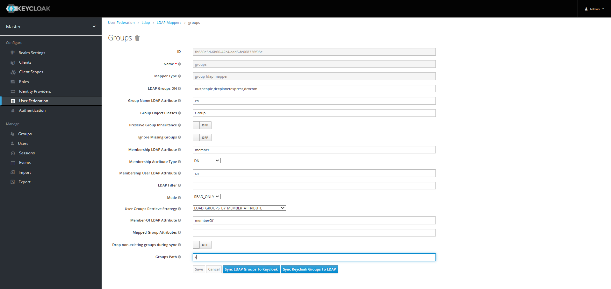

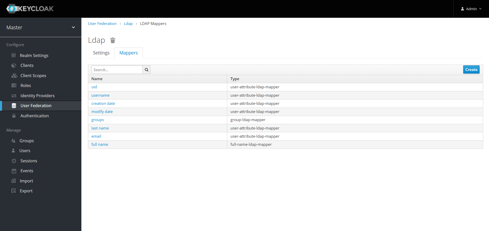

Inspect a user record to verify that the new attributes are populated.

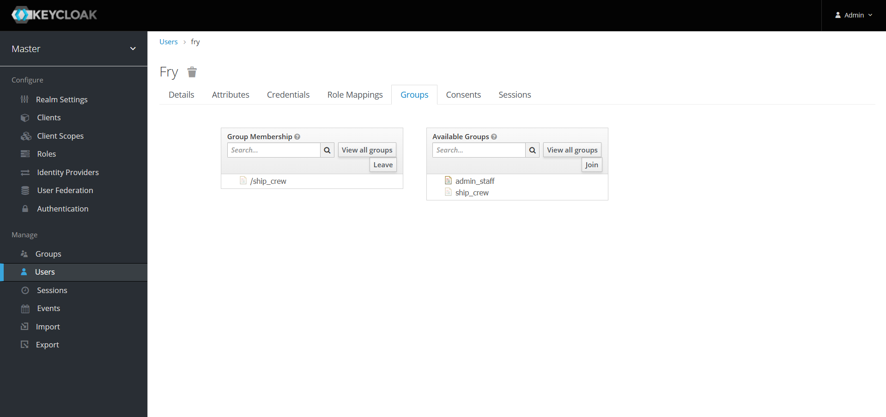
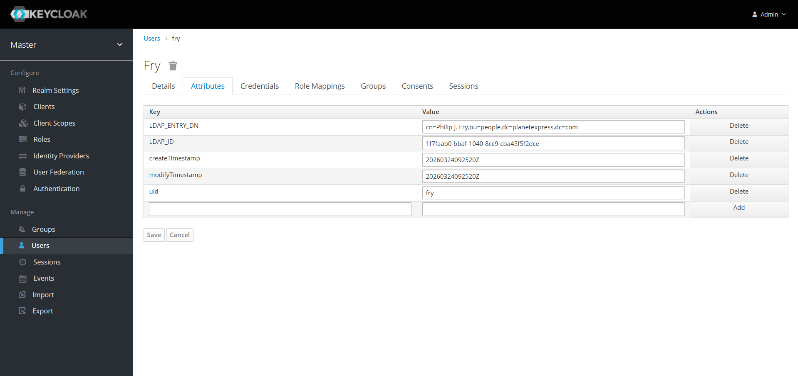

## Create a client 

To enable authentication through Keycloak, you must generate a client secret. Navigate to the **Clients** page, click **Create**, complete the required fields, and save the client.

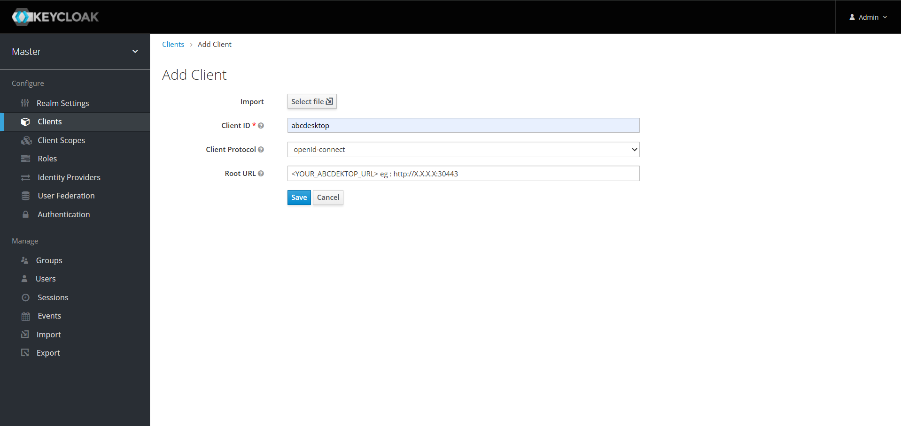

Navigate to the **Credentials** tab to retrieve the generated client secret.


!!! info
    If you created attribute mappers in the previous step, you must also create corresponding client-side mappers.

    ??? note "show details"
        Navigate to the **Mappers** tab and create one client-side mapper for each mapper previously defined.

        In this example, both `groups` and `uid` client-side mappers are required.

        
        
        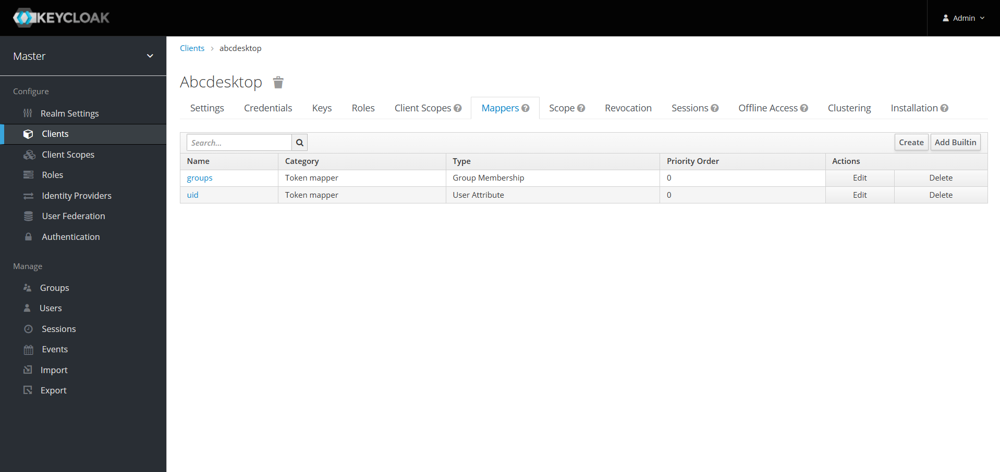

## Update od.config file

Configure abcdesktop to use Keycloak as the authentication provider by updating the `od.config` file as described on [this page](https://www.abcdesktop.io/advanced/4.4/authentication/authexternal/#keycloak-oauth).

Restart the pyos service by running the following commands.

```
kubectl create -n abcdesktop configmap abcdesktop-config --from-file=od.config -o yaml --dry-run=client | kubectl replace -n abcdesktop -f -
kubectl rollout restart deploy pyos-od -n abcdesktop
```

You can now authenticate through Keycloak. Attempt to sign in as `fry`.


A successful login creates the user desktop. Inspect the pyos logs to confirm that Keycloak is the active authentication provider.

```
kubectl get pods -n abcdesktop
NAME                            READY   STATUS    RESTARTS   AGE
console-od-7f548d74fd-48rpv     1/1     Running   0          9d
fry-c3896                       3/3     Running   0          2d23h
memcached-od-796c455cd-hqhlb    1/1     Running   0          9d
mongodb-od-0                    2/2     Running   0          9d
nginx-od-6657dd8c9-c979g        1/1     Running   0          9d
openldap-od-6f4797f9d-86jdd     1/1     Running   0          9d
pyos-od-95789468f-9dl68         1/1     Running   0          2d23h
router-od-867f5576dd-p9hj5      1/1     Running   0          9d
speedtest-od-78cdbdd9c6-vphfl   1/1     Running   0          9d
```

```
kubectl logs pyos-od-95789468f-9dl68 -n abcdesktop|grep authservice
2026-04-02 13:42:52 test-pl-worker3 140187023907640 authservice [DEBUG  ] oc.auth.authservice.ODAuthTool.login:anonymous pdr.authenticate provider=keycloak done
2026-04-02 13:42:52 test-pl-worker3 140187023907640 authservice [DEBUG  ] oc.auth.authservice.ODAuthTool.login:anonymous pdr.getuserinfo provider=keycloak start
2026-04-02 13:42:52 test-pl-worker3 140187023907640 authservice [DEBUG  ] oc.auth.authservice.ODExternalAuthProvider.getuserinfo:anonymous dump userinfo data={'sub': 'f4dccc2c-f2c6-48ca-8938-5aa17319b238', 'uid': 'fry', 'email_verified': True, 'name': 'Philip J. Fry', 'groups': ['ship_crew'], 'preferred_username': 'fry', 'given_name': 'Philip J.', 'family_name': 'Fry', 'email': 'fry@planetexpress.com'}
2026-04-02 13:42:52 test-pl-worker3 140187023907640 authservice [DEBUG  ] oc.auth.authservice.ODExternalAuthProvider.getuserinfo:anonymous expecting to read posix account response format
2026-04-02 13:42:52 test-pl-worker3 140187023907640 authservice [DEBUG  ] oc.auth.authservice.ODExternalAuthProvider.getuserinfo:anonymous posix account posixuser={'cn': 'fry', 'uid': 'fry', 'gid': 'balloon', 'uidNumber': 4096, 'gidNumber': 4096, 'homeDirectory': '/home/fry', 'loginShell': '/bin/bash', 'description': 'abcdesktop generated account', 'groups': None, 'gecos': None}
2026-04-02 13:42:52 test-pl-worker3 140187023907640 authservice [DEBUG  ] oc.auth.authservice.ODExternalAuthProvider.getuserinfo:anonymous userinfo={'sub': 'f4dccc2c-f2c6-48ca-8938-5aa17319b238', 'uid': 'fry', 'email_verified': True, 'name': 'Philip J. Fry', 'groups': ['ship_crew'], 'preferred_username': 'fry', 'given_name': 'Philip J.', 'family_name': 'Fry', 'email': 'fry@planetexpress.com', 'userid': 'f4dccc2c-f2c6-48ca-8938-5aa17319b238', 'posix': {'cn': 'fry', 'uid': 'fry', 'gid': 'balloon', 'uidNumber': 4096, 'gidNumber': 4096, 'homeDirectory': '/home/fry', 'loginShell': '/bin/bash', 'description': 'abcdesktop generated account', 'groups': None, 'gecos': None}}
```

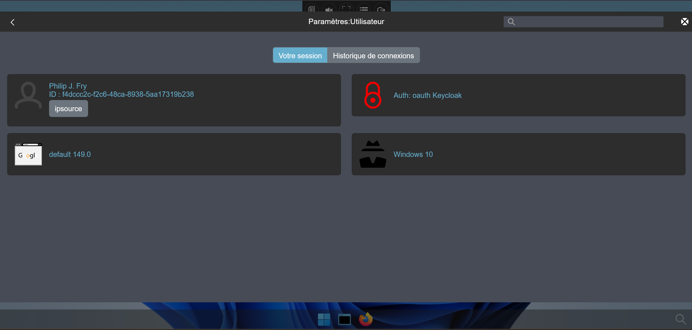

Keycloak is now fully configured with an external LDAP server for use with abcdesktop.
