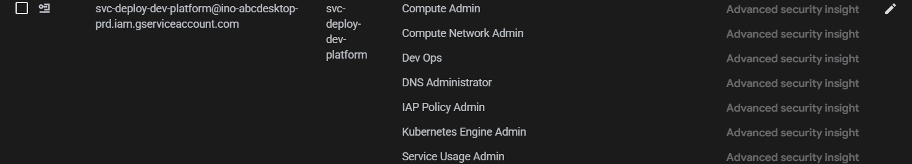
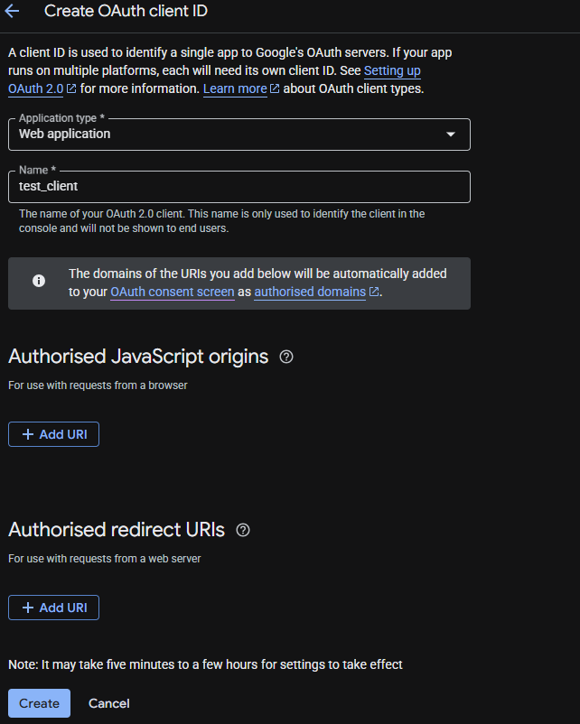
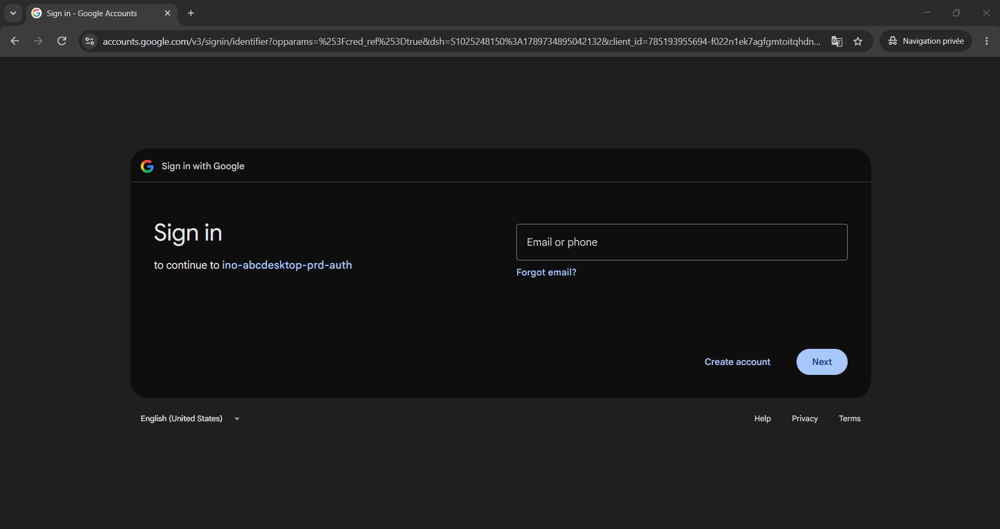
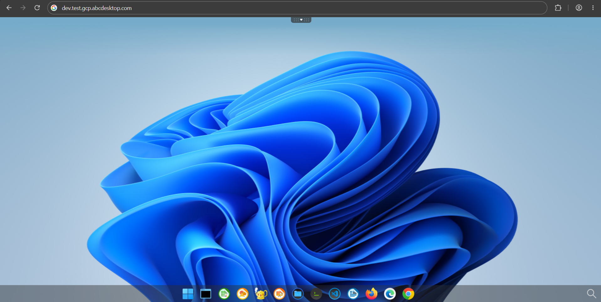

# Automate deployment with bash scripts

The two previous chapters describe how to provision a GKE cluster and install abcdesktop on it **manually**. This chapter presents an alternative, scripted approach: three bash scripts that automate the same overall process (cluster creation, exposure with a public FQDN and TLS, and cleanup) for a dev/test abcdesktop platform on GCP.

| Script | Purpose |
|---|---|
| `deploy-dev-platform-gcp.sh` | Creates the VPC/subnet/GKE cluster (or reuses existing ones) and installs abcdesktop on it |
| `expose-dev-platform-gcp.sh` | Creates the Ingress, DNS A record, Google-managed SSL certificate and, optionally, protects the platform with Cloud IAP |
| `cleanup-dev-platform-gcp.sh` | Tears down everything created by the two scripts above |

All three scripts authenticate to GCP with a service account key file and share the same `display_message`/`--help` conventions; run any of them with `--help` for the full option list.

## Prerequisites (GCP Console)

Before running any script, a few things must be prepared once in the Cloud Console. These steps **cannot be automated** by the scripts themselves, either because they require elevated permissions or because the relevant Google APIs have been retired.

### 1. Create a dedicated service account

Create a service account that the scripts will use to authenticate (`IAM & Admin > Service Accounts > Create Service Account`), then grant it the following project-level IAM roles:

| Role | Needed for |
|---|---|
| `roles/compute.admin` | VPC, subnet, Cloud Router, Cloud NAT, backend services |
| `roles/compute.networkAdmin` | Network resources management |
| `roles/container.admin` | Creating/deleting the GKE cluster |
| `roles/dns.admin` | Creating/deleting the DNS A record |
| `roles/serviceusage.serviceUsageAdmin` | Enabling GCP APIs used by the scripts |
| `roles/iap.admin` | Only required if you plan to use `--enable-iap` (manages IAM policy on the IAP resource) |

Once the roles are granted, create and download a JSON key for this service account (`Keys > Add Key > Create new key > JSON`). Its path is the `GCP_SA_CREDENTIALS_FILE` argument expected by all three scripts.

!!! warning
    Keep this key file out of version control. Never commit it to a git repository.



### 2. Enable the required APIs

In `APIs & Services > Library`, enable:

- **Compute Engine API** (`compute.googleapis.com`)
- **Kubernetes Engine API** (`container.googleapis.com`)
- **Cloud DNS API** (`dns.googleapis.com`)
- **Service Usage API** (`serviceusage.googleapis.com`)
- **Identity-Aware Proxy API** (`iap.googleapis.com`) — only if you plan to use `--enable-iap`

!!! danger "Service Usage API bootstrap trap"
    If the Service Usage API itself has never been enabled on the project, **no** `gcloud` command can enable anything else (including itself) — every API-enable call fails with a `SERVICE_DISABLED` / permission error, even with the correct IAM roles granted. This is a one-time chicken-and-egg situation that must be resolved by a project Owner enabling the Service Usage API manually from the Console.

### 3. Prepare a Cloud DNS managed zone

`expose-dev-platform-gcp.sh` creates an A record in an **existing** Cloud DNS managed zone (`Network Services > Cloud DNS`). Create the zone for your domain beforehand and make sure the domain's registrar delegates to the zone's name servers.

### 4. (Optional) Create the Cloud IAP OAuth client

This step is only required if you intend to run `expose-dev-platform-gcp.sh --enable-iap`. As of March 2026, Google permanently retired the IAP OAuth Admin API, so the OAuth consent screen and client can no longer be created by the script — they must be created once, manually, in the Console:

1. Go to `APIs & Services > Google Auth Platform` and configure the OAuth consent screen (support email, app name, scopes).
2. Go to `APIs & Services > Credentials > Create Credentials > OAuth client ID`, choose **Web application**, and create the client.
3. Note the generated **Client ID** and **Client secret** — they are passed to the script via `--iap-client-id` and `--iap-client-secret`.
4. Edit the OAuth client and add the following **Authorized redirect URI**, replacing `<IAP_CLIENT_ID>` with the Client ID from step 3:
   ```
   https://iap.googleapis.com/v1/oauth/clientIds/<IAP_CLIENT_ID>:handleRedirect
   ```
   Without this exact redirect URI, sign-in fails with *"This app doesn't comply with Google's OAuth 2.0 policy"*. Make sure not to append anything else (such as `flowName=GeneralOAuthFlow`) to this URI — that is a separate error-message parameter, not part of the URL.




### 5. Local tooling

Install the `gcloud` CLI, `kubectl` and `curl` on the machine that will run the scripts. There is no need to run `gcloud auth login` beforehand: each script authenticates automatically with `gcloud auth login --cred-file=<GCP_SA_CREDENTIALS_FILE>`.

## deploy-dev-platform-gcp.sh

Creates a GKE cluster (auto-creating a VPC/subnet/Cloud Router/Cloud NAT unless existing ones are supplied) and installs abcdesktop on it.

```
Usage: deploy-dev-platform-gcp.sh <GCP_SA_CREDENTIALS_FILE> <PROJECT_ID> <CLUSTER_NAME> <CLUSTER_REGION> <NUMBER_OF_NODES> [OPTION]...
```

| Parameter | Description |
|---|---|
| `--vpc-network <name>` | Use an existing VPC network (default: auto-create one) |
| `--subnet-name <name>` | Use an existing subnet (default: auto-create one) |
| `--abcdesktop-namespace <ns>` | Kubernetes namespace for abcdesktop (default: `abcdesktop`) |
| `--abcdesktop-version <version>` | abcdesktop version to deploy (default: `5.0`) |

Example:

```
./deploy-dev-platform-gcp.sh key.json my-project abcdesktop-dev europe-west9 3
```

## expose-dev-platform-gcp.sh

Creates the Ingress, DNS A record and Google-managed SSL certificate for a given FQDN, and optionally protects the platform with Cloud IAP.

```
Usage: expose-dev-platform-gcp.sh <GCP_SA_CREDENTIALS_FILE> <ABCDESKTOP_FQDN> <DNS_ZONE> [OPTION]...
```

| Parameter | Description |
|---|---|
| `--abcdesktop-namespace <ns>` | Kubernetes namespace for abcdesktop (default: `abcdesktop`) |
| `--dns-record-ttl <seconds>` | TTL for the DNS record (default: `300`) |
| `--project <id>` | GCP project id used for the IAP setup (default: active gcloud project) |
| `--enable-iap` | Protect the ingress with Cloud IAP |
| `--iap-client-id <id>` | OAuth client ID created in [step 4](#4-optional-create-the-cloud-iap-oauth-client) (required with `--enable-iap`) |
| `--iap-client-secret <secret>` | OAuth client secret (required with `--enable-iap`) |
| `--iap-member <member>` | Member(s) granted IAP access, e.g. `user:me@example.com` (comma-separated for several) |

Example without IAP:

```
./expose-dev-platform-gcp.sh key.json abcdesktop-dev.example.com my-dns-zone
```

Example with IAP:

```
./expose-dev-platform-gcp.sh key.json abcdesktop-dev.example.com my-dns-zone \
  --enable-iap \
  --iap-client-id 123-abc.apps.googleusercontent.com \
  --iap-client-secret GOCSPX-xxx \
  --iap-member user:me@example.com,user:colleague@example.com
```

> After the script execution, your platform should be accessible



## cleanup-dev-platform-gcp.sh

Deletes everything created by the two scripts above: the Ingress/ManagedCertificate/BackendConfig (implicitly, via cluster deletion), the GKE cluster, Cloud NAT, Cloud Router, subnetwork, VPC network and, optionally, the DNS A record.

```
Usage: cleanup-dev-platform-gcp.sh <GCP_SA_CREDENTIALS_FILE> <PROJECT_ID> <CLUSTER_NAME> <CLUSTER_REGION> [OPTION]...
```

| Parameter | Description |
|---|---|
| `--vpc-network <name>` | VPC network to delete (default: `<CLUSTER_NAME>-vpc`) |
| `--subnet-name <name>` | Subnetwork to delete (default: `<CLUSTER_NAME>-subnet`) |
| `--keep-network` | Do not delete the VPC/subnet/router/NAT |
| `--fqdn <domain>` | Also delete the DNS A record for this FQDN |
| `--dns-zone <zone>` | Cloud DNS zone name (default: `gcp-abcdekstop-demo`) |
| `--yes` | Skip the interactive confirmation prompt |

By default, the script asks you to type the cluster name to confirm before deleting anything.

Example:

```
./cleanup-dev-platform-gcp.sh key.json my-project abcdesktop-dev europe-west9 --fqdn abcdesktop-dev.example.com
```

## Full example

```
# 1. Create the cluster and install abcdesktop
./deploy-dev-platform-gcp.sh key.json my-project abcdesktop-dev europe-west9 3

# 2. Expose it publicly with IAP protection
./expose-dev-platform-gcp.sh key.json abcdesktop-dev.example.com my-dns-zone \
  --enable-iap \
  --iap-client-id 123-abc.apps.googleusercontent.com \
  --iap-client-secret GOCSPX-xxx \
  --iap-member user:me@example.com

# 3. When done, tear everything down
./cleanup-dev-platform-gcp.sh key.json my-project abcdesktop-dev europe-west9 --fqdn abcdesktop-dev.example.com
```

## Troubleshooting

- **`SERVICE_DISABLED` / permission errors when enabling any API**: the Service Usage API itself was never enabled on the project — see [step 2](#2-enable-the-required-apis).
- **`PERMISSION_DENIED: iap.webServices.getIamPolicy`**: the service account is missing `roles/iap.admin` (granting `roles/iap.httpsResourceAccessor` to end users is not enough for the script itself).
- **"This app doesn't comply with Google's OAuth 2.0 policy" at sign-in**: the OAuth client is missing (or has a malformed) `:handleRedirect` Authorized redirect URI — see [step 4](#4-optional-create-the-cloud-iap-oauth-client).
