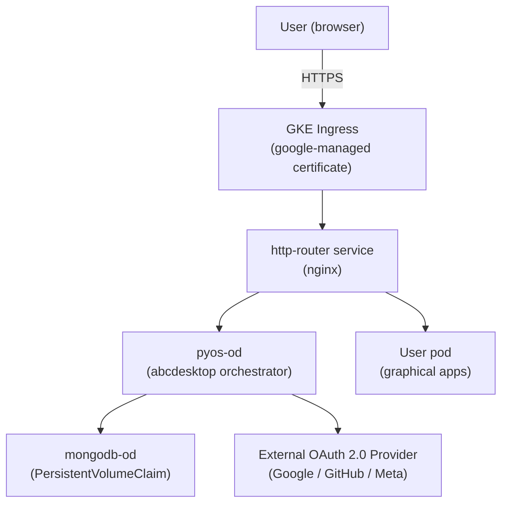

# Deploy demo.gcp.abcdesktop.com on Google Cloud Platform

This use case documents how the public demo service [https://demo.gcp.abcdesktop.com](https://demo.gcp.abcdesktop.com) is deployed and operated on Google Cloud Platform (GCP) using Google Kubernetes Engine (GKE).

The demo platform is a fully functional abcdesktop.io instance that is publicly accessible. It allows anyone to evaluate the desktopless experience without installing any local software, using an OpenID Connect provider (Google, GitHub, or Facebook) to sign in.

## Architecture overview

## Components

| Component | Description |
|---|---|
| **GKE cluster** | Private-node cluster in `europe-west9`, with autoscaling (0–6 nodes), Shielded nodes, DataPlane V2, and managed Prometheus |
| **GKE Ingress** | Google Cloud HTTP(S) load balancer, routing `demo.gcp.abcdesktop.com` to the `http-router` service |
| **Managed certificate** | Google-managed TLS certificate for `demo.gcp.abcdesktop.com` automatically provisioned and renewed |
| **Network policies** | Kubernetes `NetworkPolicy` resources restricting intra-namespace traffic to the minimum required |
| **MongoDB PVC** | A `PersistentVolumeClaim` (16 Gi, `ReadWriteOnce`) preventing data loss across MongoDB pod restarts |
| **Garbage collector** | A `CronJob` running every 15 minutes that calls the pyos `/API/manager/garbagecollector` endpoint to terminate idle desktops after 15 minutes |
| **External auth providers** | OAuth 2.0 providers (Google, GitHub, Facebook) configured in `od.config` under the `authmanagers.external` section; anonymous and LDAP authentication are disabled |

## Security considerations

- GKE nodes are **private** — they have no external IP addresses.
- **Shielded Nodes** with Secure Boot and integrity monitoring are enabled.
- **DataPlane V2** (based on eBPF/Cilium) provides built-in network policy enforcement at the kernel level.
- Kubernetes `NetworkPolicy` resources are applied to limit pod-to-pod communication. The Internet egress from user pods is blocked by policy.
- TLS is enforced end-to-end via the GKE-managed certificate.
- The garbage collector limits resource exhaustion by reclaiming idle desktop pods automatically.

## Step-by-step guide

This use case is documented in two chapters:

1. **[Create the Kubernetes cluster on GCP](./configure-kubernetes-cluster-gcp.md)**  
   Provision the GKE cluster with the recommended security settings (private nodes, Shielded Nodes, DataPlane V2, autoscaling).

2. **[Install and configure the demo platform](./install-demo.md)**  
   Deploy abcdesktop on the cluster, expose the service with a GKE Ingress and a Google-managed TLS certificate, apply network policies, configure the MongoDB PVC, set up the garbage collector, and add external OAuth 2.0 authentication providers.

## Repository

The manifests used to operate this demo are maintained in the repository [`abcdesktop conf`](https://github.com/abcdesktopio/conf/tree/main/demo). The following files are referenced throughout this guide:

| File | Purpose |
|---|---|
| `abcdesktop.yaml` | Main abcdesktop deployment manifest |
| `gke-ingress.yaml` | GKE Ingress resource |
| `abcdesktop_managed_certificate.yaml` | Google-managed TLS certificate |
| `backend_config_timeout.yaml` | BackendConfig for load balancer timeout tuning |
| `netpol-default-4.4.yaml` | Default network policies |
| `pvc-mongo.yaml` | PersistentVolumeClaim for MongoDB |
| `cronjob.yaml` | Garbage collector CronJob |
| `od.config` | abcdesktop main configuration (auth providers, routing, …) |
