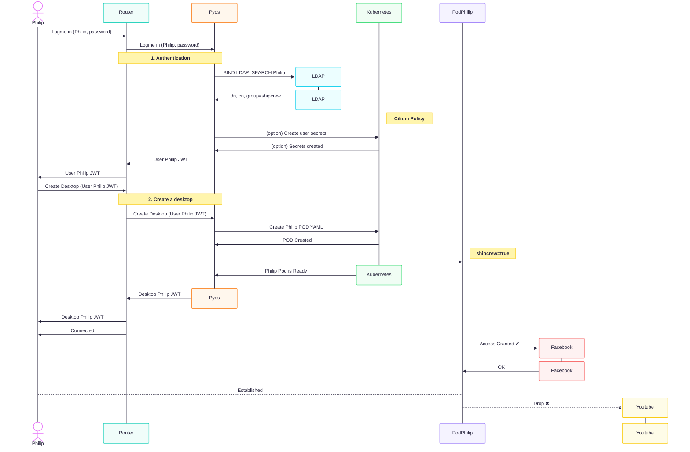
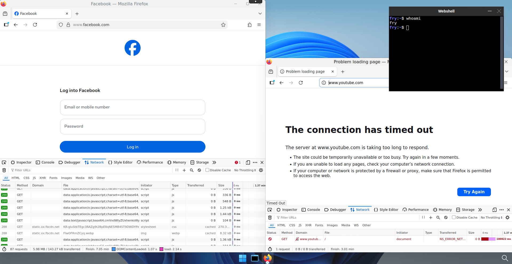
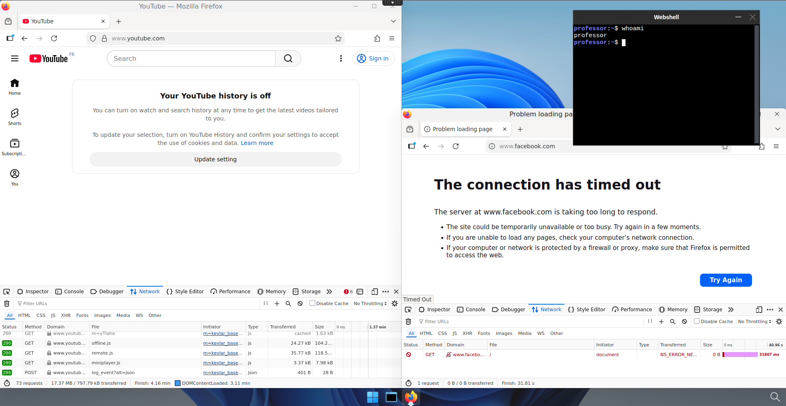

# Filter traffic based on user's groups

## Prerequisites

- a Kubernetes cluster with abcdesktop installed
- use [cilium](https://cilium.io/) as network provider for your cluster
- Any authentication system already configured with abcdesktop, see [authentication section](../authentication/overview.md) for more informations.

!!! note
    In this example, we will use [docker-test-openldap](https://github.com/rroemhild/docker-test-openldap) which is a LDAP service


## Use case description

As an organistaion, you may have several departments, such as sales, accounting, IT, etc. And you may want to control access based on department. For exemple, an IT employee shouldn't have access to accounting documents.  
With abcdesktop, you can meet these kind of needs by creating rules bases on the groups to which users belong.



## How does abcdesktop manage groups

Let's assume that the users present your authentication system are already affected to groups. In our example, we have `	Philip J. Fry` a.k.a. `fry`, and `Hubert J. Farnsworth` a.k.a. `professor`, respectively members of `ship_crew` and `admin_staff` groups (cf [https://github.com/rroemhild/docker-test-openldap](https://github.com/rroemhild/docker-test-openldap)).  

Once authenticated, abcdesktop control plane reads the user's infos, and will create the user's pod with its groups specified as labels.

```
kubectl get pods -n abcdesktop
```
```
NAME                            READY   STATUS    RESTARTS      AGE
console-od-7f548d74fd-48rpv     1/1     Running   0             2d19h
fry-3c9e8                       3/3     Running   0             45h
memcached-od-796c455cd-hqhlb    1/1     Running   0             2d19h
mongodb-od-0                    2/2     Running   0             2d19h
nginx-od-6657dd8c9-c979g        1/1     Running   0             2d19h
openldap-od-6f4797f9d-86jdd     1/1     Running   0             2d1h
professor-0ecf4                 3/3     Running   0             44h
pyos-od-68776fb486-69x5q        1/1     Running   0             2d
router-od-867f5576dd-p9hj5      1/1     Running   0             2d19h
speedtest-od-78cdbdd9c6-vphfl   1/1     Running   0             2d19h
```

Run a `describe pod` command on both user pod to check if the group label is present.

??? note "show details"
    ```
    kubectl describe pod fry-3c9e8 -n abcdesktop 
    ```
    ```
    [...]
    Labels:         abcdesktop/role=desktop
                    access_provider=planet
                    access_providertype=ldap
                    access_userid=fry
                    access_username=philip-j.-fry
                    broadcast_cookie=202f5459d1a35e54d149b75795f269796cdd78c520e4e412
                    cn-ship_crew-ou-people-dc-planetexpress-dc-com=
                    ipsource=10.0.2.216
                    labeltrue=true
                    netpol/ocuser=true
                    pulseaudio_cookie=8d8cec68f8647887efdcd1bddb09db6a
                    service_broadcast=29784
                    service_ephemeral_container=enabled
                    service_filer=29783
                    service_graphical=6081
                    service_init=enabled
                    service_pod_application=enabled
                    service_printerfile=29782
                    service_sound=29788
                    service_spawner=29786
                    service_webshell=29781
                    shipcrew=true
                    type=x11server
                    xauthkey=2d1afb247f156987dc65ae72bcc0f4
    [...]
    ```

    ```
    kubectl describe pod professor-0ecf4 -n abcdesktop 
    ```
    ```
    [...]
    Labels:         abcdesktop/role=desktop
                    access_provider=planet
                    access_providertype=ldap
                    access_userid=professor
                    access_username=hubert-j.-farnsworth
                    adminstaff=true
                    broadcast_cookie=315066f64d9c59b70ce5f0c7d86f10079b01a78cce44d8c7
                    cn-admin_staff-ou-people-dc-planetexpress-dc-com=
                    ipsource=10.0.1.22
                    labeltrue=true
                    netpol/ocuser=true
                    pulseaudio_cookie=b8c096a27cad70c114ed81ab4c4da3a1
                    service_broadcast=29784
                    service_ephemeral_container=enabled
                    service_filer=29783
                    service_graphical=6081
                    service_init=enabled
                    service_pod_application=enabled
                    service_printerfile=29782
                    service_sound=29788
                    service_spawner=29786
                    service_webshell=29781
                    type=x11server
                    xauthkey=f7e335f429be8bd8e82c48df775fb0
    [...]
    ```

You should see labels `shipcrew=true` for `fry` and `adminstaff=true` for `professor`

## Create access rules based on groups

To monitor pods incoming (ingress) and outgoing (egress) traffic in Kubernetes, we ordinarily use [NetworkPolicies](https://kubernetes.io/docs/concepts/services-networking/network-policies/). But network policies does not offer the possibility to filter based on FQDNs, you can only filter by IPs. So that means, if the service you want to grant access to has more than one IP, you need to specify all IPs in the filter, it becomes even worse if it has dynamic IPs that are constantly changing.  
This is why we use `cilium` as network provider for our cluster, so that we can apply [CiliumNetworkPolicies](https://docs.cilium.io/en/stable/network/kubernetes/policy/#ciliumnetworkpolicy). Those are very similar to the standard network policies but provides fuctionalites that are not yet supported, like DNS based rules.  

!!! warning
    It is important to keep in mind that `CiliumNetworkPolicies` operates on a whitelist basis. That means that once an egress rule is applied, everything that is not clearly indicate as authorized is forbidden.

In our example, we will allow users from the `shipcrew` group to access `Facebook`, and users from the `adminstaff` group to access `Youtube`.

First create a file called `netpol-allow-facebook-shipcrew.yaml` and paste the following content

```yaml
apiVersion: cilium.io/v2
kind: CiliumNetworkPolicy
metadata:
  name: allow-facebook-shipcrew
  namespace: abcdesktop
spec:
  endpointSelector:
    matchLabels:
      shipcrew: "true" # Selector based on group label
  egress:
  - toEndpoints:
    # Allow all DNS resolutions
    - matchLabels:
       "k8s:io.kubernetes.pod.namespace": kube-system
       "k8s:k8s-app": kube-dns
    toPorts:
      - ports:
         - port: "53"
           protocol: ANY
        rules:
          dns:
            - matchPattern: "*"
  - toFQDNs:
      # Add here all the FQDN patterns you want to grant access to
      - matchPattern: "*.facebook.com"  
      - matchPattern: "*.xx.fbcdn.net"
    toPorts:
      - ports:
         - port: "80"
           protocol: TCP
         - port: "443"
           protocol: TCP
```

Save and apply it by running the following command

```
kubectl apply -f netpol-allow-facebook-shipcrew.yaml -n abcdesktop
ciliumnetworkpolicy.cilium.io/allow-facebook-shipcrew configured
```

Now you can check if the policy exists by running this command 

```
kubectl get ciliumnetworkpolicy -n abcdesktop
NAME                       AGE
allow-facebook-shipcrew    27h
```

Your pod should now have access to Facebook and nothing else



Now create a file called `netpol-allow-youtube-adminstaff.yaml` and paste the following content

```yaml
apiVersion: cilium.io/v2
kind: CiliumNetworkPolicy
metadata:
  name: allow-youtube-adminstaff
  namespace: abcdesktop
spec:
  endpointSelector:
    matchLabels:
      adminstaff: "true" # Selector based on group label
  egress:
  - toEndpoints:
    # Allow all DNS resolutions
    - matchLabels:
       "k8s:io.kubernetes.pod.namespace": kube-system
       "k8s:k8s-app": kube-dns
    toPorts:
      - ports:
         - port: "53"
           protocol: ANY
        rules:
          dns:
            - matchPattern: "*"
  - toFQDNs:
      # Add here all the FQDN patterns you want to grant access to
      - matchPattern: "*.youtube.com"
    toPorts:
      - ports:
         - port: "80"
           protocol: TCP
         - port: "443"
           protocol: TCP
```

Save and apply it by running the following command

```
kubectl apply -f netpol-allow-youtube-adminstaff.yaml -n abcdesktop
ciliumnetworkpolicy.cilium.io/allow-youtube-adminstaff configured
```

Now you can check if the policy exists by running this command 

```
kubectl get ciliumnetworkpolicy -n abcdesktop
NAME                       AGE
allow-facebook-shipcrew    27h
allow-youtube-adminstaff   27h
```

Your pod should now have access to Youtube and nothing else



Great ! Now you can manage your organization's network access based on user groups.