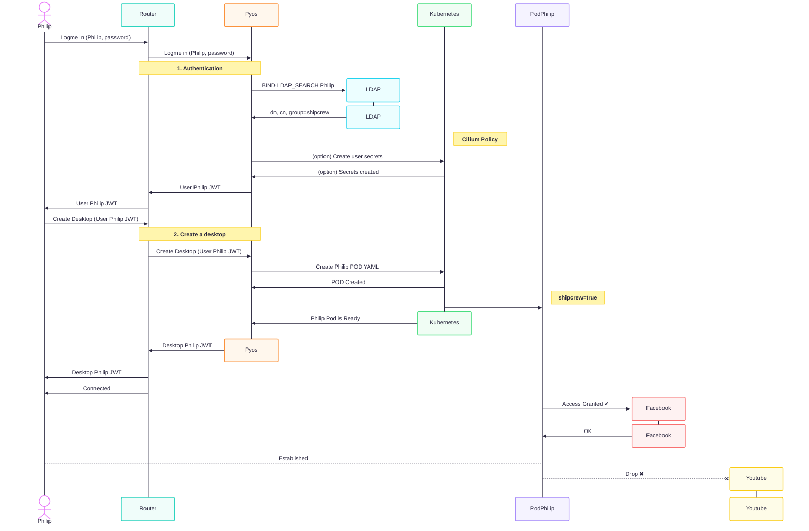

# Filter traffic based on user's groups

## Prerequisites

- a Kubernetes cluster with abcdesktop installed
- use [cilium](https://cilium.io/) as network provider for your cluster
- An authentication provider with groups support (`LDAP`, `ActiveDirectory` or `OAuth`), see [authentication section](../../advanced/4.4/authentication/overview.md) for more details. By default the docker-test-openldap provides groups support.

!!! note
    In this example, we will use [docker-test-openldap](https://github.com/rroemhild/docker-test-openldap) which is a LDAP service


## Use case description

As an organization, you may have multiple departments—such as sales, accounting, and IT—each with different access requirements. For example, an IT employee should not have access to accounting documents. With abcdesktop, you can address these requirements by creating rules based on the groups to which users belong.



## How does abcdesktop manage groups

Assume that users registered in your authentication system are already assigned to groups. In this example, `Philip J. Fry` (known as `fry`) and `Hubert J. Farnsworth` (known as `professor`) are members of the `ship_crew` and `admin_staff` groups, respectively (cf [https://github.com/rroemhild/docker-test-openldap](https://github.com/rroemhild/docker-test-openldap)).  

Once authenticated, the abcdesktop control plane reads the user's information and creates the user pod with the user's group memberships applied as pod labels.

```
kubectl get pods -n abcdesktop
```
```
NAME                            READY   STATUS    RESTARTS      AGE
console-od-7f548d74fd-48rpv     1/1     Running   0             2d19h
fry-3c9e8                       3/3     Running   0             45h
memcached-od-796c455cd-hqhlb    1/1     Running   0             2d19h
mongodb-od-0                    2/2     Running   0             2d19h
nginx-od-6657dd8c9-c979g        1/1     Running   0             2d19h
openldap-od-6f4797f9d-86jdd     1/1     Running   0             2d1h
professor-0ecf4                 3/3     Running   0             44h
pyos-od-68776fb486-69x5q        1/1     Running   0             2d
router-od-867f5576dd-p9hj5      1/1     Running   0             2d19h
speedtest-od-78cdbdd9c6-vphfl   1/1     Running   0             2d19h
```

Run the `kubectl describe pod` command on each user pod to verify that the group labels are present.

??? note "show details"
    ```
    kubectl describe pod fry-3c9e8 -n abcdesktop 
    ```
    ```
    [...]
    Labels:         abcdesktop/role=desktop
                    access_provider=planet
                    access_providertype=ldap
                    access_userid=fry
                    access_username=philip-j.-fry
                    broadcast_cookie=202f5459d1a35e54d149b75795f269796cdd78c520e4e412
                    cn-ship_crew-ou-people-dc-planetexpress-dc-com=
                    ipsource=10.0.2.216
                    labeltrue=true
                    netpol/ocuser=true
                    pulseaudio_cookie=8d8cec68f8647887efdcd1bddb09db6a
                    service_broadcast=29784
                    service_ephemeral_container=enabled
                    service_filer=29783
                    service_graphical=6081
                    service_init=enabled
                    service_pod_application=enabled
                    service_printerfile=29782
                    service_sound=29788
                    service_spawner=29786
                    service_webshell=29781
                    shipcrew=true
                    type=x11server
                    xauthkey=2d1afb247f156987dc65ae72bcc0f4
    [...]
    ```

    ```
    kubectl describe pod professor-0ecf4 -n abcdesktop 
    ```
    ```
    [...]
    Labels:         abcdesktop/role=desktop
                    access_provider=planet
                    access_providertype=ldap
                    access_userid=professor
                    access_username=hubert-j.-farnsworth
                    adminstaff=true
                    broadcast_cookie=315066f64d9c59b70ce5f0c7d86f10079b01a78cce44d8c7
                    cn-admin_staff-ou-people-dc-planetexpress-dc-com=
                    ipsource=10.0.1.22
                    labeltrue=true
                    netpol/ocuser=true
                    pulseaudio_cookie=b8c096a27cad70c114ed81ab4c4da3a1
                    service_broadcast=29784
                    service_ephemeral_container=enabled
                    service_filer=29783
                    service_graphical=6081
                    service_init=enabled
                    service_pod_application=enabled
                    service_printerfile=29782
                    service_sound=29788
                    service_spawner=29786
                    service_webshell=29781
                    type=x11server
                    xauthkey=f7e335f429be8bd8e82c48df775fb0
    [...]
    ```

Confirm that the label `shipcrew=true` appears on the `fry` pod and `adminstaff=true` appears on the `professor` pod.

## Create access rules based on groups

To control incoming (ingress) and outgoing (egress) traffic for pods in Kubernetes, operators typically use [NetworkPolicies](https://kubernetes.io/docs/concepts/services-networking/network-policies/). However, standard Kubernetes `NetworkPolicy` resources do not support filtering based on fully qualified domain names (FQDNs); they only support filtering by IP address or CIDR range. If the target service uses multiple IP addresses, each address must be listed explicitly in the policy—a significant maintenance burden, especially when addresses change dynamically. This is why Cilium is used as the cluster network provider: it supports [CiliumNetworkPolicy](https://docs.cilium.io/en/stable/network/kubernetes/policy/#ciliumnetworkpolicy) resources, which extend the standard Kubernetes network policy API with additional capabilities not yet available natively, such as DNS-based egress filtering rules.

!!! warning
    `CiliumNetworkPolicy` resources operate on an allowlist (default-deny) basis. Once an egress rule is applied to an endpoint, all traffic not explicitly permitted is denied.

In this example, users belonging to the `shipcrew` group are granted access to Facebook, and users in the `adminstaff` group are granted access to YouTube.

Create a file named `netpol-allow-facebook-shipcrew.yaml` with the following content.

```yaml
apiVersion: cilium.io/v2
kind: CiliumNetworkPolicy
metadata:
  name: allow-facebook-shipcrew
  namespace: abcdesktop
spec:
  endpointSelector:
    matchLabels:
      shipcrew: "true" # Selector based on group label
  egress:
  - toEndpoints:
    # Allow all DNS resolutions
    - matchLabels:
       "k8s:io.kubernetes.pod.namespace": kube-system
       "k8s:k8s-app": kube-dns
    toPorts:
      - ports:
         - port: "53"
           protocol: ANY
        rules:
          dns:
            - matchPattern: "*"
  - toFQDNs:
      # Add here all the FQDN patterns you want to grant access to
      - matchPattern: "*.facebook.com"  
      - matchPattern: "*.xx.fbcdn.net"
    toPorts:
      - ports:
         - port: "80"
           protocol: TCP
         - port: "443"
           protocol: TCP
```

Apply the policy to the cluster.

```
kubectl apply -f netpol-allow-facebook-shipcrew.yaml -n abcdesktop
ciliumnetworkpolicy.cilium.io/allow-facebook-shipcrew configured
```

Verify that the policy was created successfully.

```
kubectl get ciliumnetworkpolicy -n abcdesktop
NAME                       AGE
allow-facebook-shipcrew    27h
```

User pods belonging to the `shipcrew` group now have access to Facebook. All other external destinations remain blocked.


Create a file named `netpol-allow-youtube-adminstaff.yaml` with the following content.

```yaml
apiVersion: cilium.io/v2
kind: CiliumNetworkPolicy
metadata:
  name: allow-youtube-adminstaff
  namespace: abcdesktop
spec:
  endpointSelector:
    matchLabels:
      adminstaff: "true" # Selector based on group label
  egress:
  - toEndpoints:
    # Allow all DNS resolutions
    - matchLabels:
       "k8s:io.kubernetes.pod.namespace": kube-system
       "k8s:k8s-app": kube-dns
    toPorts:
      - ports:
         - port: "53"
           protocol: ANY
        rules:
          dns:
            - matchPattern: "*"
  - toFQDNs:
      # Add here all the FQDN patterns you want to grant access to
      - matchPattern: "*.youtube.com"
    toPorts:
      - ports:
         - port: "80"
           protocol: TCP
         - port: "443"
           protocol: TCP
```

Apply the policy to the cluster.

```
kubectl apply -f netpol-allow-youtube-adminstaff.yaml -n abcdesktop
ciliumnetworkpolicy.cilium.io/allow-youtube-adminstaff configured
```

Verify that the policy was created successfully.

```
kubectl get ciliumnetworkpolicy -n abcdesktop
NAME                       AGE
allow-facebook-shipcrew    27h
allow-youtube-adminstaff   27h
```

User pods belonging to the `adminstaff` group now have access to YouTube. All other external destinations remain blocked.


Network access is now controlled per user group using Cilium network policies.
