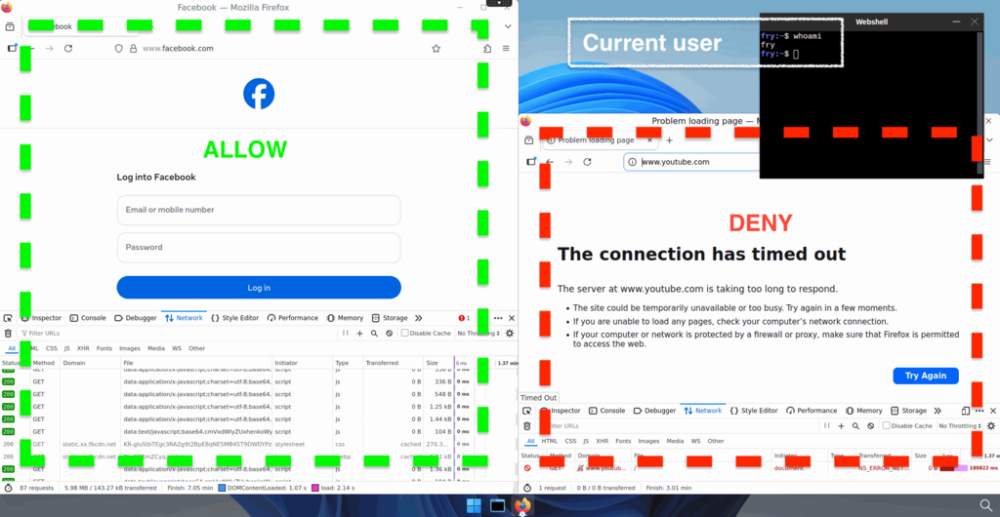
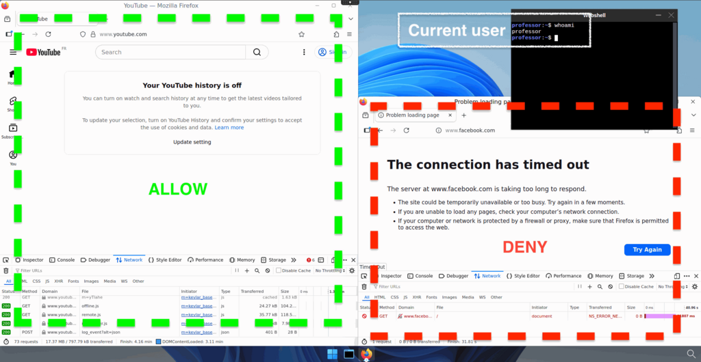

---
hide:
  - navigation
  - toc
title: Network Access Control by User Group | abcdesktop.io
description: Control network access per LDAP group using Kubernetes Cilium NetworkPolicy. Different departments, different access rights. DNS + FQDN filtering with zero configuration overhead.
keywords: network access control, LDAP groups, Cilium NetworkPolicy, egress filtering, DNS filtering, FQDN, Kubernetes security, access control, zero-trust
tags:
  - security
  - network policy
  - access control
  - solutions
---

# Network Access Control by User Group

## The Problem: One-Size-Fits-All Network Access

Your organization has departments with different security requirements. Sales should access client CRMs. Accounting should access financial systems. IT should access everything—or nothing, depending on your policy.

With traditional VDI, you apply policies per machine or per role. With abcdesktop on Kubernetes, you can apply policies directly **per LDAP group**, tied to the user pod itself.

---

## How It Works

<div class="grid cards" markdown>

-   **User Groups → Pod Labels**  
    LDAP groups automatically become Kubernetes pod labels. `shipcrew=true`, `adminstaff=true`, etc.

-   **DNS + FQDN Filtering**  
    Cilium allows `*.facebook.com` patterns, not just IPs. Maintenance is automatic.

-   **Default-Deny Posture**  
    All egress is blocked until explicitly allowed. No data leakage by accident.

-   **Zero Client Config**  
    Rules are applied on the server side. User has no way to bypass them.

-   **Dynamic Scaling**  
    Add a user to a group → pod gets labeled → policies apply automatically.

-   **LDAP/AD/OAuth Ready**  
    Works with any auth provider that supports groups.

</div>

---

## Architecture Overview

When a user logs in, here's what happens:

1. **Authentication** — User provides credentials (LDAP, AD, OAuth)
2. **Group Resolution** — System reads user's group memberships
3. **Pod Creation** — Desktop pod is created **with group labels automatically applied**
4. **Policy Enforcement** — Cilium reads the labels and applies network rules

```mermaid
---
config:
  theme: redux-color
---
sequenceDiagram
    actor Philip
    Philip->>Router: Logme in (Philip, password)
    Router->>Pyos: Logme in (Philip, password)
    Note over Router,Pyos: 1. Authentication
    Create participant LDAP
    Pyos->>LDAP: BIND LDAP_SEARCH Philip
    destroy LDAP
    LDAP->>Pyos: groups: [shipcrew]
    Note right of Kubernetes: Cilium Policy
    Pyos->>Kubernetes: Create pod with labels: shipcrew=true
    Kubernetes->>Pyos: Pod created
    Create participant PodPhilip
    Note right of PodPhilip: label: shipcrew=true
    Kubernetes->>Pyos: Pod ready
    Pyos->>Router: Session established
    Router->>Philip: Connected
    Create participant Facebook
    PodPhilip->>Facebook: ✓ Allowed (Cilium policy matches)
    Facebook->>PodPhilip: OK
    Create participant Youtube
    PodPhilip--xYoutube: ✗ Dropped (not in policy)
```

---

## Prerequisites

- Kubernetes cluster with abcdesktop installed
- **Cilium** as your cluster network provider (for DNS/FQDN-based policies)
- LDAP, Active Directory, or OAuth with group support
- Basic knowledge of Kubernetes manifests

---

## Step-by-Step Implementation

### Step 1: Verify Groups Are Being Applied

When a user logs in, abcdesktop automatically reads their LDAP/AD group memberships and **applies them as pod labels**.

Check the user pods:

```bash
kubectl get pods -n abcdesktop
```

```
NAME                            READY   STATUS    RESTARTS      AGE
console-od-7f548d74fd-48rpv     1/1     Running   0             2d19h
fry-3c9e8                       3/3     Running   0             45h
memcached-od-796c455cd-hqhlb    1/1     Running   0             2d19h
mongodb-od-0                    2/2     Running   0             2d19h
nginx-od-6657dd8c9-c979g        1/1     Running   0             2d19h
openldap-od-6f4797f9d-86jdd     1/1     Running   0             2d1h
professor-0ecf4                 3/3     Running   0             44h
pyos-od-68776fb486-69x5q        1/1     Running   0             2d
router-od-867f5576dd-p9hj5      1/1     Running   0             2d19h
speedtest-od-78cdbdd9c6-vphfl   1/1     Running   0             2d19h
```

Describe a pod to see the group labels:

```bash
kubectl describe pod fry-3c9e8 -n abcdesktop | grep -E "Labels:|shipcrew|adminstaff"
```

Output:

```
Labels:  shipcrew=true
         access_userid=fry
         access_username=philip-j.-fry
         [... other labels ...]
```

```bash
kubectl describe pod professor-0ecf4 -n abcdesktop | grep -E "Labels:|shipcrew|adminstaff"
```

Output:

```
Labels:  adminstaff=true
         access_userid=professor
         access_username=hubert-j.-farnsworth
         [... other labels ...]
```


The labels `shipcrew=true` on `fry` and `adminstaff=true` on `professor` proves the groups was read and applied. ✓

---

### Step 2: Create a Cilium Network Policy for Your First Group

This example allows the `shipcrew` group to access Facebook:

```yaml
apiVersion: cilium.io/v2
kind: CiliumNetworkPolicy
metadata:
  name: allow-facebook-shipcrew
  namespace: abcdesktop
spec:
  endpointSelector:
    matchLabels:
      shipcrew: "true"
  egress:
  - toEndpoints:
    - matchLabels:
       "k8s:io.kubernetes.pod.namespace": kube-system
       "k8s:k8s-app": kube-dns
    toPorts:
      - ports:
         - port: "53"
           protocol: ANY
        rules:
          dns:
            - matchPattern: "*"
  - toFQDNs:
      - matchPattern: "*.facebook.com"
      - matchPattern: "*.fbcdn.net"
    toPorts:
      - ports:
         - port: "80"
           protocol: TCP
         - port: "443"
           protocol: TCP
```

Apply it:

```bash
kubectl apply -f netpol-allow-facebook-shipcrew.yaml
```

---

### Step 3: Create a Second Policy for Another Group

For the `adminstaff` group accessing YouTube:

```yaml
apiVersion: cilium.io/v2
kind: CiliumNetworkPolicy
metadata:
  name: allow-youtube-adminstaff
  namespace: abcdesktop
spec:
  endpointSelector:
    matchLabels:
      adminstaff: "true"
  egress:
  - toEndpoints:
    - matchLabels:
       "k8s:io.kubernetes.pod.namespace": kube-system
       "k8s:k8s-app": kube-dns
    toPorts:
      - ports:
         - port: "53"
           protocol: ANY
        rules:
          dns:
            - matchPattern: "*"
  - toFQDNs:
      - matchPattern: "*.youtube.com"
    toPorts:
      - ports:
         - port: "80"
           protocol: TCP
         - port: "443"
           protocol: TCP
```

Apply it:

```bash
kubectl apply -f netpol-allow-youtube-adminstaff.yaml
```

Verify both policies exist:

```bash
kubectl get ciliumnetworkpolicy -n abcdesktop
```

Output:

```
NAME                       AGE
allow-facebook-shipcrew    2h
allow-youtube-adminstaff   2h
```
---

## Try it 

Let's see if the policies has correctly been applied. Log on both pods an try to succesively connect to `www.youtube.com` and `www.facebook.com`.




---

## Why This Matters

**Default-Deny**: Cilium policies operate on an allowlist basis. Once you apply a rule, all traffic NOT explicitly permitted is blocked.

**No Client Bypass**: The filtering happens on the cluster network, not in the pod. Users can't disable it.

**Scales Automatically**: When you add a user to a new group in LDAP, their pod gets the label at next login. Policies apply immediately.

**DNS-Based Rules**: Instead of managing IP lists (which change constantly), you manage domain patterns. `*.facebook.com` covers all CDNs, all subdomains, automatically.

---

## Common Use Cases

| Department | Access | Policy |
|---|---|---|
| Sales | CRM, Email, Google Meet | `*.salesforce.com`, `*.google.com`, `*.slack.com` |
| Finance | ERP, Banking, Accounting | `*.sap.com`, `*.intacct.com`, internal-banking-server |
| IT/Ops | All internal services | No policy (allow-all) or restricted list |
| Customer Service | Helpdesk, Email, Docs | `*.zendesk.com`, `*.google.com` |

---

## Next Steps

1. **Create your group structure in LDAP** — Organize teams by department or role
2. **Test with a small pilot group** — Apply policies to one group, verify behavior
3. **Scale across the organization** — Create policies for each department
4. **Monitor and audit** — Use Cilium's built-in observability to see what's being blocked

---

## Resources

- [Cilium Network Policies Documentation](https://docs.cilium.io/en/stable/network/kubernetes/policy/)
- [abcdesktop Authentication Overview](../../advanced/4.4/authentication/overview.md)


---

**Back to Use Cases:** [Use Cases](../) | [Kubernetes VDI](../../solutions/kubernetes-vdi.md)
