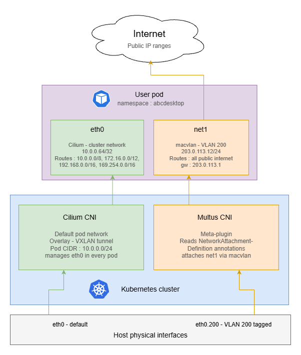

---
tags:
  - usecase
  - multus
  - networking
---

# Add multiple network interfaces to user pods using VLANs

## Requirements

- a Kubernetes cluster with abcdesktop installed
- [cilium-cli](https://docs.cilium.io/en/stable/installation/cli-download/#)
- [multus CNI](https://github.com/k8snetworkplumbingwg/multus-cni) installed on your cluster
- VLAN-tagged interfaces configured on your host nodes

!!! note 
    The goal of this tutorial is to route all outgoing internet traffic through a dedicated VLAN interface, while keeping private network traffic on the default Kubernetes CNI interface (eth0).

!!! note
    This example uses [docker-test-openldap](https://github.com/rroemhild/docker-test-openldap)

    ??? note "show details"
        This image uses standard static groups based on `RFC LDAP 4519` 

        Below is the `ship_crew` group file

        ```
        dn: cn=ship_crew,ou=people,dc=planetexpress,dc=com
        objectclass: Group
        objectclass: top
        groupType: 2147483650
        cn: ship_crew
        member: cn=Philip J. Fry,ou=people,dc=planetexpress,dc=com
        member: cn=Turanga Leela,ou=people,dc=planetexpress,dc=com
        member: cn=Bender Bending Rodriguez,ou=people,dc=planetexpress,dc=com
        ```

        Below is the `admin_staff` group file

        ```
        dn: cn=admin_staff,ou=people,dc=planetexpress,dc=com
        objectclass: Group
        objectclass: top
        groupType: 2147483650
        cn: admin_staff
        member: cn=Hubert J. Farnsworth,ou=people,dc=planetexpress,dc=com
        member: cn=Hermes Conrad,ou=people,dc=planetexpress,dc=com
        ```

## Disable Cilium CNI Exclusive Mode

By default, when Cilium is installed in a Kubernetes cluster, it operates in exclusive CNI mode, meaning it is the only plugin managing pod networking.

Before installing Multus, this behavior must be disabled to allow multiple CNI plugins to coexist. You can disable Cilium’s exclusive mode by running the following command:

```
cilium config set cni-exclusive false
```

## Create `NetworkAttachementDefinition`

A `NetworkAttachmentDefinition` is a Kubernetes custom resource that describes how Multus should attach an additional network interface to a pod. You must create one for each VLAN you want to expose to user pods.

In this example, we configure a macvlan interface bound to VLAN ID 200 (`eno1.200`). Adapt the `master` nterface, subnet, IP range, and gateway to match your network topology.

Here is an example of `macvlan-conf-1.yaml` file.

```yaml
apiVersion: "k8s.cni.cncf.io/v1"
kind: NetworkAttachmentDefinition
metadata:
  name: macvlan-conf-1
spec:
  config: '{
            "cniVersion": "0.3.0",
            "type": "macvlan",
            "master": "eno1.200",  # Interface on your host tagged with vlan ID 200
            "mode": "bridge",
            "ipam": {
               "type": "host-local",
               "subnet": "203.0.113.0/24",
                "rangeStart": "203.0.113.10",
                "rangeEnd": "203.0.113.50",
                "routes": [
                      { "dst": "1.0.0.0/8",   "gw": "203.0.113.1" },
                      { "dst": "2.0.0.0/7",   "gw": "203.0.113.1" },
                      { "dst": "4.0.0.0/6",   "gw": "203.0.113.1" },
                      { "dst": "8.0.0.0/7",   "gw": "203.0.113.1" },
                      { "dst": "11.0.0.0/8",  "gw": "203.0.113.1" },
                      { "dst": "12.0.0.0/6",  "gw": "203.0.113.1" },
                      { "dst": "16.0.0.0/4",  "gw": "203.0.113.1" },
                      { "dst": "32.0.0.0/3",  "gw": "203.0.113.1" },
                      { "dst": "64.0.0.0/3",  "gw": "203.0.113.1" },
                      { "dst": "96.0.0.0/4",  "gw": "203.0.113.1" },
                      { "dst": "112.0.0.0/5",  "gw": "203.0.113.1" },
                      { "dst": "120.0.0.0/6",  "gw": "203.0.113.1" },
                      { "dst": "124.0.0.0/7",  "gw": "203.0.113.1" },
                      { "dst": "126.0.0.0/8",  "gw": "203.0.113.1" },
                      { "dst": "128.0.0.0/3",  "gw": "203.0.113.1" },
                      { "dst": "160.0.0.0/5",  "gw": "203.0.113.1" },
                      { "dst": "168.0.0.0/8",  "gw": "203.0.113.1" },
                      { "dst": "169.0.0.0/9",  "gw": "203.0.113.1" },
                      { "dst": "169.128.0.0/10",  "gw": "203.0.113.1" },
                      { "dst": "169.192.0.0/11",  "gw": "203.0.113.1" },
                      { "dst": "169.224.0.0/12",  "gw": "203.0.113.1" },
                      { "dst": "169.240.0.0/13",  "gw": "203.0.113.1" },
                      { "dst": "169.248.0.0/14",  "gw": "203.0.113.1" },
                      { "dst": "169.252.0.0/15",  "gw": "203.0.113.1" },
                      { "dst": "169.255.0.0/16",  "gw": "203.0.113.1" },
                      { "dst": "170.0.0.0/7",  "gw": "203.0.113.1" },
                      { "dst": "172.0.0.0/12",  "gw": "203.0.113.1" },
                      { "dst": "172.32.0.0/11",  "gw": "203.0.113.1" },
                      { "dst": "172.64.0.0/10",  "gw": "203.0.113.1" },
                      { "dst": "172.128.0.0/9",  "gw": "203.0.113.1" },
                      { "dst": "173.0.0.0/8",  "gw": "203.0.113.1" },
                      { "dst": "174.0.0.0/7", "gw": "203.0.113.1" },
                      { "dst": "176.0.0.0/4", "gw": "203.0.113.1" },
                      { "dst": "192.0.0.0/9", "gw": "203.0.113.1" },
                      { "dst": "192.128.0.0/11","gw": "203.0.113.1" },
                      { "dst": "192.160.0.0/13","gw": "203.0.113.1" },
                      { "dst": "192.170.0.0/15", "gw": "203.0.113.1" },
                      { "dst": "192.172.0.0/14", "gw": "203.0.113.1" },
                      { "dst": "192.176.0.0/12", "gw": "203.0.113.1" },
                      { "dst": "192.192.0.0/10", "gw": "203.0.113.1" },
                      { "dst": "193.0.0.0/8", "gw": "203.0.113.1" },
                      { "dst": "194.0.0.0/7", "gw": "203.0.113.1" },
                      { "dst": "196.0.0.0/6", "gw": "203.0.113.1" },
                      { "dst": "200.0.0.0/5", "gw": "203.0.113.1" },
                      { "dst": "208.0.0.0/4", "gw": "203.0.113.1" },
                      { "dst": "224.0.0.0/3", "gw": "203.0.113.1" }
                ]
            }
        }'
```

!!! info
    These routes direct all public internet traffic through the VLAN gateway (`203.0.113.1` on `net1`), while leaving the following RFC-defined private
    address ranges on the default Kubernetes interface (`eth0`):

    | Range | Description |
    |---|---|
    | `10.0.0.0/8` | RFC 1918 — private |
    | `172.16.0.0/12` | RFC 1918 — private |
    | `192.168.0.0/16` | RFC 1918 — private |
    | `169.254.0.0/16` | RFC 3927 — link-local |

Then apply it to the cluster by running the following command. 
```
NAMESPACE=abcdesktop
kubectl apply -f macvlan-conf-1.yaml -n $NAMESPACE
```

## Update `od.config`

To attach this network interface to specific user pods, you need to configure a network policy in the `desktop.policies` section of your `od.config` file. The policy uses Kubernetes pod annotations to instruct Multus to attach the `macvlan-conf-1` interface at pod creation time.

The example below applies the policy exclusively to members of the `shipcrew` group. Users who do not belong to this group will not have the additional interface attached to their pod.

```
desktop.policies: {
  'rules': {
    'volumes': {},
    'network': {
        'shipcrew': {
            'annotations': {
                'k8s.v1.cni.cncf.io/networks': '[ { "name":"macvlan-conf-1" } ]'
            }
        }
    }
  },
  'acls' : {} }
```

Then update the configmap and restart pyos

```
kubectl create -n abcdesktop configmap abcdesktop-config --from-file=od.config -o yaml --dry-run=client | kubectl replace -n abcdesktop -f -
kubectl rollout restart deploy pyos-od -n abcdesktop
```

## Create a new user

Now that the configuration is done, you can connect to your abcdesktop url and perform a login with a user. Its pod will be created and once done you should see both networks interfaces by running this command.

```
kubectl exec -it <YOUR_POD> -n abcdesktop -- ifconfig
```

For example

```
kubectl exec -it fry-d3f29 -n abcdesktop -- ifconfig
Defaulted container "x-graphical" out of: x-graphical, s-sound, f-filer, i-init (init)
eth0: flags=4163<UP,BROADCAST,RUNNING,MULTICAST>  mtu 1500
        inet 10.0.0.64  netmask 255.255.255.255  broadcast 0.0.0.0
        inet6 fe80::7c7b:bbff:feb6:dee4  prefixlen 64 copeid 0x20<link>
        ether 7e:7b:bb:b6:de:e4  txqueuelen 1000  (Ethernet)
        RX packets 8154  bytes 612938 (612.9 KB)
        RX errors 0  dropped 0  overruns 0  frame 0
        TX packets 10983  bytes 7049351 (7.0 MB)
        TX errors 0  dropped 0 overruns 0  carrier 0  collisions 0

lo: flags=73<UP,LOOPBACK,RUNNING>  mtu 65536
        inet 127.0.0.1  netmask 255.0.0.0
        inet6 ::1  prefixlen 128  scopeid 0x10<host>
        loop  txqueuelen 1000  (Local Loopback)
        RX packets 50  bytes 3721 (3.7 KB)
        RX errors 0  dropped 0  overruns 0  frame 0
        TX packets 50  bytes 3721 (3.7 KB)
        TX errors 0  dropped 0 overruns 0  carrier 0  collisions 0

net1: flags=4163<UP,BROADCAST,RUNNING,MULTICAST>  mtu 1500
        inet 203.0.113.12  netmask 255.255.255.0  broadcast 203.0.113.255
        inet6 fe80::74b8:89ff:ee8d:4bc3  prefixlen 64  scopeid 0x20<link>
        ether 76:b8:8d:9d:4b:d3  txqueuelen 1000  (Ethernet)
        RX packets 56  bytes 3542 (3.5 KB)
        RX errors 0  dropped 0  overruns 0  frame 0
        TX packets 56  bytes 4324 (4.3 KB)
        TX errors 0  dropped 0 overruns 0  carrier 0  collisions 0
```

The presence of `net1` with an IP address from the VLAN subnet confirms that Multus has successfully attached the secondary interface to the pod. You can further verify routing behavior with:

```bash
kubectl exec -it <POD_NAME> -n abcdesktop -- route -n
```

Public internet traffic should route via `net1`, while traffic destined for private RFC 1918 ranges should remain on `eth0`.



## Add IPv6 support (optionnal)

This section extends the previous configuration to provide dual-stack connectivity on `net1`, giving each user pod both an IPv4 and a globally routable IPv6 address on the VLAN.

!!! note 
    This configuration only affects `net1` — the secondary VLAN interface managed by Multus. Cilium continues to manage `eth0` for internal cluster traffic and does not require any changes.

!!! warning
    Before updating the `NetworkAttachmentDefinition`, ensure the following conditions are met on your infrastructure:

    - **On the host node**, the VLAN interface must have an IPv6 address and a default IPv6 route:
    ```bash
    # Verify that an IPv6 address is present on the VLAN interface
    ip -6 addr show dev eth0.200

    # Verify that a default IPv6 route exists via the VLAN gateway
    ip -6 route show dev eth0.200
    ```

    - **IPv6 forwarding** must be enabled on the host:
    ```bash
    sysctl net.ipv6.conf.all.forwarding
    # Must return 1 — if not:
    sysctl -w net.ipv6.conf.all.forwarding=1
    ```

### Update the `NetworkAttachmentDefinition`

The dual-stack configuration requires two changes compared to the IPv4-only version: the `cniVersion` must be bumped to `0.3.1` to support the `ranges` format, and an IPv6 address pool must be added alongside the existing IPv4 pool.

Please update the `macvlan-conf-1.yaml` as below.

```yaml
apiVersion: "k8s.cni.cncf.io/v1"
kind: NetworkAttachmentDefinition
metadata:
  name: macvlan-conf-1
spec:
  config: '{
    "cniVersion": "0.3.1",
    "type": "macvlan",
    "master": "eth0.200",
    "mode": "bridge",
    "ipam": {
      "type": "host-local",
      "ranges": [
        [{
          "subnet":     "203.0.113.0/24",
          "rangeStart": "203.0.113.10",
          "rangeEnd":   "203.0.113.50",
          "gateway":    "203.0.113.1"
        }],
        [{
          "subnet":     "2001:db8:200::/64",
          "rangeStart": "2001:db8:200::10",
          "rangeEnd":   "2001:db8:200::ff",
          "gateway":    "2001:db8:200::1"
        }]
      ],
      "routes": [
        { "dst": "1.0.0.0/8",    "gw": "203.0.113.1" },
        { "dst": "2.0.0.0/7",    "gw": "203.0.113.1" },
        { "dst": "4.0.0.0/6",    "gw": "203.0.113.1" },
        { "dst": "8.0.0.0/5",    "gw": "203.0.113.1" },
        { "dst": "16.0.0.0/4",   "gw": "203.0.113.1" },
        { "dst": "32.0.0.0/3",   "gw": "203.0.113.1" },
        { "dst": "64.0.0.0/2",   "gw": "203.0.113.1" },
        { "dst": "128.0.0.0/3",  "gw": "203.0.113.1" },
        { "dst": "160.0.0.0/5",  "gw": "203.0.113.1" },
        { "dst": "168.0.0.0/6",  "gw": "203.0.113.1" },
        { "dst": "172.0.0.0/12", "gw": "203.0.113.1" },
        { "dst": "172.32.0.0/11","gw": "203.0.113.1" },
        { "dst": "172.64.0.0/10","gw": "203.0.113.1" },
        { "dst": "172.128.0.0/9","gw": "203.0.113.1" },
        { "dst": "173.0.0.0/8",  "gw": "203.0.113.1" },
        { "dst": "174.0.0.0/7",  "gw": "203.0.113.1" },
        { "dst": "176.0.0.0/4",  "gw": "203.0.113.1" },
        { "dst": "192.0.0.0/9",  "gw": "203.0.113.1" },
        { "dst": "192.128.0.0/11","gw": "203.0.113.1" },
        { "dst": "192.160.0.0/13","gw": "203.0.113.1" },
        { "dst": "192.169.0.0/16","gw": "203.0.113.1" },
        { "dst": "192.170.0.0/15","gw": "203.0.113.1" },
        { "dst": "192.172.0.0/14","gw": "203.0.113.1" },
        { "dst": "192.176.0.0/12","gw": "203.0.113.1" },
        { "dst": "192.192.0.0/10","gw": "203.0.113.1" },
        { "dst": "193.0.0.0/8",  "gw": "203.0.113.1" },
        { "dst": "194.0.0.0/7",  "gw": "203.0.113.1" },
        { "dst": "196.0.0.0/6",  "gw": "203.0.113.1" },
        { "dst": "200.0.0.0/5",  "gw": "203.0.113.1" },
        { "dst": "208.0.0.0/4",  "gw": "203.0.113.1" },
        { "dst": "224.0.0.0/3",  "gw": "203.0.113.1" },
        { "dst": "::/0",         "gw": "2001:db8:200::1" }
      ]
    }
  }'
```

!!! note 
    In IPv4, private ranges (`10.0.0.0/8`, `172.16.0.0/12`, `192.168.0.0/16`) are scattered throughout the public address space, making it necessary to enumerate all public prefixes explicitly to avoid routing private traffic through the VLAN gateway.

    In IPv6, public addresses (`2000::/3`), private ULA addresses (`fc00::/7`), and link-local addresses (`fe80::/10`) occupy completely separate, non-overlapping blocks. A single `::/0` default route on `net1` is therefore sufficient — the kernel will never forward link-local traffic regardless of the routing table, and ULA traffic has no reachable gateway on the public internet.

Then apply the updated ressource : 

```bash
NAMEPSACE=abcdesktop
kubectl apply -f macvlan-conf-1.yaml -n $NAMESPACE
```

### Verify dual-stack connectivity

Recreate a user pod and inspect the `net1` interface:
```bash
NAMEPSACE=abcdesktop
kubectl exec -it <POD_NAME> -n $NAMESPACE -- ifconfig
```

You should see something like this :

```
kubectl exec -it fry-21d8e -n abcdesktop -- ifconfig
Defaulted container "x-graphical" out of: x-graphical, s-sound, f-filer, i-init (init)
eth0: flags=4163<UP,BROADCAST,RUNNING,MULTICAST>  mtu 1500
        inet 10.0.0.229  netmask 255.255.255.255  broadcast 0.0.0.0
        inet6 fe80::7c7b:bbff:feb6:dee4  prefixlen 64 copeid 0x20<link>
        ether 7e:7b:bb:b6:de:e4  txqueuelen 1000  (Ethernet)
        RX packets 8154  bytes 612938 (612.9 KB)
        RX errors 0  dropped 0  overruns 0  frame 0
        TX packets 10983  bytes 7049351 (7.0 MB)
        TX errors 0  dropped 0 overruns 0  carrier 0  collisions 0

lo: flags=73<UP,LOOPBACK,RUNNING>  mtu 65536
        inet 127.0.0.1  netmask 255.0.0.0
        inet6 ::1  prefixlen 128  scopeid 0x10<host>
        loop  txqueuelen 1000  (Local Loopback)
        RX packets 50  bytes 3721 (3.7 KB)
        RX errors 0  dropped 0  overruns 0  frame 0
        TX packets 50  bytes 3721 (3.7 KB)
        TX errors 0  dropped 0 overruns 0  carrier 0  collisions 0

net1: flags=4163<UP,BROADCAST,RUNNING,MULTICAST>  mtu 1500
        inet 203.0.113.13  netmask 255.255.255.0  broadcast 203.0.113.255
        inet6 fe80::74b8:89ff:ee8d:4bc3  prefixlen 64  scopeid 0x20<link>
        inet6 2001:db8:200::11  prefixlen 64  scopeid 0x0<global>
        ether 76:b8:8d:9d:4b:d3  txqueuelen 1000  (Ethernet)
        RX packets 56  bytes 3542 (3.5 KB)
        RX errors 0  dropped 0  overruns 0  frame 0
        TX packets 56  bytes 4324 (4.3 KB)
        TX errors 0  dropped 0 overruns 0  carrier 0  collisions 0
```

As you can see, the `net1` interface has now a global IPv6 address (GUA) which in our case is `2001:db8:200::11`.

Great ! You can now configure user pods with multiple interfaces and VLANs !